# 2021/11/23(火・祝)のYeti，速報レポート！…結構混んだけど，月曜の雨にも耐えてコースは広がってたよ！

📅 投稿日時: 2021-11-24 01:23:01

🏷️ カテゴリ: [2022スキー滑走日記](cc9cb73e4320f6a97af6fccc37587a61a.md)

えー．

月曜は，予想していたとは言うものの．

誰か日ごろの行いが悪かったんじゃないか？？？

と思わずにいられない，大変残念な高温＆雨だった

わけですが…(涙）

そのおかげで．

せっかく人工降雪を打ち始めた一の瀬

ファミリースキー場．

人工雪が1ミクロンも残らずに完全に

この世から抹消されてしまいました…(涙)

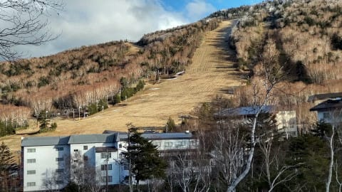

当然，高天ヶ原も全く雪はなく．

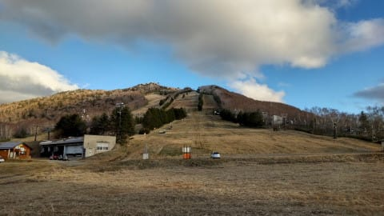

とてもこれから3日で滑れるようになると

思えないので．

…27日予定の，一の瀬ファミリー＆

高天ヶ原のオープンは厳しそうです(泣）

焼額は，22日の雨でも人工雪が多少は

残ったみたいですね…

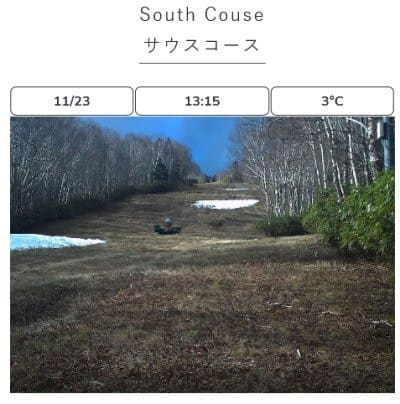

([焼額山スキー場ライブカメラページ](https://www.princehotels.co.jp/ski/shiga/livecamera/)より）

ライブカメラを見ると，今晩も全力で

人工雪を打ち続けているようです！！

とりあえず，12月4日のオープンまであと

1週間半あるので．

焼額は何とか予定通りオープンできそうな

感じ…！！

で．

熊の湯は…

雨の前に結構雪がつけてあったようで．

22日の雨に耐えて，そこそこ雪が

残ってますね…！

今，人工降雪機フル稼働しているので．

上手くいけば27日オープンできるかな…？

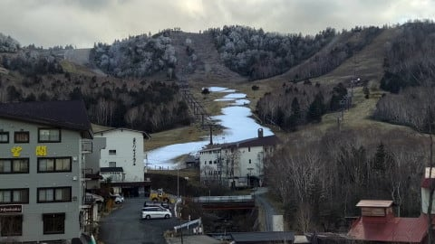

そして，横手山は…

バーンをかなり固めに仕上げてあった

こともあり．

22日の雨にも耐えて，本日も無事営業

出来たようです…！！素晴らしい！！

とはいえ．朝方，人工降雪機が動かせた

ものの，期待の天然雪はほぼ無く，

一部茶色くなってますね…(涙)

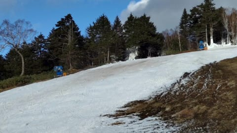

今日はおこみん特派員は午後から出動

だったようで．

午後の横手山，リフトそんなに混んで

なかったようですね…！

写真を見ても，列は短いですね．

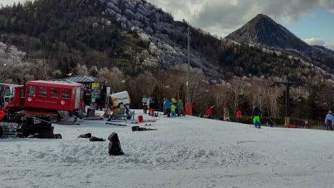

とりあえず．

22日の雨に耐えた横手山，素晴らしい…！

そして，おこみん特派員さん，写真

ありがとうございました～！

で．

他にも，かぐらの今日のライブカメラでは，

1ミリも雪が積もってないし…

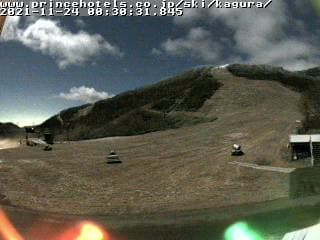

([かぐらスキー場ライブカメラページ](https://www.princehotels.co.jp/ski/kagura/livecamera/)より)

そのほか，鹿沢も湯の丸も丸沼も，

まだ27日にオープンできるかも未定の

状況だし．

野沢は27日のオープン延期を早くも宣言

しちゃったようです…(泣）

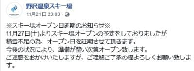

（[野沢温泉スキー場Facebook](https://www.facebook.com/nozawaonsen.snowresort/)より）

でも．

そんな中．

何と，アサマ2000は

11月27日のオープンを宣言しました！！！

さすが標高が高いだけはある！！

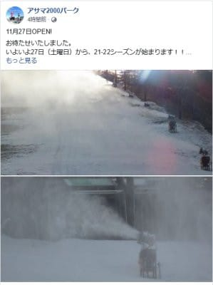

([アサマ2000Facebook](https://www.facebook.com/asama2000park/)より）

とりあえず，これから29日までは

冷え続けるので，そこに期待だけど…

今シーズンも11月末まで，まともに

スキー場がオープンしないシーズンに

なるとは思わなかった…（激涙）

ってな感じで．

異常に前フリが長くなりましたが．

ここからやっと本題．

今日，23日の祭日もYetiで滑ってきたので，

取り急ぎ速報レポート！

まず．

本日は朝は曇り空でスタート！

今日も，朝イチはポールポジションの

シマシマをいただきました～！！

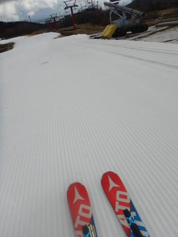

昨日の雨でゲレンデがやられちゃったん

じゃないかな？？

と，心配していたけど．

雪は土曜より薄くなった感じもあったけど．

でも，雨でやられた感じはほとんどなく．

厚みはまだ十分残っています～！

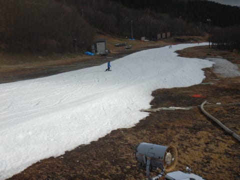

今日は気温もかなり寒く，トップ

シーズンと同じくらいの格好をして

行かないと寒いくらいで…

おかげで雪が融けて滑りが悪くなる

こともなく，結構滑る雪を終日キープ

してくれたし．

コース幅は，土曜よりもさらに広がり

ました！！

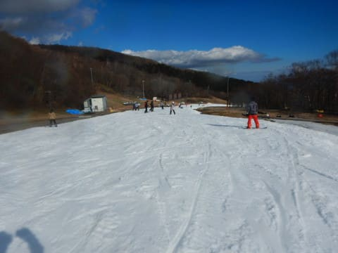

…ただ．

やはり10時を過ぎてくるとコース上の

人口密度は…

相変わらずすごいです(涙）

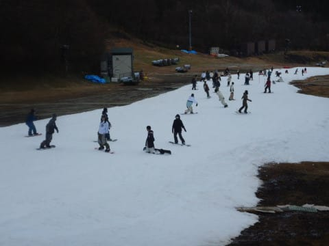

でも，リフト待ちは土日ほどじゃなかった

ですね…

クワッドが最大5分待ったくらいかな？

並行するペアリフトは待ち0なので，

コース上の人口密度はすごいけど，

リフト待ちに関しては，横手や軽井沢より

いいのかも…？？

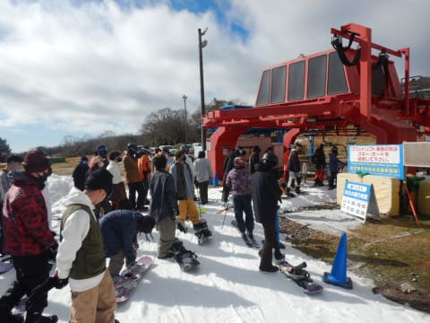

雪は終日滑りが良かったし．

夕方の16時の整備前クローズ時には

表面が多少荒れたように見えるものの，

コブやウェーブになることなく，

最後まで滑れました～！

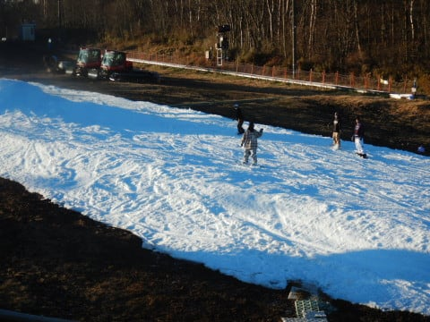

…そして．

今日もナイターへ突撃して．

いつも通りのシマシマをいただきました～！

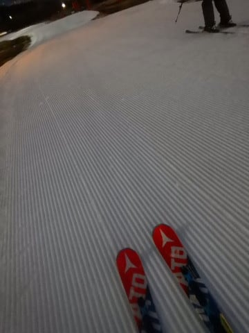

気温が氷点下近くまで下がっていたので．

ナイターのシマシマ，コースが締まって

ところどころ硬めでスピードが乗って

いい感じだったのですが…

祭日で，翌日は平日にも関わらず．

コース上はまた人がかなり増えてきて…

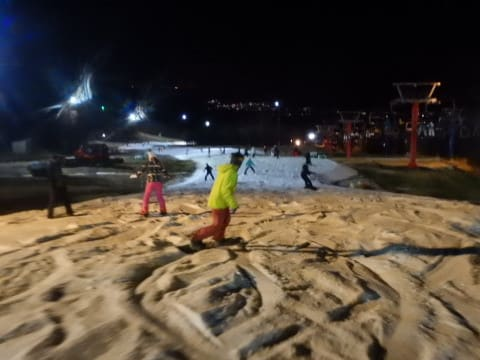

ナイターというのに，やはり今日も

そこそこのリフト待ちになったので．

また18時過ぎには退散したのでした…

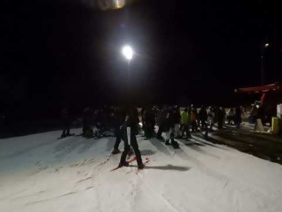

でも．

普通の土日に比べれば，リフト待ちも

短かったし．

ナイター終了後は，ウエアに着いた雪が

凍り付くほど冷えていたので，

久しぶりに締まり気味の斜面を

滑ることができて．

うむ．

結構満足できたかも…

…

…

…

でも．

やっぱりそろそろ，Yetiに飽きてきた…
