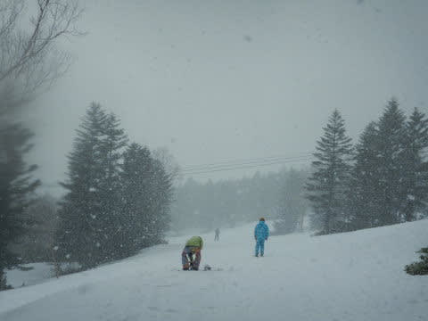

# 2022/5/2(月)，GW谷間の志賀高原スキー場は…晴れのち曇り，夕方一時雪！朝は良かったけど，午後はちょっと滑りが悪い雪…

📅 投稿日時: 2022-05-02 21:01:33

ってなことで．

GW最初の3連休が終わり，GW谷間の

平日の本日ですが…

私はまだ志賀高原で滑ってます～！

えー．

本日も，朝6:30の早朝営業から参戦！

3日連続の早朝参戦ですが．

この時期の焼額，通常営業より早朝営業の

方が並びますね…

そして．

あさイチの山頂は晴天！！

だけど，気温は-5℃と，GWとすれば

かなり冷えてますよ！！

5月とすれば，最高級の冷えっぷり！

そして，昨晩もちょっと積雪があったようで…

そのおかげで茶色い雪が隠れてくれて，

今日は真っ白シマシマでスタート！

…ただ．

今日も早朝のGSコース，昨日の凸凹が

一部埋めきれなかったり，焼額にはめずらしい

圧雪段差が急斜面の一部にあったりして，

一部気をつけなくてはならないところも

ありましたが…

でも，晴天なのに気温がマイナスで，

雪がそんなに緩まないけど表面が日差しで

エッジがかかりやすくなっている…

という，GWとしては最高級のバーン状況！

というか，4月すべての早朝を含めても

かなりいい部類に入りそうな感じ…！

いや…GWとすればいいよ！

これはいい！

…そして．

朝8:30の通常営業スタート時には…

パノラマコースもオープン！！

早朝2時間滑ったあとに，もう一度

フレッシュシマシマバーンが楽しめるという，

1日で2度おいしい，早朝参加者の特典です！！

オープン直後に飛び込めば…

人がいないフレッシュシマシマを堪能

したい放題！！

今日は気温が低めなので，通常営業開始時に

なっても雪はひどく緩んでおらず，

結構快適に滑れて．

朝9時ごろには一部急斜面は荒れ始めたところも

あったけど．

基本的には板も滑るし，壊滅的なザブザブ雪に

なっておらず，

いやーーー．

GWとしてはいいコンディション！

…と思いながらも．

欲を言えば．

晴れないで曇った方が，いいコンディションが

長続きするのでいいんだけどなぁ…

ってなことで．

普段の晴天GWなら，早朝の間に緩むところ．

10時過ぎまでそんなにひどくゆるまず．

11時ごろまで比較的板は滑ったけど…

11時を過ぎると．

残念ながら，ちょいと板の走りが悪い雪に

なっていきました…(涙)

妖怪板つかみレベルではないけど，

緩斜面で板が進まない感じの残念な雪に…

そのせいで，今日はGWの谷間の平日にしては

人も多めで，ゲートギリギリまで列が伸びる

こともあったけど．

11時には人も減り，12時にはスカスカになりました．

ただ，12時ごろには時折雲が太陽を隠す

曇り空になり…

なんと．

今日の昼間の最高気温は+2℃以下という，

かなり低めの気温だったこともあり…

日が射すと滑りが悪かったしっとりした

雪も，日が陰ると板が走る雪に！

パノラマコース側は，多少荒れては

いたものの，午後になっても板はそこそこ

滑るし，幅いっぱい大回り可能で．

うん．

GWということを考えれば，今日は

かなりいいコンディションなのでは…？？

…と，思っていたら．

なんと．

午後2時半ごろに，雪がぱらつきはじめ…

午後3時過ぎには，本格的な降りになって

来たんですけど！？？

GWに，3日連続雪が降るとは…っ！！

おかげで，3時半ごろに．

またゲレンデにうっすら雪が乗り始め

ましたが…

昨日と違って．

今日の新雪は全く滑らない！！

というか，板に張り付く！！！

ぎょええええ！

なんてこった！！

もう，パノラマコースもどこもかも，

直滑降で滑らないと止まっちゃうような，

強烈に滑らない雪にゲレンデ全面

覆われちゃいました…（涙）

惜しい…

雪が降る前まではいい感じで板が滑って

くれる雪だったのに．

そして，あと30分遅く降ってくれれば，

雪が積もり始めるのは営業終了後に

なってくれたのに…

と，15:45営業終了のラストゴンドラに乗ると．

雪は止んで，日が射し始めて来ました…

…ホントに営業ラスト前に，嫌がらせのように

一瞬だけ降った雪だったな…

ってなことで．

今日は，

冷え冷え晴れ→晴れでゆるみ気味の雪→曇って板が滑る雪

→雪降り→強烈な張り付き雪

と，目まぐるしくコンディションが変化する

一日でしたが…

まぁ，最後の張り付き雪以外は，結構楽しめた

一日だったかな～．

…明日は，朝は冷えていい感じですが．

昼間はめちゃくちゃ気温が上がって，

ザブザブ雪の悲しい昼間になりそうです…

その後，4，5日は晴れて朝から気温が

高くて，強烈な日差しで雪が緩む一日になりそう．

この時期，晴れなくていいから，

曇り空でいてほしい…

## 💬 コメント一覧

### 💬 コメント by (ikkun)
**タイトル**: Unknown
**投稿日**: 2022-05-03 00:48:32

なんと？熊での試乗会30 1だったらしいですよ😢残念です……電話の話しと？違いました❗私しがかな？(泣)

### 💬 コメント by (アツシ)
**タイトル**: Unknown
**投稿日**: 2022-05-03 03:41:46

ご無沙汰してます！３日、４日は1月半ぶりの志賀高原です！今小布施PAに着いたので、朝まで仮眠してから上がります。

### 💬 コメント by (ikkun)
**タイトル**: Unknown
**投稿日**: 2022-05-03 07:34:19

おはようございます❗少しがっかりなゆっくりな朝もしも焼額山ならば目印を頂けたらm(__)m確定デパートございませんが(・・;)あもはやゲレンデの人(笑)

### 💬 コメント by (ikkun)
**タイトル**: Unknown
**投稿日**: 2022-05-03 09:54:25

お疲れ様です❗熊にて……試乗会やってました💖しかも……受付お姉さんに半額レクチャー頂きました(泣)まずはフォルクルSLデモにて良かったです

### 💬 コメント by (インゲマル スッテンコロリ)
**タイトル**: Unknown
**投稿日**: 2022-05-03 19:41:33

はじめまして！

いつも楽しく読ませていただいています。

ところで余計なお世話かもしれませんが、Ikkunさんのコメントいつも意味不明です…

### 💬 コメント by (ikkun)
**タイトル**: Unknown
**投稿日**: 2022-05-03 21:47:37

すいません😢⤵️⤵️  控えます‼️

### 💬 コメント by (Skier_S)
**タイトル**: 5日から再び志賀に舞い戻る予定
**投稿日**: 2022-05-04 01:34:42

＞ikkunさま

熊の試乗会，結局やってたから熊の湯で滑ってらしたのでしょうか…

焼額にはいらっしゃらなかったんですか？？

私は4日は自宅なので，次の志賀高原は5日になります…

＞アツシさま

今日はお会いできずにすみませんでした…

いや，滅多にない早上りをしてしまったので．

今シーズンはお世話になりました．

また来シーズンお会いしましょう…！！

＞インゲマル　スッテンコロリさま

コメントありがとうございます！！

ハンドル名がイケてます…

ちょっとウケました（笑）．

### 💬 コメント by (ikkun)
**タイトル**: Unknown
**投稿日**: 2022-05-04 11:35:05

おはようございます❗分かりにくくすいません  はい現地で半額チケット出来まして、しかも沢山のメーカーも来ていて 半日5 6台乗りました

ありがとうございますm(__)mちなみにフィッシャーの限定colorライトgreenのあのmodel乗りましたメタルしっかりで良いですねコブはダメですかね？

### 💬 コメント by (Skier_S)
**タイトル**: ＞ikkunさま
**投稿日**: 2022-05-04 22:10:19

試乗できて良かったですね！

FischerのSCのRacetrack版履かれたんですね．

コブもそこそこ行けると思いますよ！

板が回ってくるので，縦に落とすのはちょっときつそうですが…

