# 2月11，12日の志賀高原スキー場の天気は…11日は志賀にしては重い湿った雪降り．12日は晴れて気温が上がって重めの雪になりそう

📅 投稿日時: 2023-02-09 02:02:47

本日もいつものおこみん特派員からの

写真が送れらて来ていますが…

志賀高原，水曜は朝は１ｃｍくらい

積雪があったみたいですね…

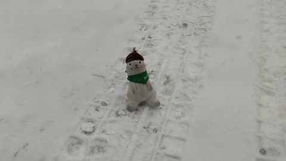

朝から天気は雲り空ながら…

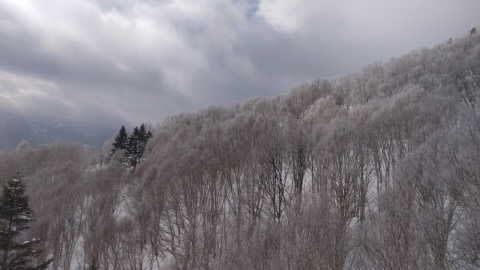

気温は高めで…

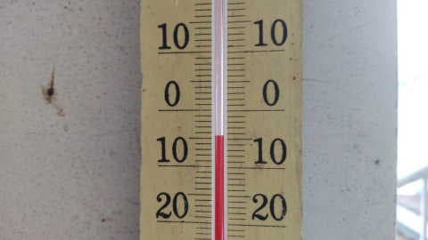

バーンは昨日の日差しで緩んだ雪が

かたまって，全体的に硬かったようです…

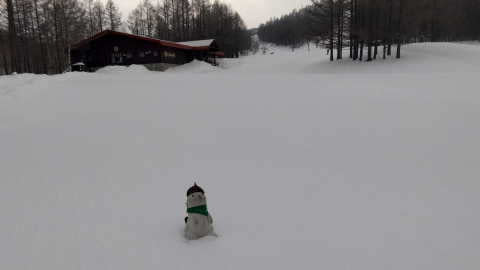

ところどころ，凍ったような硬い下地が

出てきたところがあったようなので．

そろそろ新雪が積もってほしいと

思うところですが…

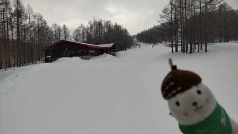

でも．

ここ数日そんなに積雪があったわけじゃ

ないというのに．

日付が変わった本日，9日の木曜から，

ヤケビウォールがオープンするようです！

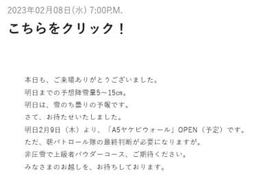

（[焼額山スキー場ホームページ](https://www.princehotels.co.jp/ski/shiga/winter/)より，以下同じ）

ただ…今週は平日ずっと，第3高速が運休

してましたが，

本日はさらに第4ロマンスも運休になるみたいです．

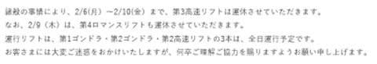

…ってなことで，本題へ．

ここしばらくは週末はいいコンディション

がつづいていたけど．

積雪が無く，さらに日差しで解けた雪が固まり，

ゲレンデが硬くなってきたようですが…

果たして今週末の志賀高原，雪が降って

回復するのか？

あるいは悪化するのか…

恐る恐る，天気図を見てみましょう…

まず，本日．9日木曜の

850hpa気温図ですが．

志賀高原は-9℃の水色の線が

かかっているので．

これは冷えそうですね…！

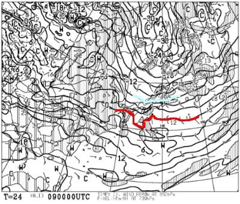

この日の地上天気図は，高気圧が

北に居座っていて．

まぁ，朝まで雪が降りそうだけど．

日中は志賀は晴れそうかな？

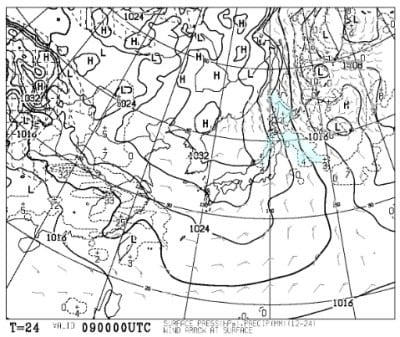

そして，10日金曜の850hpa図を見ると…

この日は，水色の-3℃線が志賀に近づいており．

2月としては，気温が高くなりそう…

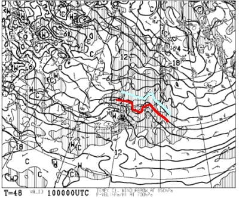

そして，地上天気図を見ると．

西から低気圧が近づいているので…

朝のうちは晴れ間も見えるけど．

昼には曇り空になり．

昼過ぎは結構湿った重い雪が

降り始めそうかな～…

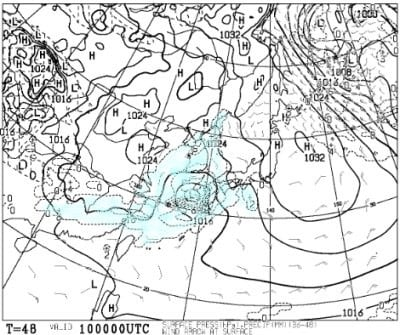

で．

肝心な週末，11日の土曜ですが．

850hpa図を見ると．

この日も水色の-3℃線が志賀にかかる程度

なので，気温は普段の2月よりは暖かそう…

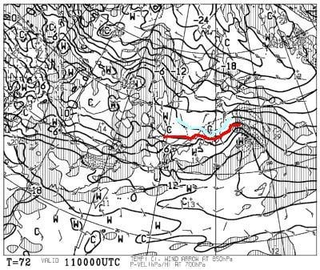

で，地上天気図を見ると…

本州がすっぽり降水域に覆われているので．

志賀高原にしてはかなり重い雪が，

10日の夜から11日にかけて降り続けそう．

10日朝は20～30cmは積もってるかも？

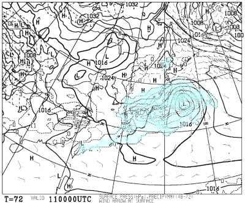

そして，12日の日曜の850hpa図を見ると．

うぐぐ．

志賀高原にはギリギリ赤い0℃線がかかって

いる感じ…きわどいけど，まぁ志賀なら

雨にならない気温．

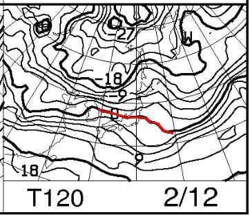

この日の地上天気図は，日本全域が高気圧に

覆われているので．

志賀では気温が上がるけど，雨にはならず…

晴れそうかな？

…でも，気温が上がって晴れると…

雪が日差しで解けそう（泣）

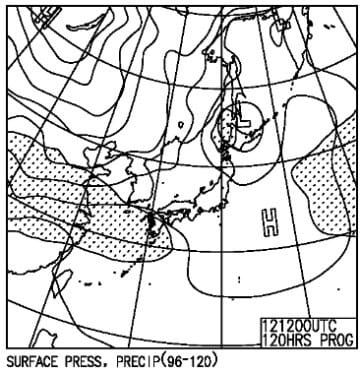

ってなことで．

まとめると．

9日(木)：早朝まで雪が降り積雪5cm．

　あさイチの気温は-12℃程度と結構冷える．

　朝のうちに雪は止み，昼ごろには晴れ間も

　出てくるかな．

　5cmの積雪のおかげで，硬いバーンは

　隠れて滑りやすくなる．

　午後は晴れていいスキー日和になるかも．

10日(金)：朝は晴れてるかな．

　あさイチの気温-5℃と比較的高め．

　天気は朝のうちから崩れ始め，

　昼には湿った重い雪が降り始める．

　午後は結構強い降りになるときも．

　滑ってる間にも積もり，夜までに　

　重い雪が20cmほど積もりそう．

11日(土)：朝イチの気温は-3℃程度と

　この時期ではありえない高温．

　朝は重い雪が降る．

　朝のうちに雪は弱まり，昼ごろには

　回復基調．夕方は晴れていくか？

　気温は終日高めで昼間は0℃を

　超えるかも．

　午後は日差しもあるので，南斜面は

　重めの湿った感じの雪になりそう．

12日(日)：朝イチの気温は-5℃程度？

　あさイチから晴れ．

　あさイチは締まったいい感じのシマシマ

　だけど…

　南斜面のごく一部，朝はコロコロが出るかも？

　そして，昼間は気温も0℃を超え．

　強い日差しで，ゲレンデ表面の雪は

　しっとりしていく．

　おそらく終日晴れて日差しが強い，

　2月と思えない暖かい晴れの一日

ってな感じでしょうか…

まぁ，雪が降ってちょっとはゲレンデの硬さは

改善しそうですね．

ただ，この週末，降るのは雪だけど，

気温が高めなので雪質は最高というより

ちょっと重めの雪になりそう．

で．

12日の晴天＆2月にしては高温で雪が緩むので．

その翌日冷えるとバーンが硬くなるんですが…

翌日には雪が降って，硬いバーンを隠して

くれるのか？？

あるいは硬いバーンのままなのか？

翌13日の850hpa気温図を見ると…

ををーっ！！！

志賀には久しぶりの水色の-6℃線が近づいて

ます！！

ただ，降水域が志賀にギリギリかかって

ないので…

薄っすら雪は降りそうだけど，

そんなに積雪はなさそう．

うーん．積雪が足りない…

急斜面，所によっては積雪がはがされて，

硬い下地が出るかな…(涙)

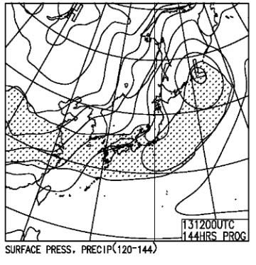

で，14日は…

今度は水色の-12℃線が志賀にかかってるよ！！

これ，志賀高原でも-15℃以下まで冷える，

激冷えなんですが…

…今度は極端に冷えるのですが？？

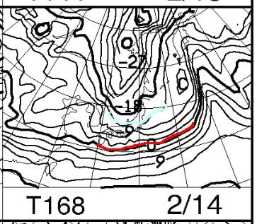

そして，天気図が見事な冬型なので…

この日は積もりそうな予感．

この日に積もれば，冷え冷え雪で

ゲレンデ状態は回復しそう！！

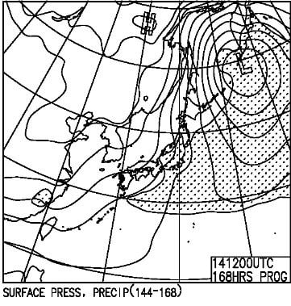

…ってなことで．

週末は気温が上がり，3月くらいの雪に

なっちゃいそうな感じですが．

でも，来週はまた冷え冷えが復活しそう！！

…しかし．

今シーズンの志賀高原．

冷えたり温まったり，極端すぎるんですが…

## 💬 コメント一覧

### 💬 コメント by (レインボー75)
**タイトル**: Unknown
**投稿日**: 2023-02-09 14:46:49

木曜日の志賀高原情報

さらさら小雪の湯田中の朝。上林-4℃　蓮池-9℃。二ゴンパークは新雪7cm。

いちごんは早く動かしてくれるので、膝パフのスーパーにはすでにスキーヤーが。二ゴンはいつも遅い！

パノラマは10cm強、さらさら。唐松の左側は飛ばされて5cm、つまらない。右側は10cm強で快適。しばらくここを食い潰してからGSサイド非圧雪。膝パフの快感に感動していたら、硬い底付きがドカンドカン！

下地の硬いこぶで目が覚めました。GSは私でもカービングできる状況。

朝の寝違いで背筋が痛いし、車修理の借金が嫌で２時間で終了。

道の駅の天ざる大盛は、私には重荷過ぎました。

### 💬 コメント by (Skier_S)
**タイトル**: ＞レインボー75さま
**投稿日**: 2023-02-10 01:37:25

ヤケビは新雪10cmだったんですか．

でも，バーンは柔らかくてトップシーズンのコンディションに戻った感じですね！

明日は朝から雪降りですので，お気をつけて滑ってください～！

