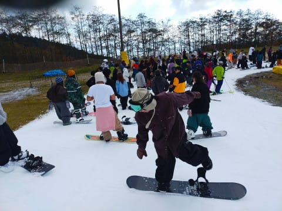
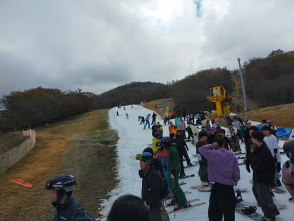
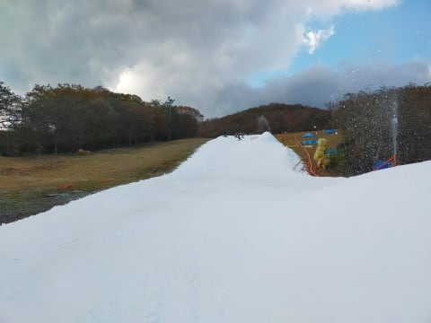
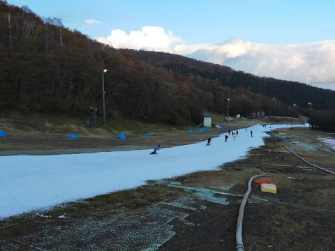
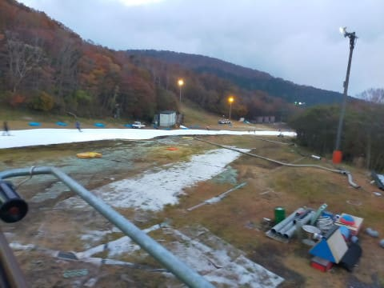

# 2023/10/28(土)のイエティ詳細レポート！…リフト10分待ち，ゲレンデは幅が狭いながら穴はほとんど開かず

📅 投稿日時: 2023-10-30 01:27:11

ってなことで．

今日は，土曜に行ってきたイエティの

詳細レポートです！

まず．

あさイチは，営業開始前の8:40くらいに

ゲートに向かいますが…

リフト券売り場の列はほとんどないものの．

ゲート入場待ちの列がすごいことに…！！

これは，先週の倍くらいの長さになってる

ので，今週は混みそうですね…（涙）

で．

朝9時にゲートがオープンし，

入場したらゲレンデ前で待たされることなく，

すぐコースに出られました！

雪は，板が軽く潜る感じの，ちょっと

柔らかめの圧雪ですが，ところどころ

硫安が効いて硬くなってるところも．

板の滑りはいい感じ…！

最初の1-2本目くらいまでは，人も少なくて

快適に滑れて．

そして天気も良く…

リフト待ちも少なかったですが…

5-6本も滑ると，コース上の人もかなり

増えてきて…

オープン1時間も経ってない，10時前に

すでにこんなリフト待ちに…（涙）

そして，10時にはさらに列が伸び…

10時15分には…

リフト待ちが余裕で10分を越えてきました（泣）

リフト待ちがなく快適だったのは，

最初の30分くらいだったよ…（涙）

これだけ混んできたというのに．

いつもなら混んできたら運転してくれる

ペアリフト，今日は動く気配があり

ません…（泣）

ってなことで．

朝10時以降は，昼休みを除いて大体

ずっとこのくらいの待ち時間という，

ちょっと残念な感じでした…

ただ，コース幅は先週よりちょっとだけ

広がったのが良かったかな…

そして，先週はかなり土が出て，石ころも

浮いていたリフト乗り場手前の急斜面も，

ちゃんと雪がつけられていて．

ちょっと薄くなることはあったけど，

すぐ雪を入れて補修されたし．

土が出てくるようなことはなかったので，

ここはいい感じ！

あと，ペアリフトが動かなくてリフト待ちは

長かったけど，輸送力が低い分コース上の

人も多くなくて，その点はわずかな不幸中の

幸い（？）だったかも．

…とはいえ，このくらいの人口密度なので，

気持ちよく飛ばせる

というには程遠いレベルですが（ちょい泣）

で．

天気は，オープン直後は晴天で暑さを

感じるほどだったのが．

10時には曇りで時折日が差す程度に

なり…

そして．

12時半ごろから13時過ぎまで，

ポツポツと雨が降ってきちゃったん

ですが！！！

…ただ，雨はそれほどひどくならず，

ホントにぽつぽつと時々降る程度だったので，

リフト待ちはちょっと短くなって

5分待ちほどになったけど，それほど

減らず．

いっそ土砂降りになったほうが人が

減ってガラガラになっていいんじゃないか

と，危険な発想が頭をよぎるほどの

混み具合でした…（泣）

まぁ，曇り空で雪がそんなに緩まず，

板は走ってくれたし．

クワッドとペアの2本で狭いコースに

人を送り込むよりは，クワッド1本

だけのほうがコースの人が少なくて

良かった，というようにポジティブに

考えて滑っていると…

16時からのコース整備時間の直前，

15時半ごろにはまた晴れてきました…！

この時間になると，気温も結構低く

なり，日が差しても雪は悪くならず，

いい感じ…！

でも．

なぜか．

16時のコースクローズ直前の時間に

なっても，人が減らず…

むしろ，この時間が一番待ち時間が

伸びてるんじゃない？？

リフト待ち，余裕で10分越えました（泣）

うーん．ナイターリフト券が15時半から

使えるから，15時半から人が増えるのかな…

ってなことで．

16時から17時は，コース整備でいったん

コースクローズとなり…

そして，17時のコース整備終了を待って…

17時のコースオープンと同時に，コースへ

Go!!

まだ誰も滑ってない整備したての

シマシマを頂くのだ！！

いやー…

ナイター開始後のこの1本だけのために，

ナイターを滑る価値があるかも…

10月に，これだけの好コンディションの

シマシマバーンのクリアラップを滑れる

なんて，シアワセ…！！

ってなことで．

ナイター1本目を満喫したけど．

2本目にはすでに人も一気に増えていき…

3本目には早くもコースが荒れて，

コース上の人口密度は昼間より高い

くらいになっちゃいました（激涙）

そして，ナイター開始30分後には，

リフト待ちが10分近くに延び…

ナイター開始後1時間近く．

6時ちょっと前には，昼間のピークを

突破する，10分を余裕で越える待ち時間に（泣）

ってなことで．

家に帰ってから仕事をしなくてはならない

という悲しい状態で滑りに来ている

私としては，無理をせず18時には

帰ることにしたのでした…←滑りに来ている

時点ですでに無理があるのでは？

ということで．

かなりのリフト待ちにやられた土曜の

イエティでしたが．

次の週末は3連休．

3連休は天気がよさそうなこともあり．

もっと混むんだろうなぁ…

まぁ，それでも当然のごとく，滑らないと

死ぬ私としては滑りに行きますが（笑）

## 💬 コメント一覧

### 💬 コメント by (1kamakura)
**タイトル**: Unknown
**投稿日**: 2023-10-30 06:14:47

早く他のスキー場がオープンしてほしいですね。

私はこれからスキーパンツを探しに行きます。

ワンシーズンに一度二度しか行かないから

上手くならないのも当たり前ですね。

### 💬 コメント by (カンタロス)
**タイトル**: Unknown
**投稿日**: 2023-10-30 20:01:31

Ｓさま、こんにちは。

ゲレンデ状態も改善してるようですね！今週木曜日に行く予定を立てました。…そのかわり三連休？なにそれ？になりますが（笑）

さて、今年はウェアを買ったわけですが、物欲選手権に再び負けて板もいってしまいました。　

新しい仲間はG9FIS183センチ、19MODビンディングです。

…使いこなせるか不安（笑）

物欲選手権の記事も楽しみにしております（笑）

### 💬 コメント by (Skier_S)
**タイトル**: 混まない平日に滑りたい…
**投稿日**: 2023-10-31 02:07:05

＞江戸の秋さま

早くいろんなスキー場がオープンしてほしいのですが…

11月1日の軽井沢の後は，しばらく待たないとほかのスキー場が

オープンしなさそうです…

スキーパンツも，シーズン1-2回なら高いものを買うのももったいないので，

ワークマンで安い防水・防寒パンツを探すのも一つの手かも…

暖かいズボンの上に，ストレッチ生地のレインウェアのパンツを履く手もありますし．

＞カンタロスさま

イエティはこの1週間でかなり改善しましたよ～！！

しかし，板購入で，G9 FISですか！

そして，ビンディングは19MODって…確か，解放値最小でも11か12からって

奴じゃなかったでしたっけ？？

普段の解放値が7.5～８の私は絶対使えないビンディングです（笑）

### 💬 コメント by (カンタロス)
**タイトル**: Unknown
**投稿日**: 2023-10-31 06:48:29

Ｓさま、こんにちは。

19modは最低開放値11です。

ICONビンディングに比べればかわいいものです（笑）

趣味で草レースに出る事もあるので、いまの板（185センチR27でノンFIS）がちょっと物足りなくなったので買っちゃいました…。

### 💬 コメント by (Skier_S)
**タイトル**: ＞カンタロスさま
**投稿日**: 2023-11-01 01:28:45

最低開放値11…！

転んだら足がもげますね（笑）．

R27が物足りないんですね…すごい．

でも，私も試乗して最近のR30は滑りやすいのにびっくりしました．

試乗すると欲しくなりますよね（笑）

