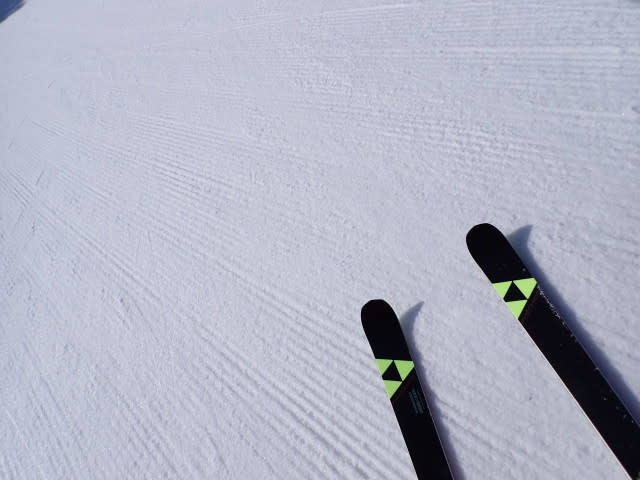
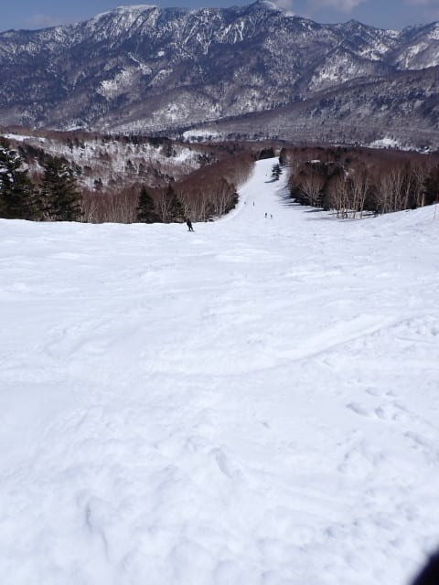

# 2025/4/12(土)の志賀高原焼額山スキー場は…終日晴れで暖かい春スキーの一日．雪は緩んで荒れたけどストップ雪にはならず

📅 投稿日時: 2025-04-13 00:08:54

🏷️ カテゴリ: [2025スキー滑走日記](cacd3fbf84d4a679ee61a5894c3f95e14.md)

ということで．

本日も予告通り，志賀高原で滑ってました～！

いやーー．

今日はすっきり晴れて，典型的な４月の

春スキーの一日でしたね…

まず．

昨日は深夜1時ごろに寝たというのに．

朝3時に出発して，なんとか早朝営業開始

1時間後の7時に焼額第1ゴンドラ乗り場へ

到着！

…ゴンドラが2本とも動いているということも

あり，早朝営業時間のゴンドラはガラガラで，

待ち時間0ですね…

そして，ゴンドラに乗ると…見事な快晴

の空が出迎えてくれます！！

朝7時の山頂の気温は-1℃．

今日はしっかり氷点下に冷えてくれた

ようで…

雲一つない快晴でかなり強い日差しも射しこんで

いるにもかかわらず，明け方の氷点下の

冷え込みのおかげで，予想通りバーンは

しっかり固め！

滑るとカリカリ言うような，エッジを研いでない

人には厳しい感じの，ザラメが固まった

かなり硬めのシマシマバーンでしたが…

でも．

私にとっては早朝営業の時間帯から緩いより

よっぽどいい！！

スピードが乗る，硬いGS板が本領を発揮

できそうなハイスピードシマシマバーン！！

すっきり晴天でバーン状況も良く見えて，

それでいてガラガラ無人貸し切りバーンなので…

ハイスピードバーンで思いっきりスピードを

出せるのがうれしい！！

やっぱりこの時期，早朝営業がいいなぁ…

楽しい，楽しいよ…っ！！！

ただ．

さすがに通常営業開始の8時ごろには表面も

緩み始めてきましたが…

でも，下地はしっかり硬くかつ表面はエッジが

効くという，むしろもっと気持ちいいバーンに

なってきましたよ～！！

うはははは！これは楽しい！！

睡眠時間を削ってでも来る価値はある…っ！

晴天だしガラガラだし，

このくらいの雪の状態が，このままずっと

続いてくれればいいんだけどなぁ…

でも．

通常営業が始まってもバーンはそこまで

混まないし…

というより，早朝営業とお客さんの数は

ほとんど変わってない感じで，

ずっとガラガラ状態が続いてて．

これでバーン状況がいい間は，かなり

楽しめましたよ～！！

しかし…

こんな晴天で楽しいのに，ゴンドラも

全然混みませんね…

今日のゴンドラ待ちは，ピークでも

この程度．

今日は第1ゴンドラも第2ゴンドラも，

ホントにガラガラ…

こんな状況がいいのに，こんなガラガラで

いいの？

ってな感じで．

晴天ガラガラいい感じのバーンをしばし堪能

してたけど．

気温はぐんぐん上がり，さらに快晴の

日差しが雪に容赦なく照り付ける本日．

残念ながら，朝9時ごろには日当たりのよい

バーンが結構緩み始めてきて…

午前11時頃には，バーン全面がずっしりと

重い春の雪に覆われてきて．

バーンが荒れ始めてきました…（泣）

でも．

GSコースやオリンピックコース，

パノラマコースは昼頃にはかなり

ボコボコに荒れたけど．

ちょっとしたコブ斜面のSGSコース．

これだけのコブ斜面を越えると…

その先のイーストコースでは，昼に

なってもシマシマが残ってます！

今日は第3高速が動いてないので，SGS

コース経由でしかアクセスできないこの

イーストコース．

滑る人が少なく，完全な穴場になってます！

ただ，それ以外のコースは残念なことに．

午後1時ごろにはかなりボコボコになってきて…

まぁ，あれですね．

春スキーでよくある，ザブザブの重い雪が

蹴散らされて凸凹になった，かなり体力を

消耗するバーンになってきましたね…（泣）

もう，午後2時ごろには，あまりにも雪が重く，

板をズラすのが難しいバーンになってきたので．

この凸凹バーンをきれいにカービングで切って

行かないといけないような，ちょいと手ごわい

バーンになっていき…

そのせいで，午前中よりさらに人が減り，

今日の午後まで生き残っているのは，

かなりの上級者か体力お化けか，

あるいは滑らないと死ぬ人くらいだった

感じですね…

ただ，そんな中でも．

SGSコースのコブを越えた先に待っている

イーストコースだけは，滑る人も少なく．

ラストまで，比較的荒れずに済んだので…

今日は午後はほぼイーストコースばかり

滑ってました！！

ってなことで．

今日も朝7時から，ゴンドラの営業が終わる

午後3時半まで．

いつも通り，睡眠が足りなくても無理して

滑りに来たのだから…と，お昼休みを取る

時間も惜しんで，ひたすらゴンドラを

ぐるぐる滑り続けたのでした…

まぁ，今日の午後はバーンがかなり荒れたものの．

雪は比較的よく滑る雪で．

緩斜面で「ちょっとだけ滑りが悪いかな…」

と感じる程度で，ストップ雪にはならなかったし．

ガラガラだし天気は良かったし，午前の早い

うちはバーン状態もフラットでエッジも効く

いいコンディションだったし．

4月の春スキーと考えれば，まぁ楽しめた

1日だったかな…！！

…しかし．

今日は夕方まで快晴が続いたのに．

明日は朝から雨が降るとは信じられない…

でも．

やっぱり明日の志賀高原．天気図を見ると，

朝9時ごろには，空から液体が落ちてきそう…（涙）

降っても小降りで納まってくれると

いいんだけど，そこそこの雨になりそうな

感じ…（泣）

いや．

皆さんの日ごろの行いが良ければ，

明日はぽつぽつ程度の雨で納まって

くれるはず…！！！

果たして皆さんの行いが良かったのか

悪かったのか，明日わかります…

## 💬 コメント一覧

### 💬 コメント by (横須賀のウルトラセブン)
**タイトル**: イーストコース
**投稿日**: 2025-04-13 07:55:09

僕も昨日イースト３回廻し～いつも貸切で最高で

した！心配なのはこのブログを見ている全国のス

キーヤーがヤケビのイーストコースに集合してし

まうのではと....(;^_^A～で日曜日今日の僕は昨日

のうちに、ふるい落とし機能が働いてしまい、家

でのんびり、明日の「雨のヤケビ貸切レポ」を楽

しみにしてますよ～！！

### 💬 コメント by (Skier_S)
**タイトル**: ＞横須賀のウルトラセブンさま
**投稿日**: 2025-04-14 02:23:23

SGS経由のイースト，良かったですよね～！

そして，日曜は滑らなくてもいい感じでした…

今日滑らなかったのは正解だと思います．

普通の神経の人なら，滑って楽しいとは思わなかったと思います…

