# 登山用トレッキングポールを買ってみた…2300円の激安ポールは使えるのか？？その1

📅 投稿日時: 2021-09-30 03:03:48

🏷️ カテゴリ: [日記](cc4b5682fb7b8b144980957a978653fb0.md)

えー．

ここしばらく．

ダイビングと山歩きのBlogと化している，

徒然スキーヤー日記にようこそ．

…最近，スキーネタがなく，

どこがスキーブログなんだ？？

と，全員からツッコミを受けそうな

今日この頃ですが．

今日も山歩きのネタだったりします．

…いや．

ちょっとここで書いておかなきゃいけない

と思わざるを得ないネタにあたって

しまったので…

一体何があったのか？？

本題へ，Go！

ーーーー

ってなことで．

[先日の記事](e2f0edf20c20d8d40708a64d8e69a4ba5.md)で，

ついつい知らぬ間に，膝の負担を減らす

ためのトレッキングポールを買って

しまっていたと，報告しましたが…

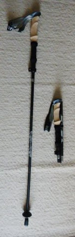

これ，Amazonで何気なくトレッキング

ポールを見ていたとき．

なんと，タイムセールで2396円という激安で

売っているのを見つけたので．

「このくらいなら惜しくないな…」

と考えているうちに．

ついつい無意識に注文してしまっていたのでした…

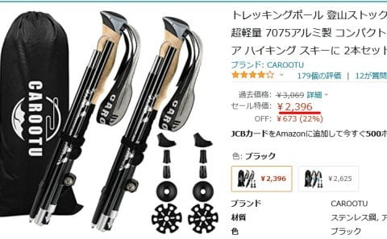

しかし．

届くまで，

「アルミシャフトとはいえ，2300円で

　2本セットって…使い物になるのかな？」

と，心配でしたが．

いざ，届いてみた箱を開けてみると…

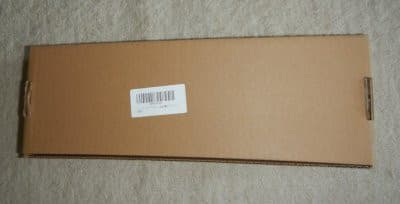

中には収納袋に入ったポールが収まってて．

2本セットなのに，結構コンパクト！

さすが3段折り畳み式…

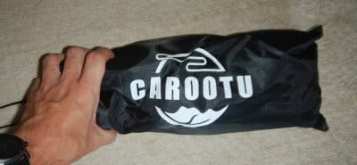

袋の中には…

ポール，説明書，バスケットやキャップなどが

入ってました．

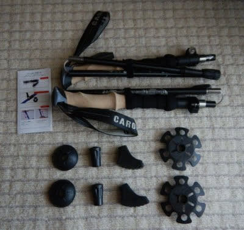

説明書は，ちゃんと日本語で書かれてますね～

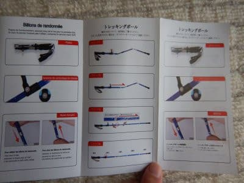

…3段折り畳み式で，折り畳み時の長さ

35cm程度．

重量250g強という，意外とコンパクト＆

軽量なこのポール．

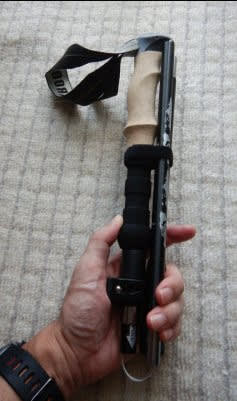

このようにワイヤーで繋がっている

3本のシャフトをつないで使うタイプで．

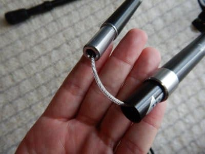

長さもワンタッチで調整出来て．

110cm～125cmまで変更できる，なかなかの

スグレモノ．

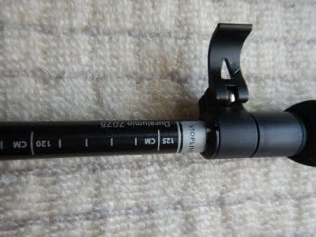

グリップも，コルク風の握り心地が

いい感じのグリップだし．

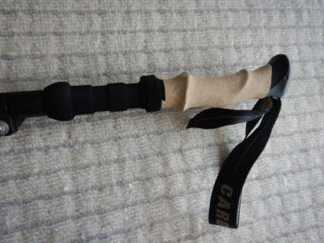

バスケットも，普通のゲレンデで使えそうな

やつと，新雪用のバスケットが付属していて．

シャフトのネジ溝に合わせて回せば

簡単に取り付け可能！

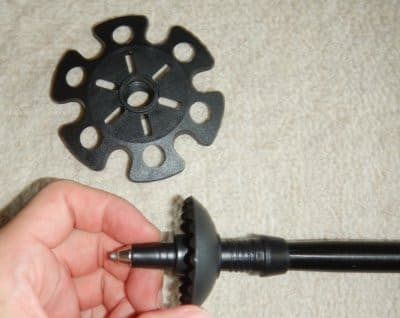

…ただ．

組み立てた感じ．ちょっとだけガタが

ある感じもするし．

強度も大丈夫かな？

…と，ちょっと心配でしたが．

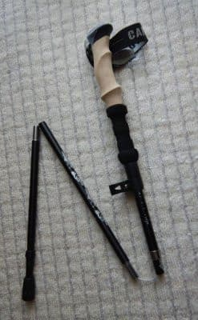

いざ，実戦で使ってみましょう…！

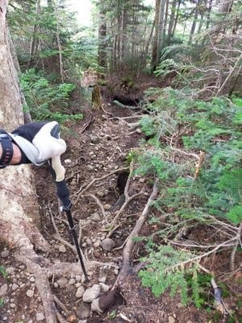

…使ってみたところ，

意外だったんだけど．

強度的には，これで十分！

体重をかけても弱さやしなりを感じず，

全然しっかりしてるし．

組み立て式のガタも，全く気になりません．

これ，十分使えるよ…！！

私にとっては，今回がトレッキング

ポールを使っての初めての登山

だったわけですが．

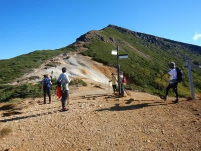

初めてトレッキングポールを使って

山を登ってみると…

なんだこれは．

むちゃくちゃ登りが楽じゃないですか！！

まさか，ここまで違うとは…！

コースの登りタイム，余裕で標準コースタイムの

半分以下の時間で登れるよ！

これまでよりさらにスピードアップ！！

これって登山用チートデバイスじゃなかろうか？

と思うほど，楽に早く登れます…

…ポールを使うのと使わないのじゃ，

全然違う！

ポール2本使い，ここまで違うとは！

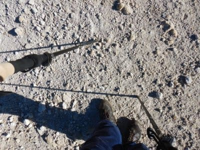

本来，スキーシーズンのオフトレのため．

負荷をかけて体力をつける目的で始めた

山歩きなので．

楽ができるトレッキングポールを使うのは

避けてたところがあったけど．

初トレッキングポールでの登り坂の，

あまりもの快適さに．

「もう，これ無しで山登りできないかも…」

と，思いつつ．

この時は，気持ちよく山を登っていた

Skier_Sだったのでした…

[（続く）](e985405394cf7a36d2f7a94393cdde04f.md)
