# 今週末は3連休！…3月20，21，22日の志賀高原の天気は，初日金曜は荒れ気味．中日の土曜は気温高めの晴れ，最終の日曜は曇り空かな

📅 投稿日時: 2020-03-19 00:08:20

🏷️ カテゴリ: [スキー天気予想](c6554f5c3c106093b511a8daae23757e8.md)

ってなことで．

本日の志賀高原も，朝は10～20cmの新雪が積もり．

そして昼前には晴天になり，

ちょっと雪は重くなったものの，

いい感じの一日だったようですね…！

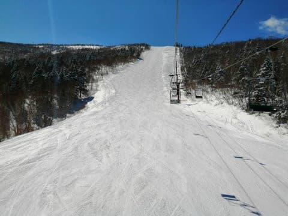

(またまた某特派員の写真をお借りしました）

うーむ．

このまま今週末の3連休までもってくれれば

いいのですが…

というか．

3連休まで毎日，

奇跡の冷え冷え雪がどっさり積もって．

毎日腰パフ天国だといいのですが．

とりあえず．

これから毎日腰パフ天国になるか否か．←どう考えても「否」でしょう…

これから週末にかけての天気を

予想してみましょう…！！

まず．

19日木曜，夜9時の850hpa気温図ですが．

…

…赤い0℃線，北海道あたりまで

北上してますね（涙）

そして，志賀高原は，水色の+6℃線より

南にあるんですが…っ！！

これは…昼間は+7～8℃くらいまで

気温が上がりそうな予感…（激涙）

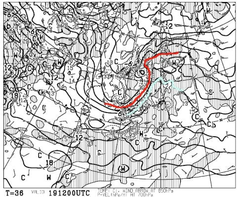

まぁ，

この日の地上天気図を見ると．

降水域が志賀高原にかかっておらず．

液体が降ってくる危機

がなさそうなのが救いですが…

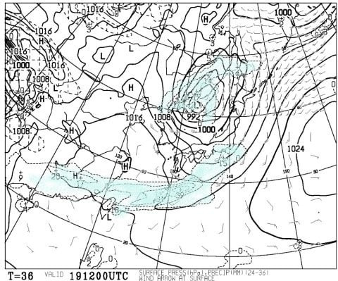

ただ．

この日の850hpa図を拡大すると…

この，赤で囲ったところ．

なに？？風速50ノット…っ！？？

…これって，風速25mってことですね．

ゴンドラが息絶える風速です(涙)．

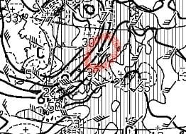

うーむ．

19日．

液体が降る危険性は無いけど．

強烈高温の南風が強く吹き付け．

かなり雪がダメージを受けそう（泣）

さらに．

午後は焼額ゴンドラは減速，

奥志賀ゴンドラは，ヘタすると

止まりそうな感じでしょうか…（涙）

で．

翌20日．

3連休初日の金曜日の850hpa図を見ると．

うむ！

この日は冷えてますね！

赤い0℃線は太平洋側まで下がり，

水色の-3℃線が志賀の南に居るので．

志賀高原，朝は-5℃以下まで下がって

くれそう…！

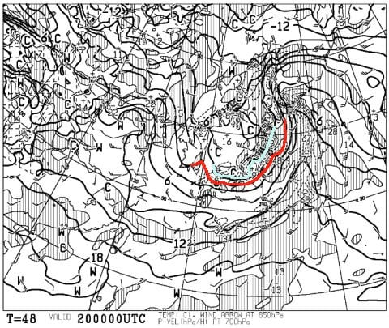

そして，20日の地上天気図は…

うむ．

志賀高原に降水域がかかっているので．

20日朝にかけて，雪が積もりそう…！

かなり重い雪だと思いますが．

でも，5cmほど積もってくれるかな？

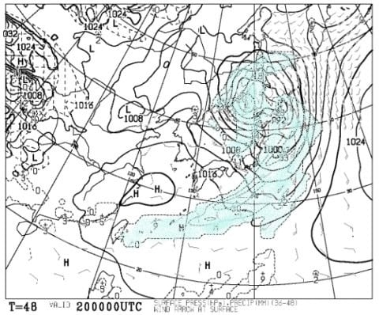

5cmでも積もってくれれば．

前日の高温で溶けた雪がガチガチに

固まった，硬い下地が隠れて

くれるので．

20日朝の雪は悪くなさそう…！！！

…

…なんですが．

でも．

20日朝の天気図も，拡大すると…

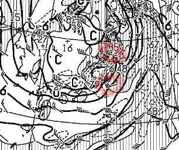

…なに？？

赤く囲ったところ，風速60ノット！？？？

風速30mってことですね…（激涙）

これは…

当日，この天気図通りになるなら．

志賀高原の全ゴンドラ，即死ですね（涙）

リフトも動かないのが多いかも…

20日午後はわずかに風が弱まりそうなので

うーん．

運がよければ，午後には焼額第1ゴンドラ，

動いてくれるかも…

でも，奥志賀はダメな感じ(涙）

次に，

3連休中日，21日の850hpa気温を見てみると．

うううーーーむ．

微妙．

0℃線がギリギリ志賀高原より北…

これは，朝はマイナスまで冷えてくれそう

ですが．

昼間はプラス気温になりそう…

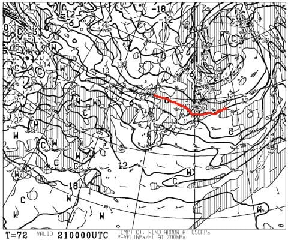

そして，21日の地上天気図を見ると．

降水域が志賀高原にかかっていないので．

志賀高原，終日晴れそうな感じですね…！

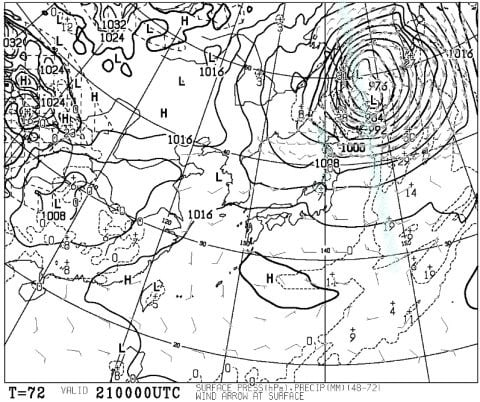

ただ．昼間は気温が上がって，

日が射すので．

ちょいと雪は緩み気味か…（涙）

で．

3連休最終日，22日の850hpa気温ですが．

うううーーん．

この日も，微妙な感じで．

0℃線が志賀高原よりわずかに北…（涙）

この日も，昼間は0℃以上に

上がりそう…

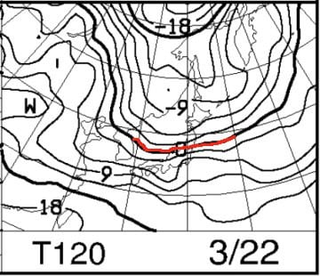

地上天気図を見ると．

低気圧の接近で，雲が多めの

天気ながらも．

網掛けの降水域がかかってないので．

液体が降ることは無さそうでしょうか…

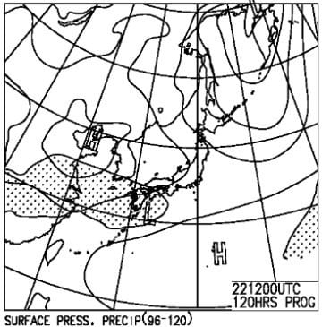

ってなことで．

まとめると．

19日(木)：朝からプラス気温のゆるゆる雪．

　天気は終日どんより曇り空．

　朝から高温の南風がだんだん強くなっていき，

　昼すぎにはゴンドラが減速・運休していくかも…

　最高気温は+7～8℃まで上がり，

　生ぬるい南風が強く吹き付けるので，

　雪は融けていき，4月並みのずっしり重い

　雪になっていく（涙）

20日(金・祝)：前日夜から気温がぐっと下がり，

　降り始めは雨かもしれないけど，雪が降り始める．

　朝までの積雪は，せいぜい5cmほどか…

　あさイチの気温は-5℃程度．

　朝の営業開始のころは雪がぱらつくが，

　じき止む．

　風が強く，朝はゴンドラ動かないかも？？

　もしかすると，リフトも一部動かない可能性が…

　午後に向かって風は弱まるので，

　午後には焼額第1ゴンドラは動くと信じたい．

　奥志賀は終日ヤバいかも…

　天気は終日曇り空．

　昼の気温もマイナスキープ．

　硬い下地の上にうっすら柔らかい

　雪が乗っていて，午後はゲレンデの

　ところどころに下地の硬いのが

　顔を出す．

21日(土)：朝は-2～3℃，

　あさイチのゲレンデは，結構しっかり硬めに

　締まった，ハイスピードシマシマ！

　終日天気は晴れそう！

　ただ，昼間の気温はプラスに上がりそうなので，

　昼間の日差しと相まって，南～東斜面は

　かなりしっとりとした，重めの雪に

　なっていく．

　雪は重めになりそうだけど，ザブザブに

　なるほどではないかな…

　春スキーと割り切れば，いい陽気で

　楽しめる一日．

22日(日)：朝はギリギリマイナス気温．

　天気は終日曇り空．

　朝は晴れ間のタイミングもあるかな？

　あさイチはかなり固めのカリカリした感じの

　圧雪バーン．

　午前中から気温はプラスになるが，

　日差しが無いのでそこまで一気に雪は

　緩まない．

　でも，昼ごろには表面はしっとりと重い

　春の雪になっていく．

　

ってな感じでしょうか…

まぁ．

初日は風が強いかもしれないけど，

そこそこ冷えてくれて．

3日とも，液体が降る危機もないので．

春スキーと割り切れば，まぁ楽しめるんじゃ

ないでしょうか…

ちなみに，23日の月曜は冷えて，

ちょっと雪が降ってくれるかも…

（降ってもちょっとだけですが）

## 💬 コメント一覧

### 💬 コメント by (AK)
**タイトル**: Unknown
**投稿日**: 2020-03-19 00:39:47

そういえば今週は三連休ですね祝日は休みじゃないので土日どちらかで行くつもりですが、ぴーかん人多めの土曜日か午後はガラガラであろう日曜日か悩みますね。

### 💬 コメント by (新米パパさん)
**タイトル**: Unknown
**投稿日**: 2020-03-19 06:43:00

金曜祝日は志賀高原行けずストレスでしたがSさんの予報見て多少諦めがつきました。

日曜行かせていただきます！

### 💬 コメント by (レインボー)
**タイトル**: Unknown
**投稿日**: 2020-03-19 06:57:27

追記

丸池Aコースも底づきがなく、2階の住人が３本も楽しんだとか。

### 💬 コメント by (レインボー)
**タイトル**: Unknown
**投稿日**: 2020-03-19 14:44:11

木曜日ヤケビの志賀高原情報

朝一のパノラマ、カラマツ。硬すぎず柔らかすぎず、いい雪だ。幸せ感に包まれる。オリンピックも然り。

これまた快適なＧＳから奥志賀へ。分岐道も気持ちいい！

ダウンヒルもいいけど、風が強い。

目的地エキスパートは、私レベルでもエッジが雪面に食いついて、夢心地で大回りが楽しめる悶絶バーン。

やっぱりこれからは北東斜面だ。

10時過ぎのオリンピックは、かなり緩んできたけど、まだ大回りが楽しめました。

三高で整理体操をしたあとの11時のサウスは、下部で妖怪が早くも現れました。

カービング狂でスピード狂の友人によると、高天や一の瀬でも、しっかり食い込んで満足したとのことです。

### 💬 コメント by (ヒータロゥ)
**タイトル**: Unknown
**投稿日**: 2020-03-19 15:54:26

初めてコメントします。

いつも、天気予報参考にしてます。

本日、ヤケビ行きました。朝はオリンピックもＧＳもエッジカミカミでしたが、早くも10時くらいには緩みはじめ、昼頃には妖怪足つかみが出ました。昼過ぎにあがりましたが、そのくらいから風が強くなってきました。それまではたいしたことなかったです

朝イチの1ゴンでNAOチャンネルさんと、いろいろお話しさせてもらいました〜ステッカーもいただきました。ありがとうございました!今度Sさん見かけたらご挨拶させてください!

### 💬 コメント by (Skier_S)
**タイトル**: 明日も志賀高原！風が強そうだけど…
**投稿日**: 2020-03-20 01:08:30

＞AKさま

土日どちらか悩まなくても，両方いけばいいんですよ！！

＞新米パパさん

金曜は天気は良さそうな感じなんですが．

風がどうなることやら…

＞レインボーさま

今日も朝は良かったんですね！！

でも，今日緩んだ雪が，明日は固まってガリガリに

なりそうですね…

いいコンディションは今日の昼で終わりでしょうか（涙）

なぜ，週末の直前でいいコンディションが終わるのか…（泣）

＞ヒータロゥさま

初めまして～！

ご愛読ありがとうございます．

今日お会いしたと，naoちゃんねるさんより報告がありました（笑）．

私のことも見かけたことがあるようですね…

また明日から志賀高原に滞在してますので，

見かけたら声をかけてください～！

