# 3月4，5日の週末の志賀高原スキー場の天気は…土日とも晴れそう！でもちょっと日曜は気温が上がり，雪はわずかに緩むかな

📅 投稿日時: 2023-03-02 02:26:05

🏷️ カテゴリ: [スキー天気予想](c6554f5c3c106093b511a8daae23757e8.md)

なんと．

我々地球人は．

それと気づかぬうちに，3月という

時空に突入していたようです！

3月…それは，スキーシーズンも終盤戦を

意味する，悲しい季節．

スキーヤーが最も嫌う，春という季節が

着実に迫ってきます…（涙）

あぁ…早くもシーズン終盤か…

しかし．

2月が終わったというのに．

今シーズンはまだ27日しか滑ってない

という…

コロナの緊急事態の年と同じくらい

しか滑ってないんですけど…（涙）

仕事が…ご無体な仕事が憎い…

ってなことで．

春が迫る3月がやってきてしまった

わけですが．

3月初日，本日の志賀高原．

特派員からの報告を見てみましょう…！

本日は見事にすっきり晴れの晴天！！

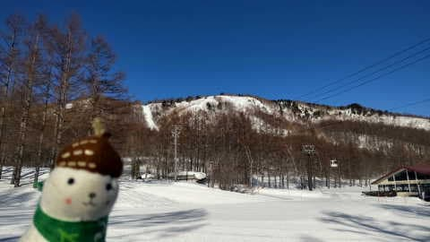

あさイチの気温は-5℃と，そこまで

ではないけどまぁまぁの冷え込みで…

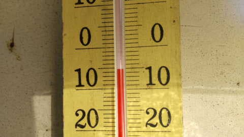

バーンはシマシマ！！

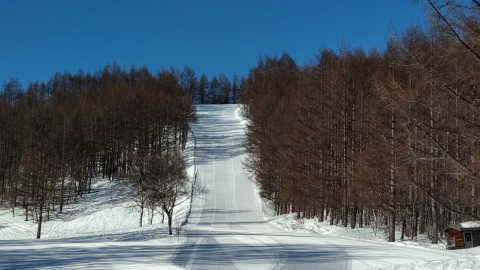

でも…

そのシマシマ．

前日に気温が上がったので，緩んだ雪が

固まった，ボソボソした感じの雪ですね…

朝はコース上，わずかにコロコロ氷が

出たようです．

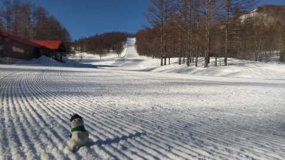

で．

やはり今日も昼間は気温がプラスに

上がってしまい…（泣）

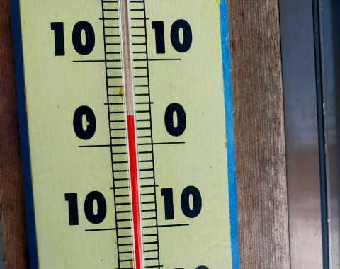

強い日差しと相まって，南斜面は

かなりしっとり緩んだようです…

ただ，南斜面以外はそこまで緩まな

かったみたいですね…

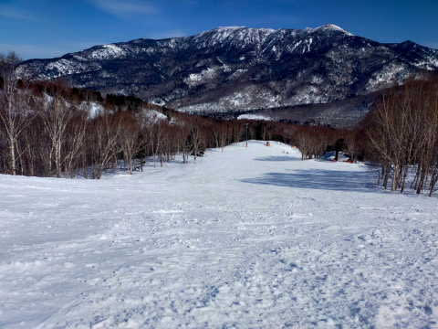

ってなことで．

いつもより早めに雪が緩み始めてきて

しまっている志賀高原．

今週末の雪はどうなるのか？？

このままドロドロに溶けていくのか？

…今週末までの天気を見てみましょう…

まず．

2日(木)の850hpa図は…

水色の-3℃線が志賀高原にかかる

程度なので．

そこまで強い冷え込みじゃないですが…

液体が降る気温ではないです．

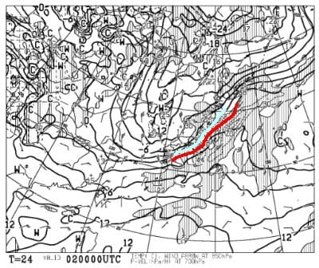

で，この日の地上天気図は…

日本全面，水色の降水域に覆われてます！

2日は朝に10cm以上雪が積もり，昼間も

降り続け，5-10cmくらい積もるかも…！

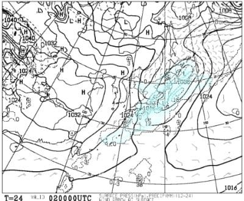

そして，3日(金)ですが…

850hpa気温を見ると．

この日は水色の-6℃線が志賀より

南にあり…

まぁまぁ冷えますね！

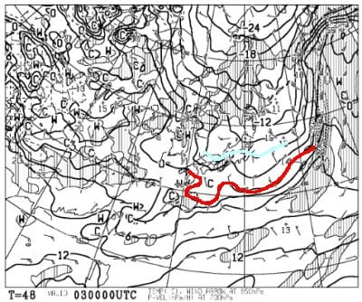

そして，地上天気図は高気圧に

覆われているので．

この日はそこそこ冷えた晴れで，

絶好のスキー日和かも！！

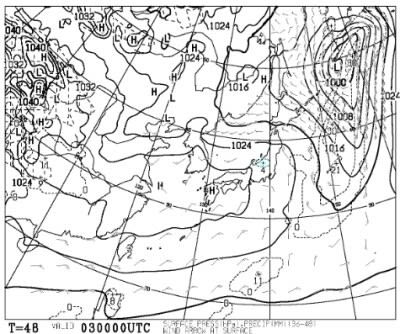

そして，肝心な週末．

4日(土)の850hpa気温は…

志賀高原にかかっているのは水色の

-3℃線．昼間は0℃を越えそうで，

3月上旬と考えると，気温が高めの

一日になりそうです…

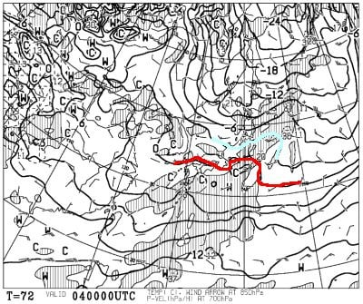

地上天気図は，微妙な感じ…

降水域は志賀高原にかかってないから，

晴れるかな．

…晴れると日差しが強い南～東斜面は

雪が緩みそうなので，気温が上がるなら

曇りの方がいいかも…

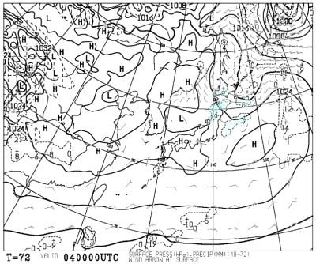

そして，日曜日の5日の850hpa気温は．

うーーーーーむ．

赤い0℃線が志賀に近づくレベルなので…

気温がかなり上がりそう．

昼間は間違いなくプラスに行きますね(泣)

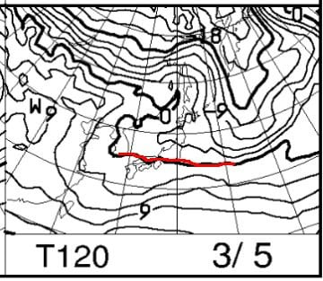

地上天気図は降水域がかかってないので．

この日も晴れそうかな～…

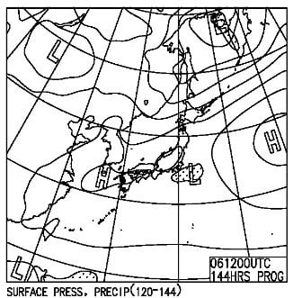

ってなことで．

まとめると．

2日(木)：雪降りの一日．

　朝までに10cmほど積もる．

　あさイチのバーンは圧雪の上に

　数cmの新雪が乗った状態．

　あさイチの気温は-6℃程度．

　昼間も気温は-3℃くらいまでしか

　上がらず，一日重めの雪が降ったり

　止んだり．

　バーンはモサモサになっていく．

　昼間だけで5～10cm積もる．

3日(金)：終日晴れ！

　前日の夜に降った雪が

　非圧雪バーンには5cmほど　

　残ってるかも？

　あさイチの気温は-9℃ほどと

　冷えて，

　圧雪バーンは柔らかめのトップ

　シーズンシマシマ！

　昼間も気温はマイナスをキープし

　晴れるので，絶好のスキー日和！

　

4日(土)：終日晴れ，時折うす曇り．

　あさイチの気温は-6℃ほど．

　朝はいい感じのシマシマ！！

　昼間も0℃を越えるかどうかという

　気温なので，そこまで雪は緩まない．

　日当たりが良い南斜面だけ，ちょっと

　雪はしっとりしそうだけど，

　それ以外は終日バーン状況も良く，

　気温は高めながら良さそうな一日！

5日(日)：晴れ，時々曇るかな？

　あさイチの気温は-4～5℃程度？

　この日の朝は締まり気味の

　スピードが出るシマシマバーン！

　前日，日当たりの良かったところは

　ちょっとコロコロが出るかもしれない

　けど，それ以外はこの日もいい感じ．

　ただ，土曜より気温が上がり…

　もしすっきり晴れなら，ところどころ

　雪がしっとり緩んでいく．

　でも，春スキーと割り切れば

　雪もわずかに緩む程度なので，

　比較的楽しめそう．

…ってな感じでしょうか．

で．

今週末の4，5日はそこまでひどく

ならないけど．

それ以降を見ると…

…

…（涙）

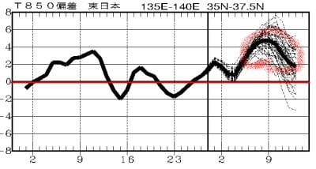

来週末の11日（土）あたりまで，

全く気温が冷える気配がないですね（激泣）

来週は，朝はカリカリバーン，

昼間は緩んでいく，春スキーっぽい

感じになるのかも…

…季節が進むのが平年より2-3週間早い感じ（泣）

うむ．

スキーを愛する皆さん．

「春はまだ来なくていい！まだ冬でいて

　お願い冷え冷え踊り」

を，来週に向けて踊っておく

時期ですので．

ひたすら真剣に踊り続けてくださいますよう，

よろしくお願いします…

## 💬 コメント一覧

### 💬 コメント by (レインボー75)
**タイトル**: Unknown
**投稿日**: 2023-03-02 12:42:20

木曜日の志賀高原情報

朝の湯田中は小雨。ニゴン待ちの間に雪が。

パノラマは僅かな積雪。白樺はガスでコースアウトしないで滑るのがやっと。楽しくない。ニ高を一時間ぐるぐるしてるうちに、雪もひどくなってきたので終了。

どうやら根性なしスキーヤーふるい落とし網にかかったようです。

### 💬 コメント by (アリス)
**タイトル**: Unknown
**投稿日**: 2023-03-02 16:46:25

S様

ご無沙汰しております。

いろいろあり、1ヶ月ぶりの志賀高原です。

一ゴンに8時到着、8時20分運転開始🎵

廻りの人は、gokurakuさんステッカー、2万mステッカーのヤケビ常連さんばかりで、気落ちしましたが親分さんと同ゴンドラ🎵奥様の言葉に

やはり、スキーは平日よね～（はい、おっしゃる通りです）と納得🎵

雪が重いとか、午後に荒れたとか、オリンピックコースは凹とかありますが、私は朝一のGS.オリンピック、パノラマ、白樺で雪があってスキーが出来るだけで、幸せ一杯です😆🎵🎵

朝昼食事なしで気がついたら16時でした😅

明日は、朝一奥ゴンでダウンヒルかエキスパートを狙っています。

でも、1ゴンも2ゴンも捨てがたいです❄️

### 💬 コメント by (Skier_S)
**タイトル**: 今週末は何とか滑りに行く！
**投稿日**: 2023-03-03 01:24:07

＞レインボー75さま

朝は意外と積もらなかったみたいですね…

明日にかけて積もってくれるといいのですが．

＞アリスさま

今日から志賀ですか！

明日はちょっとコンディションが回復すると思いますし，天気も良くなるので

明日は楽しめると思いますよ！

