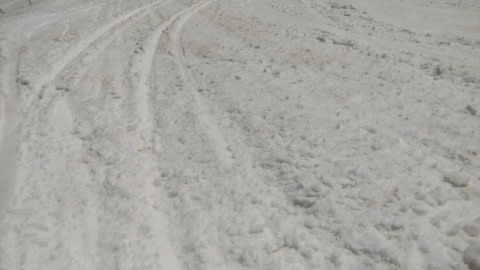

# いつもと違って朝更新！4月28日(木)の志賀高原スキー場特派員写真いっぱい！

📅 投稿日時: 2022-04-29 11:01:54

🏷️ カテゴリ: [日記](cc4b5682fb7b8b144980957a978653fb0.md)

たぶん，このBlog読者1億3000万人中，

2億人くらいの人が，

「GW初日だし，Skier_Sは志賀に行っているよね」

と思っていることだと思いますが…

実は今日はスキーに行ってません…

ええ．

行ってません．

いや．

ちょっと残り仕事をやっつけたり，

3回目のワクチン接種やら，

タイヤ交換とかをやっちゃいたかったし．

スキー板のワクシングも最近時間がなくて

できて無かったし．

そもそも睡眠不足を一回リセットしよう…

というのもあり，

今日はスキーに行かなかったんです…

が．

今晩雨で，もしかしたら深夜は雪が

ちらつくかもしれないし．

明日朝は気温が冷えるので，

路面が凍結しそうで．

スタッドレスは交換しない方が良さそう…

ってなことで．

せっかくタイヤ交換しようと思っていたのに，

その目論見は外れました(泣）

あさイチにワクチンを打ってきたので．

これから家で仕事やっつけます…

とりあえず，明日から志賀高原入り

予定ですが．

昨日木曜の志賀高原の写真を，いつもの

おこみん特派員が大量に送ってください

ました～！

水曜は午後から夜にかけてかなりの

雨になったようですが…

木曜朝は晴れ！

でも，朝から気温は高く…

シマシマはきれいだったけど，

朝から緩い雪だったようです(涙）

…しかし．

水曜の雨のせいで，かなり雪がやられちゃったようで．

先週クローズになった焼額のオリンピックコース，

もうかなり土が出てきましたね（泣）

そして，一の瀬ファミリー正面．

え？

土が出てきてる！！

今シーズンはかなり雪が多かったのに，

4月の雪の融けるスピード，早すぎ…(涙）

でも，奥志賀はまだゆきがたっぷり

ありそうですね…

雪解けが早いシーズンだと，GW前半で

土が出始めるエキスパートコース．

まだ全然土が出てくる気配はないですし…

焼額も，GSコースはまだ大丈夫そうですね！

一か所だけ，コース幅を狭めて

雪寄せしてあるところもありますが…

それ以外は，まだコース幅いっぱい

滑れそうな感じ！

このあたりはまだ真っ白で，コース外も

土が出てきてないので全然大丈夫かな．

あと1週間ちょい，5月8日まで

なんとか無事もってほしい…

焼額で一番ヤバいのはここかな．

パノラマ-サウスコースから第1ゴンドラに

戻る連絡路部分．

コース幅が半分に…(泣）

ここはGW最後までもつかどうか…

ちなみに，この日の雪質は気温が高かった

のもあり，激重のドロドロした感じの

雪ですね…(涙)

まぁ，この時期．

早朝以外に，雪質を期待してはいけません．

で．

今日，29日の志賀高原は．

午後は雨になりそうですね…(泣）

夜は一時強く降り，

夜中は雪になるかも…！

そして，明日土曜の朝は冷えそうなので．

路面凍結に注意！

早朝は冷えるので，意外といいコンディションで

滑れそう…！！

…でも，昼は晴れて気温も上がり，

板が滑らない雪になっていきそう…

そして，1日の日曜は…

午前中は大丈夫そう．

午後から雨になりますね(泣）

山頂付近ではみぞれ～雪かも？？？

午後は意外と寒いです．

2日は曇り～晴れかな？

朝は冷え込んでくれそう！！

気温は低めです．

3，4，5日は雨の心配はないけど…

4，5は気温が上がりそう．

とりあえず．

前半の30，1，2日は天気は悪いものの，

意外と冷える3日間で．

中間の3，4，5日は天気は回復するものの，

気温が上がる3日間でしょうか…

私はまた明日から，志賀高原に復活します～！

## 💬 コメント一覧

### 💬 コメント by (ikkun)
**タイトル**: Unknown
**投稿日**: 2022-04-29 15:10:43

(^-^ゞ人間の証( *´艸｀)私しもでしたが三回目はヤバいらしいのでと擁護( *´艸｀)ちなみに午前中アカカンでした❗下まで滑るのは無理でしたが……山頂リフトが途中から💖不整地をいけて良かったですが枝がヤバいのです❗追伸345どこか熊ですm(__)m

### 💬 コメント by (Skier_S)
**タイトル**: ＞ikkunさま
**投稿日**: 2022-04-29 20:36:10

三回目打って，今腕が痛いです．

熱は出てないので，明日は無事志賀に行けるかな？

3，4，5は熊ですか．

私は焼額の呪いがあるので，焼額の予定です…

### 💬 コメント by (m&t m)
**タイトル**: Unknown
**投稿日**: 2022-04-29 20:46:43

今、寝ぼけていたのか？

車の試乗記をみたような気がする・・・

明日はヤケビ早朝行きます⛷

### 💬 コメント by (Skier_S)
**タイトル**: Unknown
**投稿日**: 2022-04-29 21:17:08

>m&tさま

書きかけの記事晒しちゃいました…(笑)

後ほど再投稿します！

