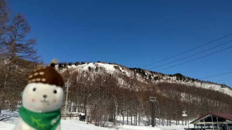
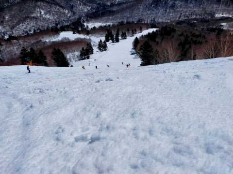
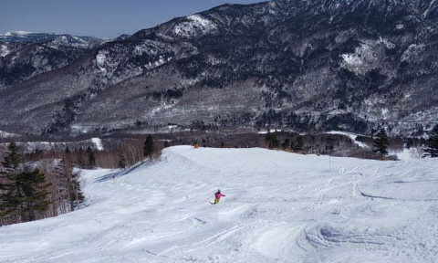

# 今日の志賀高原はめちゃくちゃ気温が上がり，GW後半並みだったみたい…そして3月25日の土曜は雨は降らずにギリギリもつかも？

📅 投稿日時: 2023-03-23 03:24:35

ってなことで．

仕事がかなりクリティカルな状況で．

とてもBlogを書いている暇がないので，

短めに更新！！←それでも更新するのね…

とりあえず．

今日の志賀高原特派員からの情報は．

すごい気温が上がったようです（激泣）

志賀高原の3月で，朝から+8℃って

どういうこと？？

これ，GWより気温高いよ（泣）

さらに終日晴天で，一日中容赦なく

日が照り付けたので．

一応あさイチはシマシマだったみたい

だけど…

朝からユルユルのシマシマで．

すぐに，エッジが潜っていくような

GW後半のザブザブ雪になり，バーンは

荒れていったみたいです…(泣)

そして，かなりの部分で妖怪板掴みが発生

したみたいで．

全然楽しくなかったみたいです…（泣）

とても3月と思えない…（激泣）

そして．

今日は水曜深夜なので，週末の天気の

予想をするところですが．

あまりにも睡眠が足りていなく．

天気図を解説する気力がない…

とりあえず．

それでも天気の概要だけは書く！！

えらい！！

えらいぞ，自分！！

（こうやって自分を誉めないと書く気力が起きない）

23日(木)：朝から気温は高く，

　昼前から雨．

　降り始めはポツポツ．

　昼過ぎからパラパラという感じの

　降りか…

　ザーザーぶりにはならなさそう．

　昼過ぎからはずっと降り続ける．

24日(金)：朝には雨は上がる．

　もしかしたらリフト営業開始後まで

　雨が残るかもしれないけど，

　午前中には止む．

　朝から気温は+5℃以上と高く，

　雪は緩いザブザブ．

25日(土)：朝は0℃前後．

　昼間は+5℃以上まで上がる．

　曇ったり晴れたり．

　もしかすると一瞬雨がぱらつくかも？

　雪質に期待してはいけない．

　日が射すとストップ雪になりそう…

　むしろ雨が降った方が板が

　滑っていいかも．

26日(日)：朝は0℃前後．

　曇り時々液体がぱらつきそう(涙)

　昼間は+5℃くらいまで上がり，

　雪は水を吸ったザブザブ．

　期待してはいけない．

　

という感じで．

26日までは暖かい日が続きます…

そして，25日は液体が降る確率はかなり

低くなったけど，

やはり26日は液体が降ってきそう(涙)

あぁ…

ダメだ．

この週末まで，ものすごい勢いで雪が

解けそう…

3月というのに，4月か5月並みの気温が

続いているけど．

多分神様が3月と4月を勘違いして入れ替え

ちゃっただけで，

今度は4月と5月に，3月並みの気温が

やってくるに違いない

と，楽観的に期待しておこう…←んなわきゃないから

## 💬 コメント一覧

### 💬 コメント by (レインボー75)
**タイトル**: Unknown
**投稿日**: 2023-03-23 04:14:44

水曜日の志賀高原情報

今日も私は野球で休場。私が野球情報を報告してる間に、特派員から来た情報を一部抜粋で！

8時47分:奥志賀は キレイにピステンが 入ってますが、もう ザクザクです

8時59分:朝イチからオリンピックは(ザクザク写真)。滑走性は今の所良好ですけどね。

楽しいのは、あと数本かなといった感じ。

9時08分:夜圧雪したのか、唐松が硬めでメッチャいいですよ！！

9時09分:シラカバもgood

10時48分:奥の第１ゲレンデも 妖怪が 出て来た

10時49分:寺子屋はまだ大丈夫

11時06分:7回を終わって3:1、８回はダルビッシュ。最近不調なので少し心配。９回は大谷みたいですね

11時37分:今永、戸郷、高橋、伊藤、大勢、ダル、大谷の豪華リレーこ

私は、エビス、志賀高原、本麒麟の、リレー

11時43分:もう仕事になりませんでもこの解説で見てる感じ

11時45分:優勝

12時55分:志賀高原は、めちゃくちゃがらがらだったそうな。

15時27分:中野市23℃

### 💬 コメント by (レインボー75)
**タイトル**: Unknown
**投稿日**: 2023-03-23 10:00:11

木曜日の志賀高原情報

WBCが今日ならよかったのに！

朝の上林+10℃　蓮池+7℃。あっかーん！

南南東の風12~13mで、奥ゴン、いちごん、ニゴン、全て運休。横風だから納得。四ロマに乗ると陽がさしだした。唐松は柔らかくてスピードが出ない。おまけに強烈な向かい風。楽しくない。雨は降ってないのに、雪面の水分が巻き上げられてゴーグルに。ちっとも楽しくない。それでも勇者は9時40分まで耐えて終了。サウスで両手開きのタイタニック滑りをしたら、やっぱり止まりましたよ。

昼は麓の関英ドライブインにしよっと。

今日は仕事に励んでおられる皆様が正解でしたよ。

### 💬 コメント by (Skier_S)
**タイトル**: ＞レインボー75さま
**投稿日**: 2023-03-24 03:34:44

9時40分までですか…1時間ちょいで退散しちゃうほどの悪コンディション

だったんですね…

なんだかこの3月は気温が高すぎて，全然ダメな感じですね…(泣)

