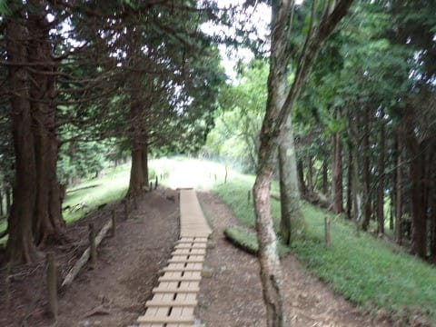
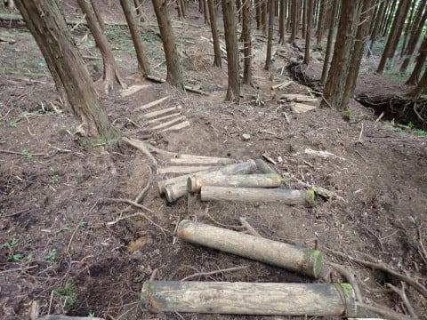

# 丹沢山系，塔の岳⇒丹沢山⇒蛭が岳を往復してみた　その3

📅 投稿日時: 2023-08-05 01:49:17

（[前回](ecb4a5b801a79983a5ff16313e8ef1172.md)から続く）

…ってなことで．

丹沢山→蛭ヶ岳→丹沢山と往復し，

下山の中間点，塔の岳までやってきましたが…

ここから先はほぼ登り返しがない下り！

下りは心拍数が上がらないので，

ペースアップできるよ！

塔の岳でも10分ほど休憩し，

11:14に塔の岳を出発！

ところどころ急なところもあるものの．

かなりペースアップできる，緩やかな

快適な下りが続く道をひたすら飛ばし…

塔の岳から25分で，天神尾根分岐に

到着！

昨年あたりから，体力や筋力をほとんど

使わない下り方を覚えたので…

バテてても，体力がいらない下りなら，

かなりいいペースで降りられます…！

で．

ここからはメインストリームの大倉尾根を外れ，

天神尾根を降りますが…

かなり荒れた道で，めちゃくちゃ急坂！！

写真だと斜度感がわかりませんが…

足場の悪さもあり，一歩一歩確実に

足を進めるのが精いっぱいで，

とても走るとかいうのは無理な

下り坂．

…この写真の，垂直に立ってる

フェンスの支柱を見てもらえれば，

斜度感がわかるかと…

足場の無茶苦茶悪い悪い急な下りを，

一歩一歩ゆっくり降りるので…

まったくペースは上がらず（涙）

大倉尾根から分かれてから，足場の悪い

急斜面をゆっくりゆっくり降りること，

約50分…

距離的には30分で移動できる距離なのに，

かなり時間がかかりましたが．

蛭ヶ岳山頂から3時間27分で，

何とか12時半前に下山！！

無事，戸沢駐車場に帰り着きました…

…うーん．

昼前に戻ってくる予定だったんだけど…

昼を30分すぎちゃった…

しかし．

塔の岳→丹沢山→蛭ヶ岳往復，

7時間半もかかるとは思わなかった…

実際の山行時間は6時間32分らしいけど．

丹沢⇒蛭が岳の間のコースを舐めてた．

かなり疲れました…

丹沢～蛭ヶ岳まで，結構なアップダウン．

それもいやらしい階段が続き…

かなり体力に来ました（涙）

距離21.4km，標高差2227mって…

阿弥陀岳に2回登り返した，

阿弥陀⇒赤岳⇒阿弥陀岳ピストン

より，距離も標高差もありますね．

それは疲れるわけだ…

そのせいで，帰りは完全にスタミナを

使い切ってしまいました…

ってか，帰りスタートして1時間くらいで

スタミナ残1％になってて，スタミナ

使い切っちゃってますね…

（帰りのスタミナグラフ）

平均気温33度，

最高気温37度というのもスタミナ消耗に

効いた感じ…

この時期に気温が高い低山を歩くもんじゃ

ないですね（泣）

熱中症になるかと思った…

今回も，下のグラフの緑の印で示したように，

行きの平均心拍は151と，いつもの心拍150

キープだったものの…

これは，途中塔の岳の休憩も含めた平均値．

最後，水色で記した部分みたいに，

15分ほど心拍170越えで追い込んてしまった

のがバテた原因の一つかも…？

今回．

帰りでかなりバテてわかったのは．

私が心拍150キープでハイペースで

移動できるのは4～5時間が限度かな．

4～5時間を越えるときは，145くらいに

落とさないとダメなのかも…

ってなことで．

暑さによる脱水と，

消費カロリー3700kcal以上

という激しい運動のおかげで．

家に帰って体重計に乗ると…

うげげげげげげげっ！！！！

体重がベストから‐5kg！！！

…これはヤバい！

体重減りすぎてる！！

こんな低い数字，見たことない！！

…ということで．

帰宅してシャワーを浴びた後．

体重を全力で戻すべく．

そのまま娘を誘って電車に乗って，近所の

デザートビュッフェに出かけ，

必死にカロリーを摂取してきたのでした…

いや．

実はこの山登り．

私の好きなデザート類を罪悪感なく

いっぱい食べるための言い訳だったのか

もしれない…

PS.

めちゃくちゃお腹が減っていたので，

ケーキ類だけじゃなく，パスタやらカレーやら

アイスやらなにやら死ぬほど食った…

ビュッフェの元を取るために，食事前に山登りするのは

おススメ！←誰も真似しないって…
