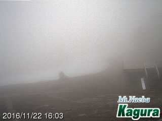
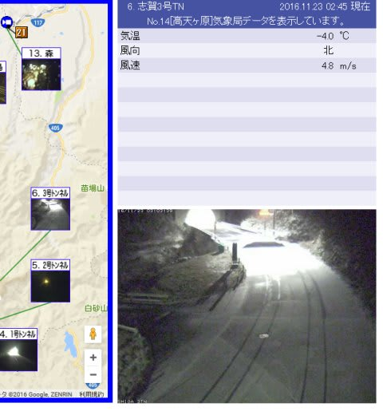
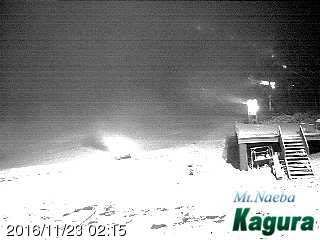

# スキー場は冷えだしてきたよ！25日までは冷えるよ！…でも．私は明日，スキーに行けるのか？

📅 投稿日時: 2016-11-23 03:48:22

🏷️ カテゴリ: [日記](cc4b5682fb7b8b144980957a978653fb0.md)

ということで．

昨日の記事で，

かぐら・白馬方面は時折雨がぱらつくかも？

終日人工降雪機の稼働は期待できず．

と，予想した通りに．

今日のかぐらは時折霧雨っぽくなり…

全く，人工降雪機は動かせなかったようです（泣）．

でも．

安心するのだ，皆のもの！

かぐらや志賀は，前夜降り始めた雨が，深夜に雪になり．

朝にかけて積もる！

（中略）

ガンガン人工雪が打てる．

と，予想した通りに…

つい先ほど，志賀も雪が積もり始めたようですっ！！

そして，かぐらでも夜中2時ごろから，

人工雪を打ち始めましたよ～っ！！！

はいはいはいはい．

待ちに待った冷え込みが，

ついに来ますよ～！

23，24，25日は終日冷えて．

朝も昼も夜も，人工降雪機フル稼働できますよ～！

天然雪も少しだけど降りますよ～．

はっはっは．

そう．

その通り．

これもみなすべて．

[この日](e1146fd76c0bf0731d4d131d90511a8d8.md)から，私が必死に休むことなく踊り続けている．

「今週はもう仕方ないけど，せめて23日以降

　ガンガン冷え込んで，来週26日以降は

　たっぷりの雪で滑れるよう神々に捧げる踊り」

のおかげなのだっ！！！

このおかげで，ちょうど23日から雪が降り始めたのだ！

私の力が，天気を決めているのだっ！

皆のもの，感謝するのだ！！

…

…

あ，痛い！

石を，

石を，ぶつけないでください…っ！！

（読者からの大量の怒りの投石に埋まっていくSkier_S）

…

…

し，失礼しました…

（ぼこぼこになりながら）

…で．

明日ですが．

また，スキーに行けなさそう…（涙）．

家族の体調が昼ごろまでに快復すれば．

Yetiのナイターだけにでも行っておきたい

ところだけど…

もし，運よくナイターに行けたら．

また明日，Yetiレポートします…
