# 12月21日の志賀高原は…午後から大雪．夜はすさまじい降りに…！

📅 投稿日時: 2013-12-21 22:09:39

🏷️ カテゴリ: [2014スキー滑走日記](c992167609b6415052179ee69ea1ea7d8.md)

えー．

本日の志賀ですが．

現在，夜10時．

すさまじく降ってます．

夜7時に雪をどけたのに，2時間で車がこんなに…

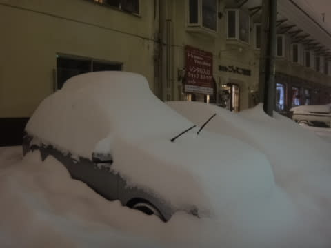

2時間で30cm以上！

これは…明日はパフパフに違いないっ！！！！！←車が無事出せるのか…という心配はしないのか？

で．

今朝は．

中野の街中からすでに積雪があり…

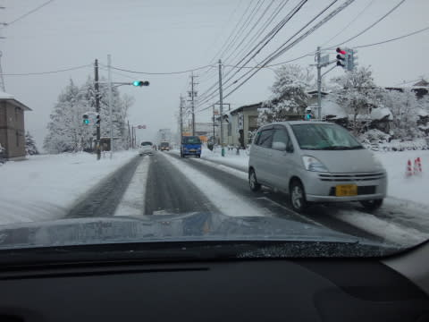

ゲレンデに出ると…

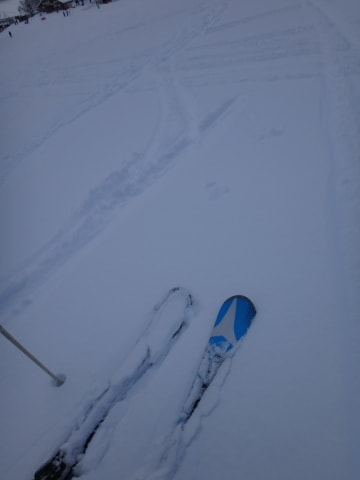

うはは．新雪だ！

そして．

本日から，待ちに待った焼額第一ゴンドラ運転開始です！！

第1ゴンドラに乗ると，日が射してきて，超テンションアップ！

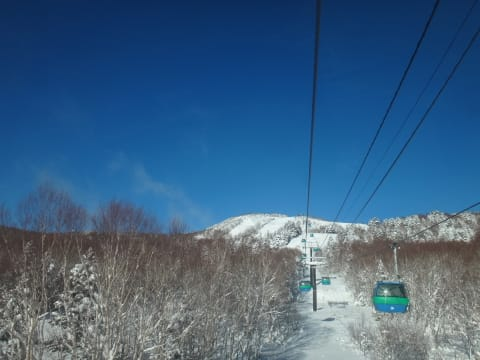

ただいま～！

第1ゴンドラっ！！！

7ヶ月ぶりっ！

…ゴンドラからの景色は．

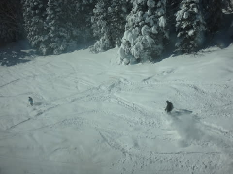

…うひょう．

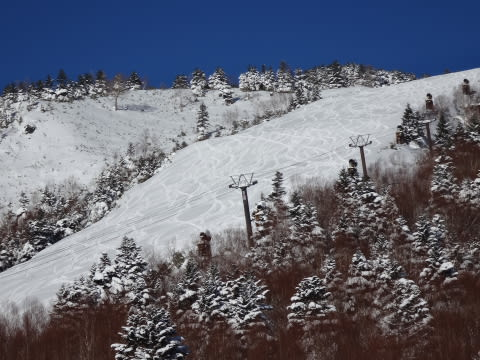

うはーーーっ！

じゅるるるる(よだれがたれる音)

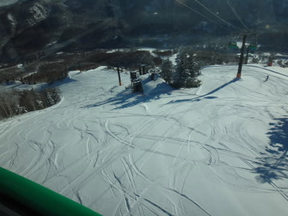

どひゃーっ！

は，早く山頂について滑りたい…

急げ，急ぐのだ，第1ゴンドラっ！加速だっ！←しないって

ゴンドラの中で，悶絶の足踏みをしつつ山頂に着くと…

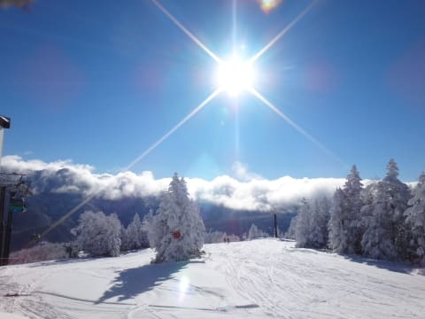

うほーっ！！！！！

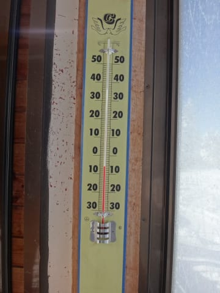

気温もしっかり低く．

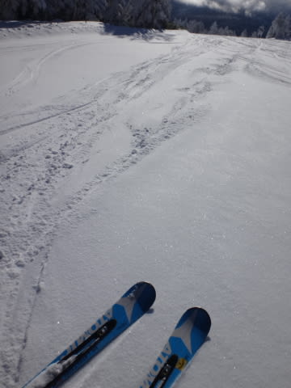

雪は最高っ！

ぐははは！これだ！

これは最高だっ

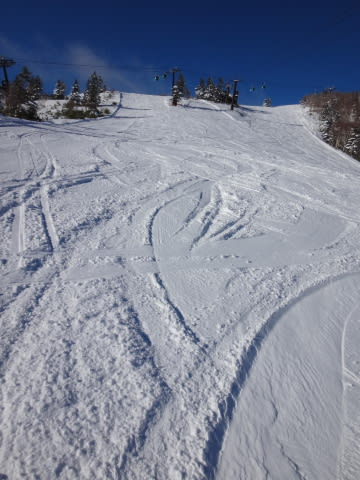

この瞬間のために生きてきたんだね…

神様ありがとう～．

…

でも．晴れていたのはわずか1時間ちょっと．

10時過ぎには雪が降り始めました(ちょっと涙)．

さらに．

昼間は娘と遊んでいたので…

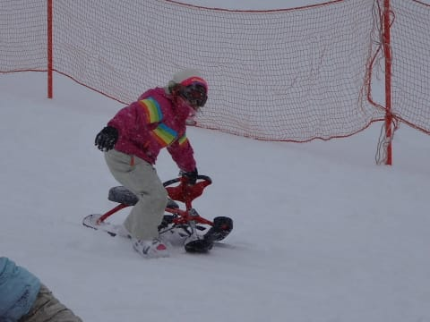

(本日オープン日でキッズパーク無料，ってのに惹かれてひたすら

　そり遊びの娘．スキー滑ろうよ～(お願い）)

再びゲレンデに復活したのは，午後遅く．

…うむ．

なんだか，雪がかなり降っているんですが…

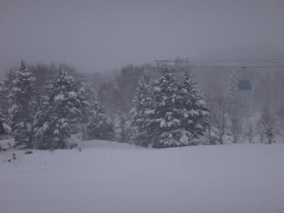

雪がもそもそして，でこぼこが見えず滑りにくいんですが…

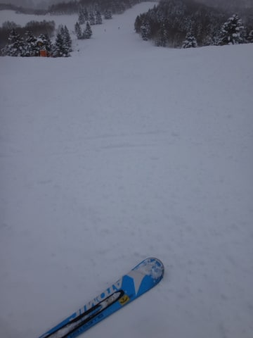

うーむ．

午後は結構降ったので．

新雪が積もった日の午後の定番として．

もさもさ荒れあれで，ちょっと難しいゲレンデコンディション

だったかな～．

まぁ，ゴンドラもリフトも待ちが0で，ガラガラだったので

良しとしておこう．←何様だ

で．

当然．

本日から営業開始のナイターに行くわけですね．

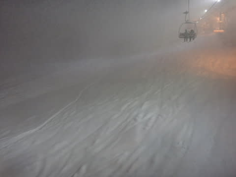

…ナイターのときは，さらにものすごい激降りに．

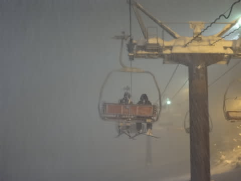

…でも．その代わり．

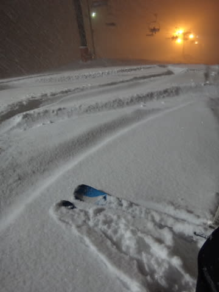

うむ．

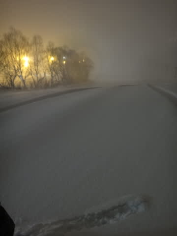

うむむむむっ！

そして，さすがこんな悪天候では人が出てこず．

滑っていたのは数人だったし．

雪が降り続けたので．

ナイター終了時でも…

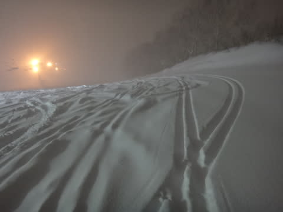

ぱふぱふだったのでした～！！

…今も，相変わらずすごい勢いで降ってます．

一時間10cmくらいの勢いです…

明日は，多分すごいよ…っ！

## 💬 コメント一覧

### 💬 コメント by (komu)
**タイトル**: 凄い雪ですね
**投稿日**: 2013-12-22 20:22:41

富士見は晴天で相変わらずのカチカチバーンでした。志賀高原はやはり良いですね。

トップシーズンに行きたくなりました。

### 💬 コメント by (Skier_S)
**タイトル**: やっぱりこの週末は…
**投稿日**: 2013-12-22 22:30:54

ドカ雪の日本海側がいいですよ！

ぜひトップシーズンの志賀にきてみてください！

