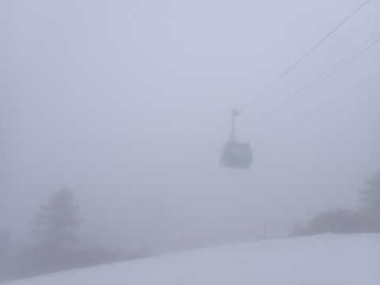

# 2023/4/16(日)の志賀高原スキー場，速報レポート！…早朝は雨だったけど，通常営業から晴れ！午前は晴れ時々曇り，午後はうす曇り

📅 投稿日時: 2023-04-17 01:09:17

ってなことで．

本日は日帰りで志賀高原へ行ってきました～！！

いや…しかし．

朝3時に家を出て，帰宅は深夜0時近く

という強行日程だったので，かなり眠い…

今週からは，焼額山は第1ゴンドラ1本のみの

営業となり，滑れるコースも

・GSコース

・パノラマコース

・パノラマインコース

の3本だけで，雪も結構減ったけど…

でも…ガラガラで雨も降らず，

雪も予想ほどひどい状況じゃなかったので…

無理してでも日帰りで行って良かった！

とりあえず．

今日は早く寝たいので…本日の志賀高原の

状況を速報モードにて！

えー．

まず．

あさイチの志賀高原への登り坂．

かなりの雨なんですが…(涙)

今日はやっぱり雨降りの中滑るのか？？

と，恐れていたところ．

一の瀬に到着するころには雨も上がり，

日も射し始めてきました…！！

が…

一の瀬正面バーン上部．

一見すべて真っ白に見えますが…

真ん中あたり，圧雪されてない部分が

見えますよ…？？

…これって，昨日からの雨で，

圧雪できないほど雪が薄くなったって

ことだよね！？？（涙）

いや…

一体，先週からどれだけ雪が減ったのか？？

と，戦々恐々として，通常営業開始の

8時の焼額第1ゴンドラで山頂に登りますが…

やっぱり，ブッシュ出てますよね…

ってか，コースはホントに大丈夫か？？

しかし．

ちょっと前まで結構な雨だったのに…

8時にはすっきり晴天になりました！！

…気温は朝で+3℃と高かったので，

日が射すと滑りが悪い雪になるから，

日が射さないでいてくれた方がいいんだけど…

でも，いい感じの晴天で．

コースも予想よりずっと雪が残っていて，

ちょっと安心…

そして，あさイチはフラットで人もいなくて，

板もそこそこ滑ってくれたので…

これ，楽しいよ！！！

この週末は壊滅的天気＆雪だと諦めて

いたので，これは嬉しい誤算！！

でも．

パノラマコース側から1ゴンへ戻る

通路は，結構狭くなってて，

貼りつく雪というほどではないけど，

ちょっと滑りが悪めの雪．

プリンス東館前の通路も…

ちょっと狭くなってて，汚れの多い

雪でしたが…

でも，雪が悪いのはこのあたりと，

あとはGSコースの右カーブのあたりだけ．

もっと壊滅的な状況を予想していたので．

予想よりはかなりいい感じですよ！

そして，春休みが終わったこの時期なので，

ゴンドラは朝からガラガラだし…

ちょっと昼過ぎは一瞬ガスが出ることもあったけど．

昼前後からはうす曇りになり，

バーンはしっかり見えるけど，強い日差しで

雪がドロドロになって板に貼りつくこともない

という，ちょうどいい感じの天気になり．

ちょいと滑りが悪めのところもあるけど，

意外と板は滑ってくれて，

人も少なかったのでゲレンデもそれほど

荒れなかったし…

今日も15:30のラストまで，しっかり楽しめ

ました～！！

いや…

良かった．

予想よりはずっと良かった…

無理して日帰りで行って良かった…

そして，月曜はかなり冷えてくれそう！！

…でも，雪はパラパラ程度で，積もるほど

降ってくれなさそうだし．

月曜は，かなり硬いガチガチバーンかも…？

とりあえず．このままならあと1週間．

次の週末までは，なんとか行けそうな

感じかな…！！
