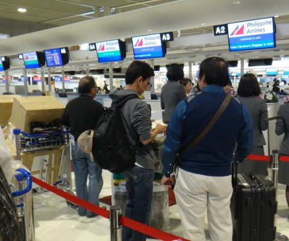
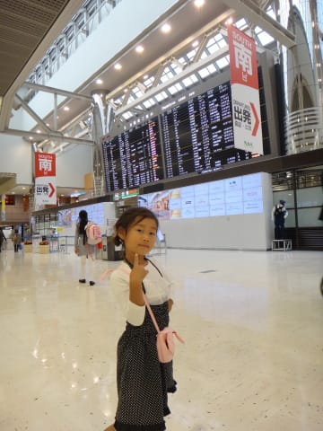
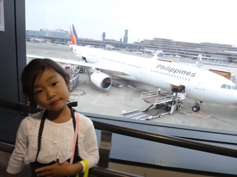
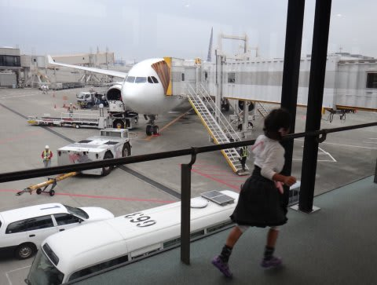
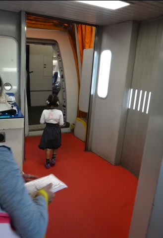

# 2013年11月　フィリピン・オスロブ　子連れでジンベエを見るぞっ！　その1

📅 投稿日時: 2014-07-05 01:38:50

さて．

今回の旅行．

娘は5歳の幼稚園年長さんで．

かなり言うことも聞いてくれるようになったし．

さらに．みなさんご存知のように．

スキーやら旅行やらに連れまくっているわが娘，

長距離移動も異常なほど慣れていて．

船や飛行機にも強いし（というか，大好きだし）．

そのうえ外泊も慣れていて，どんなところでも

寝てくれて．

で，どこに行っても，だいたい現地の

ものを食べてくれる…

という．

チョー手間のかからない娘に育ってくれたし．

さらに，海かプールで泳がせておくだけで，

一日中機嫌よく過ごしてくれるという，

私に似た超アウトドアな遊び人に育ってくれたので．

特別にもっていくものの何もいらず．

だもんで．

娘のウェットスーツとシュノーケリングセット，

あとは暇つぶしの，折り紙と落書き用メモ帳＆ペン程度，

そして，私のPCとスマホに，いくつかの子供用番組やら

映画やらをダウンロードしてもっていけば．

それ以外は何も特別なものをもって行かなくても

良いという．

あー．

楽な娘に育ったものよ…

＃そう育たざるを得ない環境に置き続けていたので，

＃こう育ってしまった気もするが…

って感じなので．

もう，子連れ海外と言っても，何も気負うことも

なく，出発当日を迎えます．

んで．

今回利用したのは，成田発のフィリピンエア，

セブ直行便にての現地入り．

…最初のころは．

空港に着くまで寝かせず，飛行機でしっかり寝てくれるように

気を使ったものよのお…

と．

遠い昔を思い出します…

それが幼稚園に入ったころから．

飛行機に乗ることを，心待ちにするようになった娘．

空港に着くと．

「ヒコーキ！ヒコーキっ！！！

早くヒコーキ乗ろうよ～っ！！」

と，いつも通りのハイテンション．

分かった．

わーかったから…

と，飛行機を目の前にして我慢できない娘を，

搭乗時間まで抑え込み．

午後2時過ぎに，いざ搭乗！

…したわけなんだけど…

あれれ？

（続く）
