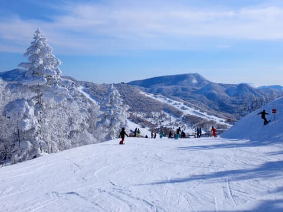

# 2024シーズンの全滑走日記！後半…2月から6月まで，奇跡の3月＆ダメダメ4月，早く終わったGW以降

📅 投稿日時: 2024-07-09 01:00:32

前回は，[2024シーズン全滑走日記の前編](e12143e62fca12807a00e900d983415a5.md)を

記事にしましたが，今回は後編です！

…雪不足でスタートも遅かった今シーズン．

1月後半は何とか冷えて雪が降ったものの，

雪の量は少なく…

そして，2月にはほとんど雪が降らない

異常気象（涙）

その後，奇跡の3月でほぼ平年並みに

近い積雪量に戻り，2023シーズンより

マシな状態になって安心したけど…

平年比+3℃という超高温の4月で，

普通なら余裕でGWまで行ける積雪が

あっという間に融け，GW前に次々

スキー場が死んでいき．

焼額は何とかGW最後まで営業したけど，

その後GW以降はかぐらも月山も，

いつもより早く終わっちゃいました…

ってな感じの2024シーズン後半の滑走日記です！

…しかし．

一見短い記事だけど…

これだけリンク張りまくる作業をやると，

普通の記事3本分書くくらいの時間が

かかってます…

面白くはないけど，地味に手間が

かかっている記事なんです…（涙）

2024/2月

[2/3（土）　1泊2日　志賀高原焼額](e959d8756a5a53a1770310c565d376dc6.md)　2024シーズンで珍しい好コンディション！！午後は晴れで締まったいい雪でラストまで大回りOK，人は多めだけどリフト待ちは少なめ

[2/4（日）　1泊2日　志賀高原焼額](ebf7f96c0b43650f27fa00f6226a255ab.md)　　ちょっとガスが出て気温は高めだったけど，さすがにこの時期氷点下キープなので雪は緩まず．でも，雪は硬めでそろそろ新雪が滑りたい…（速報は[こちら](e7fc1e0b79602a5ee5a4e7f945a0577eb.md)）

[2/11（日）　1泊2日　志賀高原焼額](ece89c09acf2d1da80583a4d1559ff4c2.md)　　3連休2日目からの参戦．久々の新雪10cm！3連休なので混んで午後はボコボコに．

[2/12（月・祝）　1泊2日　志賀高原焼額](eb0cef000f315c25dc05ef129145df574.md)　　積雪5cmながらも冷えた雪が積もって，2月の志賀高原らしいコンディション．このころはまだ平和だった…（速報のみ）

[2/17（土）　1泊2日　志賀高原焼額](eed2ae4e635005cacdb8e0ed0a40781e1.md)　　晴れなのはいいけど，2月の志賀であり得ない昼間の気温山頂でプラス越え（泣）3月後半の春スキーみたいだったよ（涙）

[2/18（日）　1泊2日　志賀高原焼額](e5aed5f7e6ffc3dbd043e7afb58a9b8c9.md)　　山頂で＋5℃という2月と思えない高温で，4月並みの雪（涙）．ところどころブッシュも出始め，ダメダメ2月が本性を現し始める（速報のみ）

[2/24（土）　1泊2日　志賀高原焼額](efeb100c28beb2f15f43e9fa370469aa3.md)　　雪不足でオリンピックコースがクローズ！ブナやGS下部もブッシュが大量に…この日は気温が上がったけど雪はまぁまぁだったのに，圧倒的に雪が少なく残念…

[2/25（日）　1泊2日　志賀高原焼額](ea9ddff4332c9829add631ecc801b3aca.md)　　昨日高温から冷えてガチガチアイスバーン，強風で11時ごろ第1・第2ともゴンドラ運休になり．吹雪の中リフトで凍えたうえにガチガチバーンを滑らさせられる残念な一日(涙)　（速報のみ）

2024/3月

[3/9（土）　1泊2日　志賀高原焼額](e38e5f04ec8e2930f4bd8fd786e91708f.md)　　冷えて積雪20cm！終日冷え冷え，2月よりトップシーズンらしい冷え冷えでガラガラな一日！

[3/10（日）　1泊2日　志賀高原焼額](e8f5434da1ec2b83d686d386905108d0e.md)　　一晩で積雪50cm！午後は荒れたけど冷え冷えで3月なのに2月より2月らしい雪！この2日の積雪でオリンピック・SGS・ミドル・イーストコース再オープン！（速報は[こちら](e3cef4235c7a7c423157e6a62f87c1fdd.md)）

[3/16（土）　1泊2日　志賀高原焼額](ea4630d93ba9d52aadd73985f0b929eb5.md)　　直前にドカ雪が降って下地が冷えてたからか，最高気温+5℃の快晴なのに，雪が緩まなかった不思議な一日！良かったよ！！

[3/17（日）　1泊2日　志賀高原焼額](e6274a04f57c0ba61459c910df2081661.md)　　気温は高めだけど曇りでそこまで雪は緩まず．焼額は良かったよ！（速報のみ）

[3/23（土）　1泊2日　志賀高原焼額](ee4a2cb1ae949202f4f63c41087f41b2e.md)　　雨になりそうな予想だったけど，雨にならず激しい雪に！午後はかなり湿った雪だったけど積もってくれて，夕方から晴れ

[3/24（日）　1泊2日　志賀高原焼額](ecb77dc406846b19d9b4026e7a49e5cd4.md)　　暑いくらいの晴天の1日だけど雪はザブザブにならず．ガラガラで楽しめたよ！ここしばらくの積雪で，雪の量は平年並みくらいに戻ったか？（速報は[こちら](ea86503413f6199030cd14f0f59fd9dc9.md)）

[3/30（土）　1泊2日　志賀高原焼額](e2a5ed4dd83a57bd772f5f759c158bcf7.md)　　晴天＆高温の春スキー．昼間はちょいと滑りが悪い雪になったけど，夕方は回復．…でも，奇跡の雪降り3月も終わって，また高温に戻ってきたな…（涙）

[3/31（日）　1泊2日　志賀高原焼額](e4723abb797c9d9d10b20fac40579c682.md)　　朝から気温はかなり高くあさイチから緩んだ雪(泣)．昼間はGW並みの激烈高温ザブザブ雪，緩斜面は滑り悪め．午後はバーン荒れたし，奇跡の3月は終わったようだ…（速報は[こちら](eb2546c33b6cca84d6484b65f36e9ea268.md)）

2024/4月

[4/6（土）　1泊2日　志賀高原焼額・一ノ瀬](efe60c86f366e3f4758f14f70351122d2.md)　　終日晴れ＆異常高温．朝はそこそこ冷えて日が当たらない西斜面は午前は硬かったけど，日が当たるところはザブザブ，

[4/7（日）　1泊2日　志賀高原焼額・一ノ瀬](e9404b627f3d55178ac828e7a5d221ba4.md)　　終日晴れで激烈に暑い一日．朝は雪は良かったしストップ雪にはならなかったけど，昼には全面モサモサ（速報のみ）

[4/13（土）　1泊2日　志賀高原焼額](e6f610d9d6a712a147d70abd75a455c3d.md)　　先週に引き続き終日晴れでGW並みの暑い一日昼には雪はかなり緩んだけどガラガラなのでそこまで凸凹にならず

[4/14（日）　1泊2日　志賀高原焼額](e286f9ec45765c65abc27d3ed917c78a2.md)　　この日も夏かと思うほど暑かった，異常な4月．でも早朝はかなりGood！昼間の雪はかなりザブザブに．奇跡の3月のおかげで雪はまだまだあるのにこの日で第2高速終了（速報は[こちら](e85ded82127426338e3629022e4708f0f.md)）

[4/22（土）　1泊2日　志賀高原焼額](e31d756bf9e10e5882923cc2dfda0992d.md)　　この日も気温が異常に高いダメダメ4月．朝はいい感じで締まり気味，昼は日差しが弱めでそこまでひどくならず．GSコースは雪寄せされたけど，異常高温にしてはまだまだ雪はある！

[4/21（日）　1泊2日　志賀高原焼額](eb0f5095caa7d1f8e473072c059dba7a3.md)　　曇りだけど昼間に1時間ほど雨（泣）日が射さなかったけど気温が高く午後は緩んで楽しくないバーン状況（泣）4月は気温が高すぎるけど，まだ第1・第2のゴンドラ2本運転！（速報は[こちら](e594a2e2a8b3cc3d0ed8cb6056ae2c99e.md)）

[4/29（月・祝）　3泊4日GW　志賀高原焼額](eb796158198ce28d840218672e50f512f.md)　　晴れのち曇り，この日も激烈高温（泣）．GSコースは明日で終了（涙）サウスコースはまだいける！この高温4月で良くここまで雪がもった…

[4/30（火）　3泊4日GW　志賀高原焼額](e051f81cd3a9e63c08d186b9280094f5c.md)　　曇り時々小雨，GW谷間で激烈ガラガラ，午後まで雪は荒れず緩斜面以外板も滑ったけど，この日で第1ゴンドラ終了．パノラマサウスはまだ行ける！

2024/5月

[5/1（水）　3泊4日GW　志賀高原焼額](e5e81c5d29e6220e8e208cff47e98cc5e.md)　　この日も気温が高めで曇りのち小雨．雨はそこまで降らず雪はそんなに解けてないよ！GW谷間で人がいない…

[5/2（木）　3泊4日GW　志賀高原焼額](e0d63086c0db19cacbbf63baa2fef7ca6.md)　　翌日から4連休のGW谷間最終日，気温は+10℃近く，ダメダメ4月ほど暑くないけど冷えてない（泣）そろそろパノラマ上部はヤバい感じだけど，GW4連休もぎりぎり第2ゴンドラ行けそうか？

[5/6（日）　GW日帰り　志賀高原焼額・横手山](e61180fefb1c0849299fcdd8aeb57381f.md)　　かなりご無体日程でGW最終日のみ日帰り志賀．雪がなくなり焼額は何とか4ロマのみ．焼額山，よくGW最終日まで営業できたもんだ…．強風で渋・横手第2，第3運休で横手は海和ゲレンデのみ．（海和ゲレンデの状況は[こちら](ef17bdae9a4e665d64ba6f61faef7b937.md)）

[5/12（日）　日帰り　かぐらファイナル](e97e4432832867232ca1f3117f3ca90ff.md)　　渋峠もかぐらも予定を早めこの日で終了（涙）．滑れるのはかぐらクワッドメインバーン1本のみ．曇り一瞬ポツポツ雨．コースはかなり混んで昼頃にはコブ溝でかなりひどく土が出たけど，リフトは待ちほぼ無し．（速報は[こちら](e12b6999240721c19d8afa07b0819d4d6.md)）

[5/25（月）　1泊2日　月山](ee2b30ce1fcbaf12a1efcd56d872b7c74.md)　　板を履いてリフト乗り降り可能！天気は午前中は雨，午後は晴れでちょっと寒め．沢コースもまだいけるけど，例年より2-3週間雪解けが早い（泣）

[5/26（火）　1泊2日　月山](eb0d148cb9811c27305b2a93d8fa0a5e1.md)　　終日晴れ，今日も板を履いてリフト乗車可能！リフト待ち最大5分が数回，午後はほぼ待ち無し．午前大斜面は混雑だけど沢コースは圧雪が入ってよかったよ！　（速報は[こちら](ea26c3e20bd077fc1654450560c68d2ba.md)

2024/6月

5/12（日）　日帰り　月山[その1](e0e6f8ceddc2175fee2f726d7fc2ad84f.md)　[その2](e84b5941bb3176aa01c8c0c2fae6e7730.md)　[その3](e242be69c07c8d1bbcb1dd1fe5d723a11.md)　　板を脱いでリフト乗車，ぎりぎり降り場から藪を越えてゲレンデにまっすぐ出られるけど，降り場は下から登る最終形態．大斜面も藪漕ぎが！沢コースも滑れるけど2か所ほど板を脱ぐ必要あり．（速報という名の詳細レポートは[こちら](ee262cc6f3ef77a8d6bfe5cfcce54218d.md)

　

　

## 💬 コメント一覧

### 💬 コメント by (1kamakura)
**タイトル**: Unknown
**投稿日**: 2024-07-09 19:20:25

江戸の秋

スキーシーズンはもうとっくに終わってしまったけど、今年はダイビングは？

私も20代の頃は、冬はスキー、夏はダイビングと、青春を謳歌していました。

下手ですけどね。

なので、Sさんのブログを見る事で私の若かりし頃を懐かしんでいます。

ちなみに私は今年の10月で58歳。

これからもSさんのブログを楽しみにしています。

### 💬 コメント by (Skier_S)
**タイトル**: >江戸の秋さま
**投稿日**: 2024-07-10 02:08:03

今年もダイビング，行きますよ～！

娘が来年受験で，その次は大学生になっちゃうので．

親との旅行ももうあと何回行けるかわからないので，今シーズンがラストチャンスかも？？

と，ちょっと無理な計画を入れてしまいました…

8月中旬に遠征に行ってきます！！

