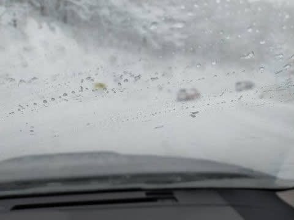
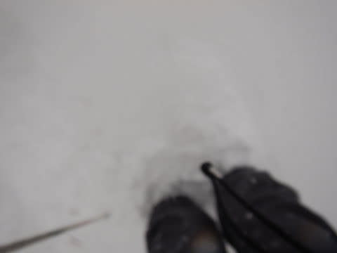

# 2021/12/18(土)の志賀高原焼額山は…朝は積雪50cmオーバー！午後は晴れたけど，強風で昼間はゴンドラ運休．

📅 投稿日時: 2021-12-19 00:02:43

ということで．

今日も志賀高原にやってきました～！

心配された道路状況ですが，

朝7時には上信越道の通行止めもすべて解消され…

志賀高原の登り坂は，かなり視界が悪く，

積雪はあったものの．

朝は除雪も終わっていて，登り坂の

途中で動かなくなるようなこともなく．

いつもより数10分ほど時間はかかりましたが，

それ程焼額の営業開始時間前にスキー場に

到着できました～！

…が．

朝の積雪＆強風のおかげで．

焼額は，第2ゴンドラ強風で営業見合わせ(涙）

さらに，8:30営業開始予定の第2高速，第4ロマンスも

予定が30分ほど遅れ，営業開始は9時過ぎ…

営業開始前，リフト待ちにかなりの列が

並んでます…(涙）

とりあえず．

何とか朝9:10過ぎに準備が完了し，

第4ロマンスリフトが動き出して…

山頂に着くと．

圧雪コースなのに，コースは脛パフ！

これは…とても圧雪コースとは思えない！！

激軽とまでは言えず，緩斜面ではちとブレーキが

かかる雪でしたが…

でも，今シーズン初の膝パフパウダー！！

12月のこの時期に，これだけのパウダーが楽しめるとは…っ！

この日の朝は，ひたすら雪が降り続き…

前も見えないほどの勢いでゲレンデに

降り積もり続けるので．

パウダーがひたすら楽しめますが．

風も強く，さすがに今日はこのままひたすら

第2高速と第4ロマンスしかすべれないかな…

と思っていたんところ…

朝10時過ぎに，第2ゴンドラ営業開始！！

やったー！！！！

営業開始直後は，それほど人も並んでおらず，

待ち時間はゲートの中におさまる程度！

でも，減速運転で，山頂まで10分以上かかったけど．

山頂の気温は，-10℃以下！！

激冷え！！！

営業開始直後で，誰も滑ってないゴンドラの

コースでまたまた膝上パフを楽しめます！

…特に，昨日からオープンの白樺コースの

シアワセ具合と言ったら…っ！！！

と，思ったら．

ゴンドラが営業したのは1時間弱（涙）

11時前には強風でゴンドラがまた

止まっちゃいました…(涙）

そのあとはまた，焼額は第2高速と第4ロマンス

のみの営業になりましたが…

でも，まだコース横はバフバフ新雪エリアで．

さらに，昼過ぎ，1時前には…

雪がやんで，薄日も射してきました！

日が射してくると…そこは，激冷えの

いい感じの冷え冷えバーン！！

そして…

12月中旬と考えれば，かなり恵まれた

バーンコンディションなのに…

さらに午後2時過ぎ．

営業中止で，今日中の再会をあきらめていた

第2ゴンドラが，残り1時間ちょっとしかないのに

営業開始しました！！

普通ならここから再度すべて搬器を出すなんて

めんど臭いことをあきらめるのに…

また営業再開って，すごいよ！！

…とはいえ．

2時以降のゴンドラ待ちは10分越え(涙）

でも…

ゴンドラ運休中は誰も滑れなかったコース．

まだ新雪が残ってるよ！！！

てな感じで．

第2高速と第4ロマンスの営業終了の，

日が暮れる3:45まで．

ひたすら滑り続けたのでした…

とりあえず．

今朝の雪で，志賀高原は全面ほぼトップシーズンの

積雪になりました！！

リフトを動かすスタッフさえそろえば，

全面オープンできる感じになりました…！！

明日は，焼額も第1ゴンドラが10時から動き

始めます！！

我が住まいが，ついに始動です！！←住んでないから

## 💬 コメント一覧

### 💬 コメント by (かず)
**タイトル**: Unknown
**投稿日**: 2021-12-19 14:03:42

イチゴンやばかったですね…イチゴン下1本滑って奥にもどりました 笑  明日に備えて降ります  お疲れさまでした！

### 💬 コメント by (かず)
**タイトル**: Unknown
**投稿日**: 2021-12-19 14:57:01

帰り大きい事故あります  早めの帰宅がいいかと

### 💬 コメント by (レインボー74)
**タイトル**: Unknown
**投稿日**: 2021-12-19 15:24:44

日曜日の志賀高原情報

朝の上林-5℃　蓮池-8℃。湯田中では車のドアが凍りついて大変でした。

イチゴンが10時からなので、ニゴンには長蛇の列が。

夜中に-18℃まで冷え込んだので、ゲレンデはシマシマかみかみ、極上バーン。従業員が「今日は滑りたい。代わってよ」

まずは白樺へ。かむかむ最高！

唐松も文句のつけようのない仕上がり。

しばらくは唐松回し。

そろそろと思ってニゴンへ着くと、うぎゃー！並んでる！

避けて四ロマから唐松へ逃げるも、ニ高にガタがきているのか、かなりの時間宙吊りに。

ただでさえ寒いニ高です。指先が、つめたーい！

誰かが「いつやめてもいいよ」「そだね」

速攻10時終了。根性なしスキーヤーふるい落とし網に引っ掛かってしまいました。

明日からは動けるので、本来のレインボー(２時終了)の生活ができそうです。

### 💬 コメント by (Skier_S)
**タイトル**: 無事帰宅
**投稿日**: 2021-12-20 01:54:35

＞かずさま

イチゴン，午後1時からは飛び乗りでしたよ！

そして，帰りの情報ありがとうございました．

17時段階では，事故の処理も終わっていたのか，問題なく下山できました…

＞レインボー74さま

今日もお世話になりました！

明日もコンディション良さそうです…

楽しんできてください！

### 💬 コメント by (新米パパさん)
**タイトル**: Unknown
**投稿日**: 2021-12-20 11:43:08

お疲れ様です。

日曜の志賀高原良さそうでしたね。

うちは25.26日こそは泊まりで志賀高原シーズンデビューの予定です。

いつものキッズ達もこの吹雪でも志賀高原でガンガン滑っちゃうんですか？

うちのは、たんばらの吹雪で、1本目から心折れて帰宅催促モードでした、、、

### 💬 コメント by (Skier_S)
**タイトル**: ＞新米パパさま
**投稿日**: 2021-12-21 01:37:47

日曜の志賀は良かったですよ～！！！

25，26の週末は，私もキッズ達もいると思います．

吹雪いたらさすがに時々休んでますが，でもリフトストップまでは

みんな帰らないですね～．

