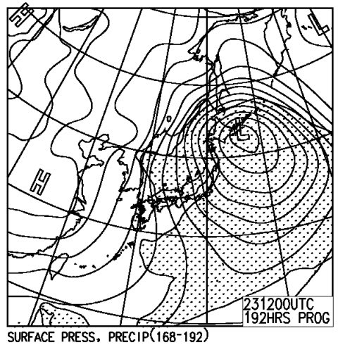
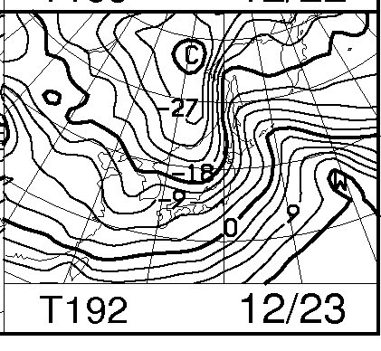

# 今週末も志賀高原

📅 投稿日時: 2011-12-16 23:31:39

🏷️ カテゴリ: [日記](cc4b5682fb7b8b144980957a978653fb0.md)

えーっと．

[予想通り](e8a69c4f8c2585317bef9b949aad7cdcd.md)．

新潟では16日，そこそこの雪が降ったので，かぐら・みつまた・田代は

全面オープンになったようですね…

それに対して．

志賀高原や信州のスキー場では，16日の昼間はほとんど雪が降らず．

…しかし，なんとか夕方には降り始めてきたようですが．

さて．明日土曜までに積もるのか？？？

今のところ，降りはいいみたいですが…

明日の午前中までは，降りそうです．

その後は…あんまり降雪量は期待できない感じ．

いい感じで冷えるんですけどね～．

空から降ってくるものが少ない．残念ながら．

志賀高原は，高天ヶ原が山頂から滑走可能になり，

ダイヤモンドがオープンに向けて準備，

サンバレーもオープンしたみたいですね．

とりあえず，明日からまた志賀高原．

またどんな感じか，レポートしますね～

…あ，そうそう．

今のうちに予告しておくか．

来ます．

来ますよ～

何がって，

そう．クリスマス寒波．

このまま上手く行けば，23日は大雪になるのだ！

