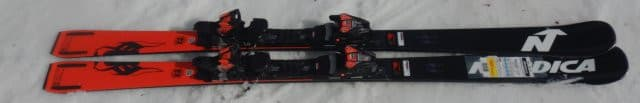
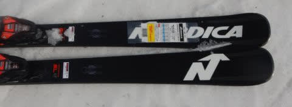
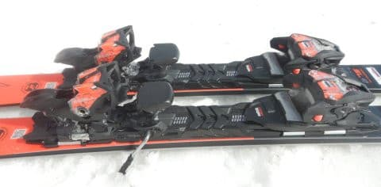
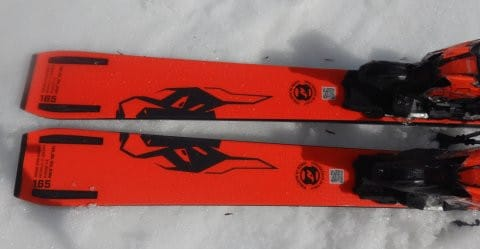
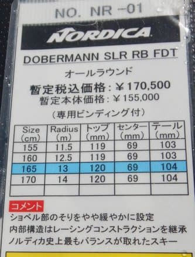

# 2023シーズンモデルのスキー板，試乗レポートその17…NORDICA DOBERMANN SLR

📅 投稿日時: 2022-06-24 03:48:20

🏷️ カテゴリ: [スキー板試乗](c0bd8048615710cee890e403a36cc9a2b.md)

先日のこと．

コロナ禍に巻き込まれて以来，ずっと

自粛令が出ていた会社の飲み会というものが，

ついに開催されました…

さすがにまだ大人数の飲み会は許され

ないようで，異動する人とごく親しい人の

5人程度での飲み会だったんですが．

実に2年以上ぶりの飲み会でした…

しかし．

会社の飲み会って，こんなに金がかかるもん

だったか（涙）

送別会だったので，当然送られる主賓の参加費を

みんなで負担するんですが．

参加者が少なかったので，その負担が大きかった

ってのもあるけど…

コロナ以前は，人事異動があるとこんな歓迎会

＆送別会が5回も6回もあったんだなぁ…

人事異動の時期は，軽く○万円が飛んでいったものだ…

会社の飲み会

というものがあまり好きではない私は．

楽しくない飲み会に出させられたあげくに

ものすごいお金が取られる

という，

「これ一体何の罰ゲーム？」

と言いたくなる状況だったわけですが．

そういった意味では，コロナによる飲み会自粛

はありがたかった…

…そして．

私にとってはすごくありがたい（飲食業界にとってはありがたくない）

自粛のおかげで，

冷静に振り返ると，年2回の人事異動時期と

忘年会・新年会が無くなったおかげで，

トータルでものすごい額のお金が

浮いたというメリットが！！

うむ．

この浮いた額を考えると．

多少の物欲に負けても…

…

と，久しぶりの飲み会の帰り道で思った

今日この頃，皆様いかがお過ごしでしょうか←危険な発想

ってなことで．

本題へ．

今日も2023シーズンモデルのスキー板の

試乗レポート．

今回はノルディカ編です．

では，どうぞ～！

○NORDICA DOBERMANN SLR RB FDT 165cm

基礎小回り

この板は，ほぼ今年度の継続に見えますが．

微妙にマイナーチェンジしてるみたいですね…

R=13m と，完全に小回りスペシャルな板ですが．

この板も，結構固めで張りが強く感じる板．

簡単にたわんでくれる板ではないのですが，

逆にスピードを出してもたわみすぎず，

どこまでスピードを上げて行っても板が

耐えてくれる，ハイスピード耐性の高い板．

ただ，板が結構強いので，春の柔らかい雪では

板をたわませにくい感じ．

柔らかい雪が板に負けて，板をたわませられない

感じで，比較的まっすぐ行っちゃいます…

でも，R=13というサイドカーブなので，

縦目に落として行ってもそこそこの半径で

曲がってきてくれるし，

ある程度のズラシのコントロール性もあるので，

春の雪でもミドルターン用～ロングターン的な

板として行けますね…これ．

むしろ，この板はどっしりとした安定感と

スピード耐性があり，クルクル回りすぎちゃう

ってこともないので．

この板，ハイスピードのミドル～ロング用だと

思ったら，春の雪でも結構いいかも？？

しかし，これ，やっぱり本領を発揮するのは

多分硬めの雪．

スピードを出して，強い圧を受けてくると

良いたわみが出てくるので，

しっかり締まったバーンで強い圧をかけられるように

なってくれば，キレキレのハイスピードカービング

小回りが決められそう…

本当に硬い雪では試してないので分からないのですが，

柔らかい春雪では，ハイスピード大回り板と

思えば，かなりの安定感とスピード耐性があり，

足元のしっかり感もすごい強いので．

小回り板というより，むしろ大回り寄りの

オールラウンド板として使えそう…

スピード派のスキーヤーは，それだけでも

履く価値はあるかも！？？

うん．

でも．

トップシーズンの良い雪で試乗したかった…
