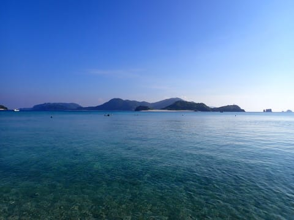

# 2024年8月，今年も座間味で親子ダイビング！その9…座間味ダイビング初日終了！娘と阿真ビーチへお散歩

📅 投稿日時: 2024-09-02 00:37:15

そういえば．

先週は台風の影響で原則在宅勤務だとか，

出張で新幹線に乗る予定だったのを

キャンセルするかとか，いろんな人が

影響を受けてバタバタしてたのですが…

職場の同僚「台風，今後どう進むんですかね～

　いろんな国での台風10号の進路予想が

　全然違うってニュースでやってたけど」

私「台風みたいな局地の現象は，予想

　メッシュ精度をムチャクチャ上げ

　ないと正確に予想は難しいですからね～．

　気象庁の予想でも初期値誤差を変えた

　予想どうしで全然進路が違ってるので，

　初期値ズレを重ねたアンサンブル

　予報図では，数日後の台風が消え

　ちゃってますよ…」

同僚　「え…Sさんって，天気も詳しいん

　ですか…？」

私（ヤバい…！）「いや，ニュースの受け売り

　ですよ．受け売り！！」

という感じで

職場バレしてなかった私の天気図マニアっぷり

が一部の人に露呈しかけたのですが．

今から考えると，天気図マニアって職場に

バレても，何の影響もなかったのでは…

とりあえず，台風被害が広がらずに収まることを

祈りながら，本日の本題へ．

今日は，いつもの座間味のダイビング日記です～！

ーー

（[前回はこちら](eedb8f746745c92544a51f440e06b8aa5.md)）

ってなことで，本日のダイビング3本，

全て終了！

あとは器材を片付けて，港へ帰る

だけですが…

潜ったポイントから目の前に見える

阿真ビーチ．

見ての通り，すごいきれいな海なので…

宿から15～20分も歩けばつくはずだから，

あとで散歩で行ってみようかな．

ということで．

3本目のポイントは，宿からも歩いていける

距離のビーチの目のまえだったので．

港からはそれほど遠くなく，ボートで

5分くらいで港へ戻ってきます…

3本目を終えてすぐの午後3時ごろには，

早くも港に到着！

ってなことで．

港から徒歩2分ほどの宿へ戻りますが…

いやー．

今日も一日いい天気だったし．

まだ時間も早くて夕食まで暇があるので．

宿に帰ってシャワーを浴びたら，

ちょっと娘を誘って阿真ビーチに

行ってみようかな…

明日も潜る人は，器材はボートに積んだ

ままなので．宿に帰ってから器材を

洗う必要はなく．

ウェットスーツだけ洗えば，あとはシャワーを

浴びるだけですが…

娘はウェットスーツを洗った後，

宿の向かいの駐車場に吸い寄せられるように

ふらふら歩いて行きましたね…

何があったんだろう？と思ったら…

また，猫を発見して喜んでいるようです．

座間味はネコだらけの島と言ってもいいくらい，

街中のそこら中にネコさんがいますが．

娘もネコ好きすぎ…

その後，シャワーを浴びて一休みしたら．

阿真ビーチへお散歩へ！

娘を誘ったら，

「一緒に行く」

ということだったので…

二人でこんな感じの海岸沿いの道を，

ぶらぶらと歩いていきます．

いや…結構暑いなぁ…

そして，宿から20分ちょい歩いたら．

到着しました，阿真ビーチ！

到着したのは午後5時ごろだったけど，

まだいっぱい泳いでいる人がいますね…

まぁ，日没が夜7時近くでまだまだ明るい

ですが，もう誰もいないと思っていたのに，

こんな時間まで泳いでいる人がいっぱい

いることに驚き…

[昨年行った古座間味ビーチは早朝で貸し切り](efe86ccc6639e4c5efe9584b455856c67.md)

だったけど，今日の阿真ビーチは賑やかな

感じでした…

でも，ビーチはやっぱりきれいですね！！

沖合にダイビングボートが何艘か見えますが…

今日の3本目はあのあたりを潜ってたのかな．

船の上から見てもきれいだったけど，

ビーチ側から見てもきれいな海だわ…これは．

遅い時間だし，もうシャワーも浴びてきたので，

泳ぐことは全く考えていなかったけど．

泳ぐのが好きな娘は，泳いでいる人がいっぱい

いるのを見て，自分も泳ぎたかったようで．

「水着でくればよかった…」

とつぶやいてましたが…

夕食の6時にぎりぎり間に合う午後5時半すぎまで，

ぎりぎりいっぱいゆっくりビーチを堪能して．

宿へ向かって帰路についたのでした…

（[続く](e9ac15b11681ec41ed1b5975388b31838.md)）
