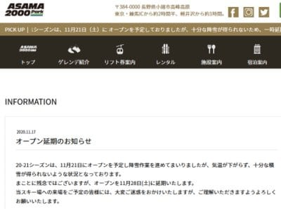
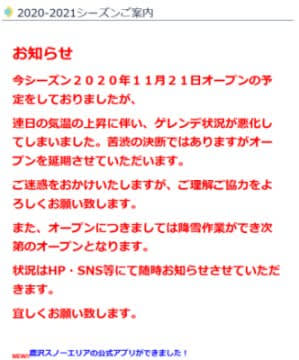
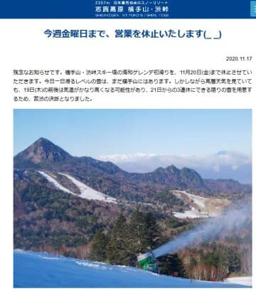
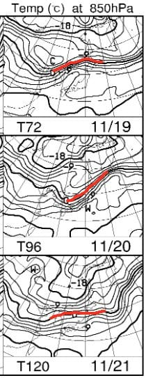
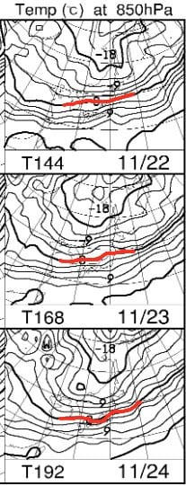

# この3連休，アサマ2000も鹿沢もオープン延期(涙）…でも，3連休が終わったころから冷えるかも．

📅 投稿日時: 2020-11-18 02:01:29

🏷️ カテゴリ: [日記](cc4b5682fb7b8b144980957a978653fb0.md)

ということで．

昨日は夜死んでましたが．

今日も半死半生です…

明日も朝早いので，とてもBlogを書いている

精神的余裕はないけど，昨日書けてないので

今日は書く！！

えらいぞ，自分！！←自分を鼓舞しておく

えー．

まず．

12日以降，気温が上がってヤバいよね…

3連休にオープンのスキー場は厳しいかも…？？

と，予想していた悪い予感が見事に当たって

しまい．

アサマ2000も…

（[アサマ2000ホームページ](https://asama2000.com/2020/11/17/%e3%82%aa%e3%83%bc%e3%83%97%e3%83%b3%e5%bb%b6%e6%9c%9f%e3%81%ae%e3%81%8a%e7%9f%a5%e3%82%89%e3%81%9b/)より）

鹿沢も，

オープン延期となりました（涙）

[(鹿沢スノーエリアホームページ](http://www.kazawa.com/snow/)より)

かぐらはまだ延期の案内をしていませんが…

まぁ，これからの気温上昇を考えると，

21日オープンはほぼ不可能でしょう（涙）

…そして，13日からオープンしていた横手山も，

一旦クローズになってしまうようです…（激泣）

([横手山スキー場ホームページ](https://yokoteyama2307.com/news/11169/)より）

一応，3連休の再オープンに向けての

一旦クローズとなっていますが…

20日の前線通過前の高温＆雨を

乗り切れるのか？？

微妙な感じ…

志賀高原は，20日の雨はそれほど

降らなさそうだけど．

気温の高さを考えると，おそらく，

3連休はオープンできない可能性が

高そうな予感…

…こんな予感は外れてほしいんですけど(泣）．

とりあえず，19日から21日までの850hpa気温を

見ると…

うーーーーーむ．

19日，21日は赤い0℃線は北海道～東北で，

志賀高原は人工降雪機が打てるほど

冷えません（涙）．

20日に赤い0℃線が多少本州に近づく

ものの…

志賀には+6℃線，ヘタすれば+9℃線が

かかってるかな？

この状況で降ったらほぼ間違いなく液体です（涙）

続く，22日から24日を見ると…

22，23日は赤い0℃線が志賀より北なので，

昼間は人工降雪機が打てなさそうだけど，

朝晩は行けるかも？？

24日は，0℃線が志賀にかかっているし．

雨も降らなさそうなので…

この日は標高が高い志賀なら終日人工

降雪機動かせるかも…？

ということで．

3連休はダメっぽいけど．

3連休が終わるあたりから，

ちょっと期待が持てる感じに

なりつつあります…

…でも．

出来れば3連休前に冷えてほしかった…

3連休が終わる頃から冷え始めるって，

誰か3連休にスキーに行こうとした人に，

普段の行いが強烈に悪い人がいる

としか思えない…←それは自分でしょ

## 💬 コメント一覧

### 💬 コメント by (いちと)
**タイトル**: Unknown
**投稿日**: 2020-11-18 20:54:39

S様の爪の垢でもとセコい心と決別し、本日、神田へ

なんとカンダハー定休日　それでもくじけず、急遽、アスペンで買いました!

当然、型落ちですが、、、

後は踊る事に専念します

### 💬 コメント by (かず)
**タイトル**: Unknown
**投稿日**: 2020-11-18 22:52:10

なんかコロナヤバい感じですね…GOTOトラベルやってる場合じゃないと思うのですが…ゲレンデが閉店したら意味ないです

### 💬 コメント by (西館)
**タイトル**: 中央エリアのナイターが！
**投稿日**: 2020-11-19 01:47:54

壊滅状態でございます、年末年始にしか営業されないよ～（ファミリーを物の数としていないから）。

サンバレーは1月3連休も営業予定だけど。

こりゃ、今シーズンの20000m達成は昨シーズン以上のハードルになるね、昨シーズン頑張って良かった。

### 💬 コメント by (Skier_S)
**タイトル**: コメント回答おそくなりました…
**投稿日**: 2020-11-19 11:13:28

＞いちとさま

物欲選手権大敗おめでとうございます．

日本経済に貢献していますね(笑)．

あとは必死に踊りましょう…！

＞かずさま

なんだかやばい感じになってきました．

また，緊急事態宣言やら県境またぎ移動自粛とかしなくては

ならないほどの状況まで悪化しなければいいんですが…

＞西舘さま

がーーーん！

ショック！

まさか，ダイヤナイターが3連休もやってくれないとは…

これは，焼額ナイターに期待するしかないですね（涙）

でも，焼額ナイターに行くときは，宿の夕食をキャンセルしないといけないんですよね…

困った．

### 💬 コメント by (Unknown)
**タイトル**: 宿
**投稿日**: 2020-11-20 23:00:16

ヤケビってプリンスに泊まるんでしょうか？

### 💬 コメント by (Skier_S)
**タイトル**: ＞Unknownさま
**投稿日**: 2020-11-21 00:49:27

ヤケビに行くならプリンスが便利だし，ナイター行くならなおさら

プリンスに泊まりたいですが…

我が家の経済状況から，私はプリンスに泊まることはほとんどないです．

### 💬 コメント by (Unknown)
**タイトル**: Unknown
**投稿日**: 2020-11-22 21:44:25

って事は一ノ瀬？

一ノ瀬の宿はあまり良い思いをしていないなぁ

### 💬 コメント by (Skier_S)
**タイトル**: ＞Unknownさま
**投稿日**: 2020-11-22 23:48:02

私が泊まる定宿は，一の瀬に2件，ビワ池あたりに1件ですが，

そのほか時々湯田中に泊まったり，知り合いのところに泊まったり…

という感じで，いろいろ渡り歩いています．

一の瀬の宿も悪くないですよ…

### 💬 コメント by (Unknown)
**タイトル**: 一ノ瀬の宿
**投稿日**: 2020-11-28 22:08:57

一ノ瀬でお薦めの宿、差し支えなければ教えてください

### 💬 コメント by (Skier_S)
**タイトル**: >Unknownさま
**投稿日**: 2020-11-28 22:40:35

私がよく泊まるのは，家族連れの時は一の瀬ファミリー目の前のオリンピックホテル．

トップシーズンはお値段お高めですが，12月や4月は値下がりしてリーズナブルで，

ゲレンデ目の前なのが楽です．

トップシーズンは一井ホテルに泊まることが多いです…

一井ホテルは割とリーズナブルですが，チューンナップ用の常設作業台が無いとか，

駐車場が遠くて歩かなくてはならないとかいう欠点があります…

