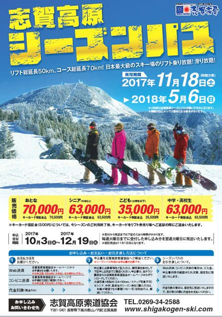

# 志賀高原スキー場の2018シーズンのリフト券価格が出てきたけど…なぬっ！！値上げしてるんですけど…っ！！！！（涙）

📅 投稿日時: 2017-10-04 01:05:14

ということで．

10月です．

そう．

もう10月．今週末はシーズンインなわけですが．

シーズンインが迫ってきたこの時期．

志賀高原の[シーズン券の申し込みサイト](http://www.shigakogen-ski.com/order/)が

オープンになったよ～！！！

…と．

喜び勇んで，シーズン券情報を見ると…

ん？

んん？

んんんんん～っ！！！！？？？

シーズン券，値上げしてるよっ！！！！

2014シーズンまで65,000円だったのが，

2015シーズンから67,000円に上がったんだけど．

今度は…

2018シーズンから70,000円ですか…！！！（涙）

また値上がりか…っ！！

…まぁ．

自分も含めて．

20000mクラブな皆さんは．

70000円だって言われても文句のつけようがないくらい，

シーズン券のモトは取りまくってるし．

まぁ，払いますが…

払わざるを得ませんが．

…でも．

お財布に，痛い…（激泣）．

志賀高原＆野沢温泉の2スキー場共通券が75,000円で，

昨シーズンから据え置きなので．

1-2日野沢温泉に行くつもりなら，こっちの方が魅力的に

なってきますね…

どうでもいいですが．

私は昨シーズンの滑走総標高差が大体70万mだったので，

シーズン券7万円なら，1円あたりの標高差が約10mになりますね．

標高差約450mの焼額ゴンドラ1本あたり，

45円で乗っているという計算が成り立ち

ますから…

まぁ，7万円でも，やっぱり十分モトは

取ってると言えますか…←ってか，取りすぎてる．十分モトは取りすぎてるから

ついでに．

志賀高原の総滑走標高差ぶっちぎりトップ，

世界20位内，シーズン滑走標高差120万mを誇る，

某Kon Sukeさんのデータで計算すると．←全然「某」になってないから

リフト券が7万円なら1円当たり17m．

標高差317mの一の瀬第3クワッド1本あたりの

リフト代が18円になる計算なので…

いや．

この方にとっては，シーズン券が7万円でも安い．

安すぎる気がします…←いや，他人の計算はしなくていいから

しかし．

やはり，値上げは痛いなぁ…（涙）

で．

[シーズン券以外のお値段](http://www.shigakogen-ski.com/lift-charge)を見ると…

1日券￥5,000-，2日券\9,300-，3日券\13,400-は，

昨シーズンから値段が変わってないようで，

一安心．

ですが…

なんということか．

4日券以上の，シーズンいつでも使える「スーパーパス」．

これが…すごい値上げしてるよ！！！！！

　　　　昨期　　今期

4日　17,500　18,000

5日　21,600　22,500

6日　25,800　27,000

7日　29,900　31,500

10日 41,200　45,000　←3800円値上げ…（涙）

なんだ？これは…？？

4日券の方が，3日券より一日あたりのお値段が

高くなるんですが．

ってか，4日券～10日券，全て一日あたり4500円．

昨年までは日数が多いチケットの方が割引率が

高かったけど，来シーズンは4日券以上は，

どのチケットを買っても，一日4500円です．

…これだと，使いきれるか分からない10日券を

買うメリットはほとんどありませんね．

そもそも，初滑り期間（オープンから12/20まで）と春スキー期間（4/1以降）

は1日券4200円，2日券8100円なので…

10日券よりよっぽど安いです．

ということで．

スーパーパスは，春スキー以前の3月までに確実に

使える量を，4日券とか5日券の最小限で買い続ける

ことをおススメ…

そもそも，3日連続滑るなら，スーパーパスより

3日券の方が安いので，そこもご注意を．

ということで．

多くの日数を滑るヘビーユーザーを

狙ったような値上げが，ちょっとかなり

微妙に残念な感じですが．

…これで，シーズンが長ければまだ許す．

12月の早くから雪が積もって，GWまでたっぷり

雪が残ってくれれば，許す．

今年も雪がたっぷりの志賀高原でありますように…

と，願わずにいられないSkier_Sなのだった．

## 💬 コメント一覧

### 💬 コメント by (yama)
**タイトル**: 値上げが残念
**投稿日**: 2017-10-04 06:37:25

やはり値上げはおサイフに厳しい(≧ω≦)ですね。でもシーズン券の申し込みが始まると、いよいよシーズンインの期待が高まります。psコンスケさんの場合は６万３千円で計算するのではないでしょうか。こちらも後数年ですが。

### 💬 コメント by (かず)
**タイトル**: お久しぶりです
**投稿日**: 2017-10-04 11:18:51

ヤケビ　GWまでですね　雪が残れば広々ゴンドラで快適！　僕の場合ヤケビ奥志賀だけなので奥志賀限定パス期待したのですが…またいい志賀高原ニュース期待してまーす

### 💬 コメント by (つーちゃん)
**タイトル**: 物欲選手権
**投稿日**: 2017-10-04 18:20:48

今シーズンは志賀高原のシーズン券

買っちゃおうかと結構迷ってます

作シーズンは13日志賀高原で滑っているので

志賀高原比率を上げれば元が取れるんですよねぇ

あ。そういえば気づいたらスーパシェイプスピードが

家に届いてました＼(^o^)／

明日は神田にブーツを見に行ってきます

見るだけですよ。見るだけ。

### 💬 コメント by (Goku)
**タイトル**: 痛い！
**投稿日**: 2017-10-04 18:30:33

痛い！これは痛い！

特に4～10日券の値段設定は？？？ですね。

ちなみに、よくある早割券も4,300円と値上がりしていました。

後は雪が昨年並みにたっぷり降って、ＧＷまで焼額山含め目いっぱい滑れることに期待するしかないですね。

### 💬 コメント by (しんちゃん)
**タイトル**: 厳しい
**投稿日**: 2017-10-04 22:35:01

リフトの数が減ったりしているのに、値上げは厳しいですね(*_*;

つーちゃん様は、物欲にやられちゃったんですね。。。

Ｓ様の物欲選手権にも期待･･･

Ｓ様の痛々しいスキーズボンの早期交換も祈っています。

### 💬 コメント by (Skier_S)
**タイトル**: 共通7日券より超早割ヤケビシーズン券の方が安い…
**投稿日**: 2017-10-05 00:12:55

＞yamaさま

いや…痛いですよね．値上げ．

ナイター券や早朝券は今シーズン上がらなかったのが

救いでしょうか…

普通なら，毎年シーズン券買ってたら

連続購入割引とかあってもよさそうですが…

＞かずさま

今シーズンは，ヤケビがGWまでやってくれて嬉しい限りです…

そういえば，今シーズンは奥志賀シーズン券無いんですかね？

＞つーちゃんさま

あれだけ志賀高原にいらっしゃってたら，それは

シーズン券買うべきでしょう！！

…でも，13日しかいらしてなかったんですか…

今年はGWまで焼額も滑れるので，春期間も

志賀で滑れば，20日は行くのではないですか？

そうしたら，シーズン券のモトは取れますよ～！

…で．

意識を失っている間に，板が家に届いていたのですか…

そして，見に行くだけに神田へ…

あぶない．いろいろアブナイパターンです（笑）

＞Gokuさま

ここ2シーズンほど，妻はシーズン券を買わずに，

10日券にしていたのですが…

10日券の値上げが，痛いです（涙）．

＞しんちゃんさま

そうなんですよ…

リフトが増えたなら，まだ納得いくのですが．

リフトは減るわ，値段は上がるわ…（涙）．

とりあえず．

私は物欲選手権開催前にシーズン

突入しちゃいます…

### 💬 コメント by (サトシ父)
**タイトル**: シーズン券買っちゃいました
**投稿日**: 2017-10-31 08:22:22

毎年購入しようか迷ってましたけど、この記事と昨シーズンの行った日数を数えたらシーズン券の方が安いと判明。息子と二人分買っちゃいました。

### 💬 コメント by (Skier_S)
**タイトル**: サトシ父さま
**投稿日**: 2017-11-01 01:00:34

をを！

今シーズンは買っちゃいましたか！

それも息子さんと二人分！

これは…毎週志賀高原確定ですね（笑）

シーズン券買っちゃうと，滑れば滑るだけ

オトク…という．

危険な発想が頭に浮かぶようになって

きますよ～！←それ，一部の人だけだから

