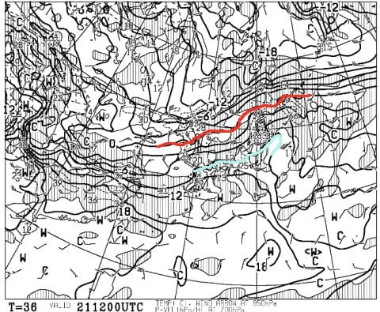
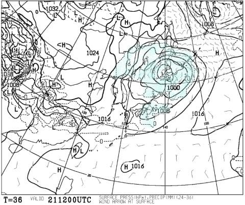
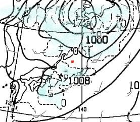
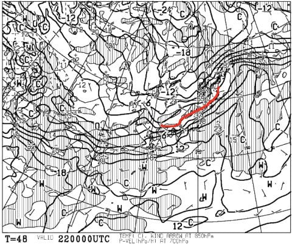
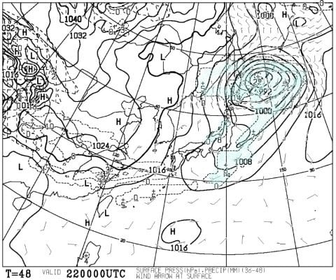
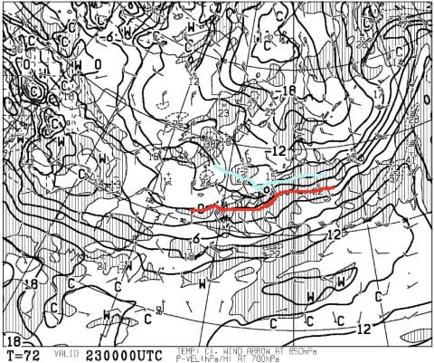
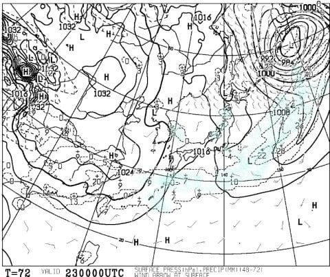
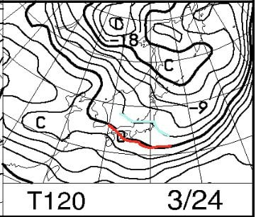
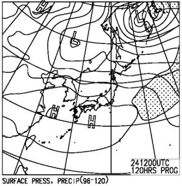

# 21日の志賀高原の天気は，朝に雨がぱらつくかもしれないけど，あとはそれほど降らなさそう．週末は，土曜は小雪⇒晴れ，日曜は終日晴れの冷え冷え！

📅 投稿日時: 2019-03-21 00:03:31

ということで．

明日は祭日なので．

いつも通り志賀高原で滑ってます～！

で．

明日，21日木曜の天気ですが…

850hpa気温を見ると．

赤い0℃線は北海道まで上がり．

志賀高原にかかっている水色線．

+9℃

です（涙）

やっぱり，志賀高原でも+10℃くらいに

上がりそう…（激泣）

しかし．

地上天気図を見ると…

うむ？

志賀高原のあたり，降水予想の

水色部分から外れてる気が…！？？？

拡大してみると．

赤く印した志賀高原．

降水予想エリアの外にありますよ！？？

…これは．

私の「雨よ降るな降るな踊り」が効いたのか！？？←いつからそんな踊りができたんだ？？

ただ．朝8時頃に．

前線が通過するしばらく，雨がぱらつきそうだけど…

でも，それ以外は降らずに済みそうな感じ…！！

壊滅的な雨で，雪が解けまくる心配は

なさそうです…（ちょっと安心）

で．

翌22日の金曜は．

赤く印した0℃線が志賀近辺まで下がって

くれてるので．

水色の降水域が志賀にかかってますが．

ギリギリ雨にならずに済みそうな感じ！！

標高の高い志賀高原は，

ちょいと重めの湿った雪ながら．

金曜はうっすら雪が積もってくれるかな…？？

そして．

肝心な週末．

23日の土曜日ですが．

850hpa気温を見てみると…

うおっ！！

今度は冷えますっ！！

水色の-6℃線が志賀にかかってるので．

土曜の朝は-9℃程度の，真冬の冷え込みが

戻ってきそう…！

おそらく，昼間も-3～4℃程度までしか

上がらないんじゃないかな．

土曜の地上天気図を見ると．

日本海側にぽつぽつ降水域が

予想されているので．

土曜の朝までに，うっすら冷え冷え

新雪が積もってるかな～．

うっすらでも雪が乗ってくれれば．

21日に雪が解けて固まったアイスバーンが

隠れてくれるので．

朝のうちはいい感じで滑れるん

だけど…（懇願）

で．次の日の日曜ですが．

850hpa図を見ると．

この日も水色の-3℃線が志賀に

かかる程度なので．

そこそこの冷え込み．

昼間も，氷点下をキープしてくれそう…！

地上天気図は，高気圧に覆われるので．

日曜は，晴れそうですね…！

下地のアイスバーンが出てきそうだけど．

昼間の日が当たるところは，アイスバーンの

表面もちょっと緩んで滑りやすくなるかな…

ってことで．

まとめると．

21日（木・祝）：朝7時～8時頃，雨がぱらつくかもしれないけど…

　それ以外は曇り空が続く．

　朝から気温は+5℃程度．

　昼間は+10℃程度まで上がり，

　ゲレンデは全面しっとりした

　重い春の雪になる．

　夕方まで気温が高いまま．

　もしかしたら，夜にまた雨がぱらつくかも…

22日（金）朝は氷点下．

　下地は昨日の高温で融けた雪が固まった，

　アイスバーンに．

　この日の明け方から朝にかけて，

　雪がぱらついてるかも？

　朝までにうっすら積雪も期待．

　でも，気温が高めなので，降るのは重い雪．

　この雪で，アイスバーンがちょっとは

　隠れてくれればいいけど…

　昼間は曇り空．

　昼間も雪がぱらつくかも．

23日（土）朝から冷え冷え！朝は-9℃程度．

　朝は曇り～小雪がぱらついている可能性も．

　ガチガチアイスバーンの下地に，うっすら

　柔らかい雪がカバーしている状態で

　スタート．

　少しでも雪が積もって，アイスバーンを

　カバーしてくれていれば，

　この日の朝は楽しめそう．

　でも，斜度のあるバーンは，じきに柔らかい雪が

　はがされて，硬いツルツルアイスバーンに．

　午後になると晴れてきて，日が射す．

　昼間も気温が低いので，日が射しても

　バーンは硬いまま．

24日（日）朝から晴れ！

　朝は-5℃程度．早朝の時間帯はもう少し

　低いか．

　朝イチから，硬めの圧雪．

　すぐにアイスバーンが出てきて，

　磨かれてツルツルになっていきそう．

　昼間も気温は氷点下をキープ．

　でも，日差しが強いので，

　日が当たる東側斜面は，アイスバーンが

　緩んで滑り良くなるか．

　基本的にバーンは硬めなので，

　午後までそれほど荒れなさそう．

ってな感じでしょうか．

うーん．

土日冷えそうなので，

21日木曜に気温が上がるのが，惜しい…

とりあえず，明日は焼額滑ってます～！

あと3時間半後に出発です．

また3時間ほどしか寝られない…（涙）

## 💬 コメント一覧

### 💬 コメント by (大阪のS)
**タイトル**: Unknown
**投稿日**: 2019-03-21 00:10:20

ご無沙汰しております。22日(金)と23日(土)は志賀高原で滑ります。またお見かけしたら声かけますね〜(^^)先月頂いた銀のお札はヘルメットに貼りました。今季のラストなので、少しでもいい雪で滑れるよう祈ってます。

### 💬 コメント by (なるなる)
**タイトル**: Unknown
**投稿日**: 2019-03-21 01:33:26

毎度の事ですが、睡眠3時間で志賀まで行けるのがすごいですね。

明日は諸事象でスキーに行けないです。レポート楽しみにしています。

その代わり、週末は土日+月で志賀に滞在出来そうです。今シーズン初の平日志賀!

泊まりで行けるのも最後かなぁ…

お時間あれば月曜の予想もお願いします。カリカリorザクザクですかね…

### 💬 コメント by (Skier_S)
**タイトル**: 今日は先週とはうって変わって悲惨
**投稿日**: 2019-03-22 05:08:37

＞大阪のSさま

明日から志賀ですか！

朝は焼額滑ってると思いますので，またお会いしましょう～！！

雪はちょっと悲惨です（涙）

＞なるなるさま

月曜は，晴れて気温が上がりそうなので．

朝はカチカチ，昼は緩んだ雪になりそうです…

週末土曜にお会いしましょう～！！

