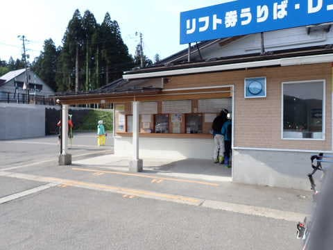
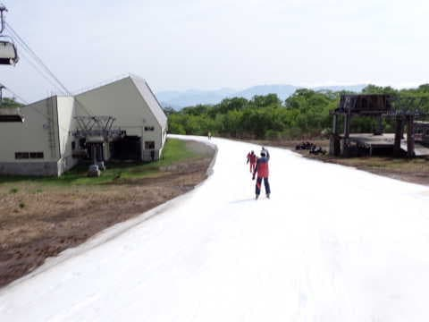
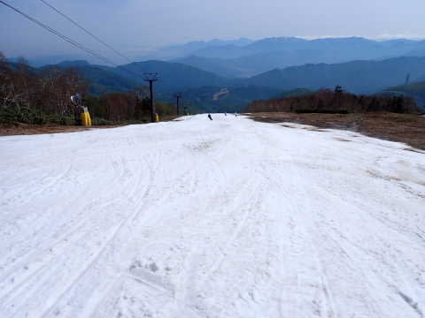
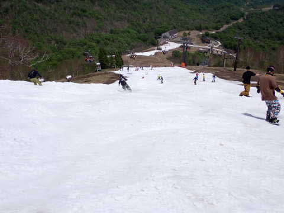

# 2023/5/21(日)かぐらスキー場ファイナルの詳細レポート！…晴れのち曇りのちガスでリフトはガラガラだったけど…ファイナルまでよく頑張った

📅 投稿日時: 2023-05-24 01:37:58

🏷️ カテゴリ: [2023スキー滑走日記](cd943df30cfcc3d0896469e2ff98720cd.md)

えー．

昨日，このBlogが更新されませんでしたが．

昨日は帰宅が深夜すごい遅い時間で…

帰宅後Blogを書く体力も精神力もなく，

倒れたように寝てました…（涙）

ということで．

Blog更新を楽しみにしていた方，←そんな人，いるの？

更新できなくてゴメンナサイ…

ってなことで．

本日は，昨日書こうと思って書けなかった

5月21日（日），かぐらファイナルデーの

詳細レポートです！

えー．

まず．

7:30からのロープウェイ営業開始にも関わらず．

驚くことに，7:20のリフト券売り場には

誰も並んでおらず…

ロープウェイ待ちの列も，リフト券売り場の

建物の角を越えたくらいまでしか伸びて

無くて．

今日はかなりガラガラの予感…！

7:30ちょい前にロープウェイの営業が始まり

ましたが…

おそらく4便くらいまでに全員乗れたんじゃ

ないかな？

もう少し混むかと思ったら，駐車場も

ガラガラですね～！

で．

ロープウェイを降りたら，

キャリーサービスにスキー板を預けて，

みつまた高速リフトに乗って…

　リフトを降りたら，しばらく歩いて

今度はみつまたペアリフトに乗って…

ゴンドラ側へ降りて．

そして，キャリーサービスで運んでもらった

板を受け取って，

ゴンドラに乗って…

という，最終形態のかぐらで覚悟しなくては

ならない，遥かなる道をたどって．

やっと滑れるゲレンデに到着したのが，

8:30近く…

ここまで，駐車場からはるばる1時間

近い旅でした…

で．

ここからリフト乗り場に向かいますが…

ゴンドラ降りてからかぐらクワッド

までの道，先週比で一気に狭くなりましたね（涙）

まぁ，リフト乗り場前はまだ雪の

厚みもあるし，意外と大丈夫そうだけど…

しかし…

リフトの上から見たら，コース幅が

先週より一気に狭くなっちゃってる感が

すごいんですが…！？？

先週は，このリフト支柱より手前側まで

雪があったはずですけど…

もう，支柱より向こう側しか雪が

ないですね（涙）

でも，真上から見たら…

先週よりは狭いながらも，思ったより

幅はあるのかも…！？？？

ってなことで．

リフトから下りて滑り出しますが…

リフト降り場付近も，幅が狭いながら

雪の厚みは結構あって，すぐには

穴が開かなさそうな感じ…！

まぁ，先週よりはかなり幅は狭く

なったけど．

まだこれだけ幅があれば，シーズン最初の

Yeriよりはずっとマシかな…？

雪の厚みが十分じゃなく，雪を上手く

均しながら圧雪できないのか，

あさイチから多少凸凹が残っている

圧雪バーンでしたが…

あさイチはまだコブコブもなく，

硫安で硬めに仕上がった，大回りが

できるバーン！！

いや…

例年に比べれば，下のパークの巨大

キッカーもないし，コースの狭いところは

かなりきわどい感じになってきてるけど，

異常に気温が高かった今シーズン，

5月下旬までこれだけ雪が残ってたら

上出来ですよね！！！

ちなみに．

雪が無くて縮小されたパークは．

今週はパイプが横に数本並んだだけの

寂しいものでした…

パークが縮小されたせいか，この日は

ボーダーがすごい少なかったのもあり．

リフト乗り場は最大でもこの程度の混雑で，

午前はほぼ待ちなし～搬器3-4台待ち，

午後は飛び乗り，待っても搬器1台

という感じで，リフトはガラガラ！

あ，ちなみに．

この日はペアリフトは営業されず，

クワッドのみの営業でした…

ってな感じで．

リフト待ちは無いのはいいのですが．

朝から晴天で，雪はすぐに滑りが悪く

なっていったし．

さらに，すごい狭いコースに高速クワッド

で人を送り込んでいるので…

9:30を過ぎてくると，だんだんゲレンデの

人口密度が上がっていき…

ピークの10時ごろには…

もう，すごい人口密度になってしまい

ました（涙）

滑るというより，人を避けてなんとか

降りていくという状態（泣）

そして，当然のごとく．

多数のスキーヤーが滑るゲレンデは，

11時ごろにはだんだんボコボコになって

行きます…

昼ごろにはうす曇りになってきたものの．

午前中は晴天で気温も高かったので…

朝は真っ白で，十分な厚みがあったように

感じたリフト乗り場前も，あっという間に

雪が解けて穴が開き始めたかと思うと…

そして，午後1時ごろには．

大勢のスキーヤーによる，

ゲレンデ全面コブ化作業が

完了して…

コブ溝部分に，だんだん大地が顔を

見せ始めてきました（泣）

いや…

朝は全面，真っ白だったゲレンデ．

一気に雪が融けて，ヤバい感じに

なってきたかと思うと…

もう，完全に貫通完了（涙）

午後2時ごろには，ゲレンデのいろんな

ところに，大いなる大地が現れてきました…

午後2時を過ぎると，和田小屋から

リフト乗り場に向かう道も，かなり

茶色くなってきて．

ヤバい感じになってきたし…

朝は真っ白だったリフト乗り場前も，

あっという間に穴が開いちゃって．

そして，コース幅が狭いところは…

もう，石を踏まないで滑ることは

難しい状況に…（涙）

そして．

さらに追い打ちをかけるように．

午後2時半を過ぎると，なぜか一気にガスが

広がってきたんですが…！？？（涙）

ガスっていて何が何だか分からない状態で，

足元にいきなり土が出てくるこの恐怖…！！

この視界が悪い状態で，このゲレンデを

滑るのか…！！←滑らないで帰るという選択肢もあるのだが？？

そして，最後の方は…

もう，そこかしこが穴だらけになっただけではなく…

もう，コース幅いっぱいを完全に横断する，

デンジャラスゾーンが！！

これは…

板を履いてここを突っ切らねばならぬ

のか！？？

もう，最後は阿鼻叫喚のゲレンデ状況と

なっていましたが…

こんな状況でも，まだ帰るわけにはいかないと

思っているおかしい人精神的にたくましい人

がまだこんなに残ってることに，驚き…！←あなたも残ってた一人でしょ

ってなことで．

ひどいゲレンデ状況になりながらも．

「今日でかぐらは営業終わっちゃう！！」

という，ファイナルの名残惜しさで．

ついつい，ラストの15:30まで滑り倒して

きたのでした…←いや，ファイナルデーじゃなくてもラストまで滑るでしょ

…ってなわけで．

これにて，かぐらも今シーズン終了です…（涙）

最後のゲレンデ状況はすごかったけど．

この状況で，シーズンの当初予定通り，

5/21まで営業したかぐらのゲレンデ維持の

努力は素晴らしい…

かぐらスタッフの皆さんに感謝！！

## 💬 コメント一覧

### 💬 コメント by (副院長)
**タイトル**: Unknown
**投稿日**: 2023-05-24 08:54:08

S様、毎日Blog読ませてもらってます。朝仕事前のルーチンワークになっています。今後はスキー板試乗記もよろしくお願いします。

### 💬 コメント by (カンタロス)
**タイトル**: Unknown
**投稿日**: 2023-05-24 18:11:33

Sさま、こんにちは。

激務のなか滑りに行って更にブログの更新とかもはや

常人の所業とは思え無い（笑）

本当にお疲れさまです。

ここ数年は４月、５月に全く休みが取れない（休日ゼロ）

状況なのでわたしは今年も３月でシーズンは終了です。

このブログで滑った気分だけ味わってます（笑）

これからも更新頑張って下さい！

追伸、このブログ記事カテゴリの人気投票とかやったら面白いかも？と無責任に思ってしまいます。

予想では1位はブッチギリで物欲選手権かなと（笑）

### 💬 コメント by (Skier_S)
**タイトル**: コメント回答遅れました…！
**投稿日**: 2023-05-25 23:46:15

＞副院長さま

楽しみにしていただけているなら良かったです…

これからは試乗レポートの時期なので，ガンガン試乗レポート書いていきます！

お楽しみに！！

＞カンタロスさま

我ながらよくBlog更新しているな，と思います…ホントに．

でも，4，5月に全く休みが取れないというほどひどくないので，まだ恵まれているのかも（笑）．

このBlogの人気投票ですか…

意外といろんな小ネタも印象に残ってるのですが，やっぱりシリーズものの

物欲選手権が人気が出ますかね．

物欲選手権のどの会が人気か，ちょっと気になりますね（笑）．

