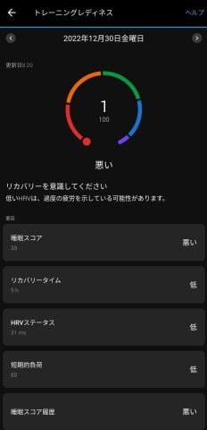
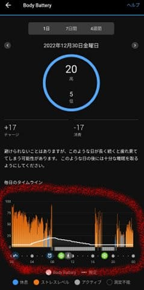
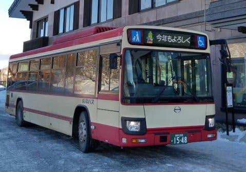
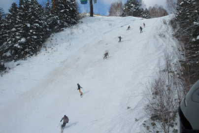
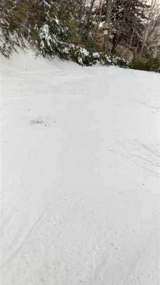

# このあとの正月休み後半，志賀高原に雪は積もるのか？？…2日朝までに15～20cm，3～4日の2日間で40cmくらい積もるかな

📅 投稿日時: 2023-01-02 03:06:35

🏷️ カテゴリ: [スキー天気予想](c6554f5c3c106093b511a8daae23757e8.md)

ってなことで．

12月28日は仕事納めだったのですが，

「残った仕事は正月休みの宿題！」

ということで，夜9時ごろには仕事を

終えるという，私にとっては天国の

ような平和な時間に仕事を終え，

Blog書いたり何だりで，

深夜0時を回ったころに寝て．

12月29日は睡眠3時間ちょいで

4時に家を出て志賀高原に向かい，

8:30のゴンドラ営業開始から

21:00のナイター終了まで滑り，

その後0時頃までホテルの部屋飲み

の傍らBlogを書き．

翌12月30日も，

朝8:30から20:00のナイター終了まで

滑り倒し，5時間運転して深夜1時半に

帰宅し，片付けやらBlogを書いて

3時前に就寝し．

12月31日は朝起きて仕事して

一日過ごし…

という生活で．

ちょっと疲れが溜まってきたな…

と思っていたら．

Garminさんに怒られてしまいました…

Garminさんを持っている人しか

分からないと思いますが．

トレーニングレディネス「１」って，

そうそう出ない数字のような気が…

「自分もこんな最悪値をたたき出した

ことがあるよ」

という方がいれば，教えてください…

ちなみに，Body Batteryの方は

ここ数日，地を這う数字を記録しています…

毎日夕方には最低の5まで落ち込むし．

最高値が20程度…

今日は昼近くまで寝てしまったので．

ちょっと疲労から回復しましたが…

そのせいで，宿題が仕事始めまでに

終わらなさそうな気配…（涙）

順調なら1月3日は志賀に舞い戻る

つもりだったけど，かなりヤバそう（泣）

ってなことで．

元日の本日も，志賀高原特派員から

写真が送られてきましたが…

今日は晴天で，初日の出も見えた

らしいけど…

そのかわり，積雪の積み増しは無かった

わけで．

コース上，土が出てきたところが

増えてきたみたいですね…

これ，GSコースの一番最後の落ち込み

部分ですが．

雪はかなりヤバい感じ…

正月休みにしては人も少なめで，

ゴンドラもそれほど並ばなかった

ようですが…

雪が薄くなってきて，そろそろ

積雪が欲しいところ…

まぁ．

でも．

私はどうやらこの正月休みは，

もうスキーに行ってるどころじゃ

なさそうなので，

私にとっては，雪が降らなくてもいいんですけどね

というより．

むしろ積極的に降らないでいてくれた方が，

あきらめがついていい

…という，Skier_Sの呪いで志賀高原に

雪が降ってないわけですが←あなたが志賀高原の天気を決めてるわけじゃないですから…

とりあえず，ここ数日の天気図を見てみると．

昨日の記事で，

　次に降るのは1日の夜~2日の朝，

　そして3日にちょっと積もるくらいで．

　ドサドサパウダー大量供給にはならない

　感じ…

と書いた通り，1日夜の今晩から

明日2日にかけて，15cm~20cmくらいは

積もってくれそうです．

…ただ，

　いや．1日夜から3日にかけて冷え

　るんですが．

　また，志賀高原殺しの西風になりそう

　です（泣）

と書いた通り．

風が西風気味なので，膝パフや腰パフまで

ドサドサ積もることはなさそうですが…

しかし．実にきわどい風向きで．

もう少し風が北に回ってくれると，

ドサドサ積もってくれそうなんだけどな～…

とりあえず，朝までに15～20cm．

2日は昼間も午前中は雪が

降り続け，午前中で5～10cmくらい

積もってくれるかも…

午後には止むかな．

で．3日から4日は…

ちょっと積もりそうな予感．

3日朝はパラパラと降っている程度

だけど，昼間に時折強く降って

積もるようになり．

4日昼間にかけて，風も北東に回るので，

ちょっと積もりそうな予感…

3日と4日の2日間で40cm以上

積もるかも…？？

しかし．

正月休みがちょうど終わった4，5日

あたりが一番コンディションが良く

なりそうというタイミングの悪さは，

多分私の呪いでしょうね…←違うから

その後，5，6日は降らなさそうですが…

3連休の7，8日は，降りそうです．

それも，7日はゴンドラ運休の

可能性もある激荒れ南風の吹雪．

8日は志賀高原でもドサドサ積もる

パウダーデーになりそう…！！！

…これも，3連休前に積もれば

いいものを，3連休初日に激荒れ天気

ってのは，ちょいタイミングが悪い…（涙）

でも．

今のところ，私は3連休もフルで志賀高原に

行ける可能性が低く…

7日は仕事しなくちゃならなさそうなので．

これもたぶん，私の呪いですね

ってなことで．

明日2日はちょっとは雪が改善しそうだけど．

本格的な積雪は正月休みの終わった

4日になりそうだし．

そのあとの3連休初日も激荒れになりそう

という，

Skier_Sの呪い

を確かめられた，この一週間の天気図だったのでした…

1月7，8，9日の詳細天気予想はまた

後日やります～！

## 💬 コメント一覧

### 💬 コメント by (大阪のK)
**タイトル**: Unknown
**投稿日**: 2023-01-02 12:31:57

FTから滑ってますが、Sさんの呪い通り20センチ位しか積もっていなかったです。

それでもオリンピックコースのパウダー、少しは楽しめましたよ🎵

明日は此方にいらっしゃるのですか？

### 💬 コメント by (けんた)
**タイトル**: 三が日最終日
**投稿日**: 2023-01-02 16:16:32

返信していただきありがとうございます。

午後は空きそうとのことですので、

ゆっくり滑って帰ってくるようにします。

プリンス系のスキー場は小学生が無料なので

助かります。

シニア料金を55歳からにしてくれるといいんですが...

いつか会える日を楽しみにしています。

### 💬 コメント by (Skier_S)
**タイトル**: 昨日コメント書き忘れました！すみません
**投稿日**: 2023-01-04 05:42:36

＞大阪のKさま

私の呪いは強いんです…

でも楽しめたようで良かったです．

1月3日は滑れずじまい．

結局正月休みは29，30日の2日間しか滑れませんでした（泣）

＞けんたさま

3日午後はガラガラだったんじゃないでしょうか．

シニア料金は残念ながら60歳からですが，志賀高原は「この人がシニア料金？？」という感じの，

そんじょそこらの若者の数倍滑り続ける60オーバーの方がいっぱいいるので…

55歳からシニア券だと若すぎかも（笑）

