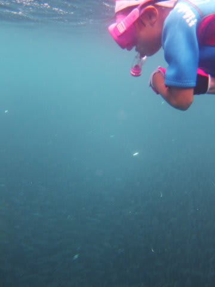
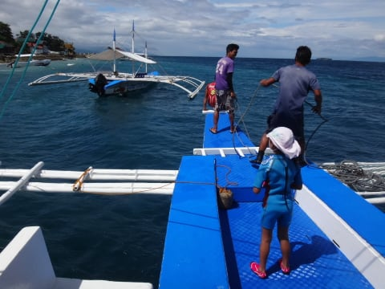
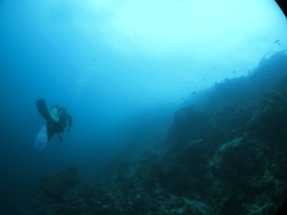
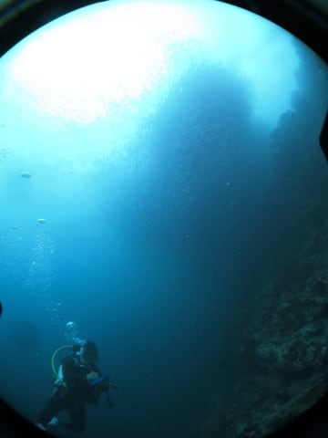
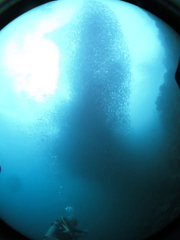

# 2015年8月　子連れでモアルボアルでダイビングその18…2日目午後のダイビングは…イワシポイント！

📅 投稿日時: 2016-07-15 03:26:50

はいはいはい．

今日もご無体時間に帰宅ですが．

でも，今日も頑張って更新．

ダイビング日記です～！

では，どうぞ～！

----

ということで．

シュノーケリングでイワシの群れを眺めた後は．

午後のダイビングタイムになるわけですが…

ガイドの小宮山さん曰く．

「3本目も，ここのハウスリーフでイワシ見ましょう～！」

…あ，3本目もイワシポイントなのね…

となると，だ．

本日，私が2本目を潜って．

妻が1本目と3本目の2本潜る予定だったので…

妻は2本連続でイワシポイントになっちゃうんですが！

で．イワシポイントを潜りたくて仕方ない私が，

全くイワシポイントに潜れなくなってしまう…っ！

私「…

　　…

　　…また，イワシポイントだね」

妻「…そうね」

私「あなたは，1本目でイワシ見ましたよね」

妻「…見た」

私「私，まだ，見てないんですが…」

妻「私は2本連続でイワシってのはちょっと…」

私「…んじゃ，次，私が潜りに行ってよろしいでしょうか…？？」

妻「…いいよ」

…ってことで．

2本目に続けて，3本目も私が潜りに行くことに！

やったー！

ついに来た，イワシポイントっ！！！

ってことで．

ビーチエントリーで入ってもいいくらいの，

ショップ目の前のポイントなわけですけど．

長く続いている群れの，一番端っこまで行ってから

エントリーしますかね…

ということで．

ボートに乗って，2～300mほど離れたところまで移動します…

なに？

このイワシの群れ…

そんな離れたところまで続いてるの？

そんなにでっかい群れなの？？

…って感じで．

どうやら，群れの端っこにエントリーしたようですが…

向こう側に，なにやら，影のようなものが

見えてきました…

あれが，イワシの群れかっ！！？？

…

…

…をををををををを～っ！！

キタ～っ！！！！！

