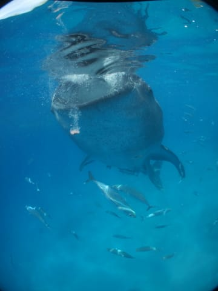
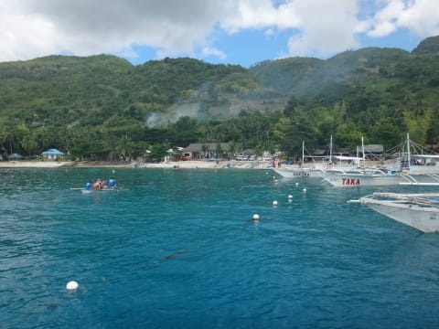
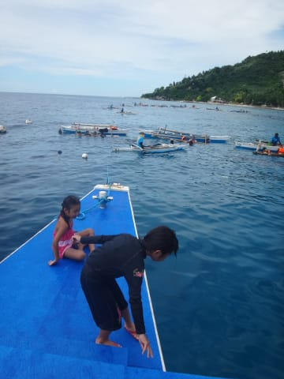
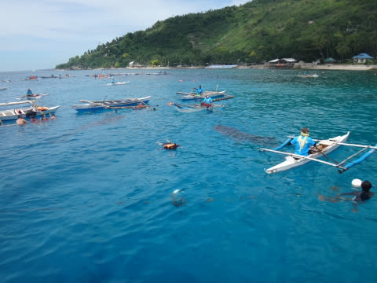
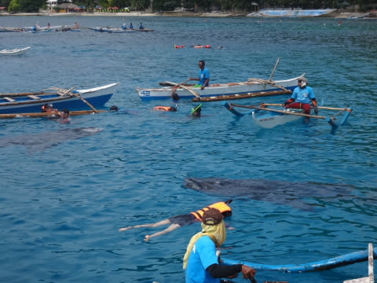
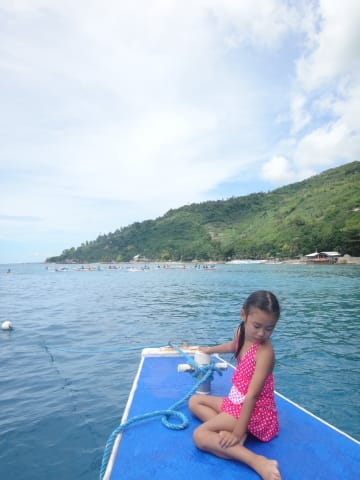
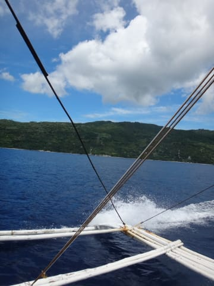

# 2014年8月　オスロブagain…再び，子連れでジンベエザメと泳ぐぞ！　その18

📅 投稿日時: 2014-09-27 03:00:46

という感じで．

この旅行のハイライトであり，山場であり，

目的でもあるジンベエシュノーケリングを終えて．

ボートへ戻ってきた，わが一家．

はたしてはたして．

…これにて，妻の病気は完治したのか？？

船に上がって，さっそく妻に尋ねる私．

私「どうだった？ダイビングよりシュノーケリングの方が，

　満足できたでしょ？」

妻「…うん．…こんなもんかな」

私（………『こんなもんかな』って…あーた，

　ま，まだ不満が？？）

妻「…とりあえず，満足したわ」

私（…当たり前だ．これで満足しなかったら，

　この海に置いていくところだった…）

ということで．

昨年夏から，約1年．

ながいこと引きずっていた

「突発性ジンベエを見たくてガマンできない病」

は，めでたく完治したようです…

…良かった…（心の底から安堵）

長い完治への道だった…

＃まさかリロアンに2回来るとは思わなかったよ

ってことで．

まだ目の前の海では…

ジンベエがいっぱい泳いでいるのが見えます．

しかし，やっぱりあれですね．

夏は人が多くて．

さらに，シュノーケラーを岸から運ぶボートも

多くなり．

ちょっと人とボートの間にいるジンベエを

見るみたいな感じになっちゃってるところも

あるなぁ…

11月は，もっと船も人も少なくて，

ゆったり泳げたし．

…妻の「こんなもんかな」発言は．

ちょっと人が多すぎたのがあるのかも…

うーむ．

やっぱり来るなら冬の方がいいかなっ！！

＃11月でも日本の夏並みの水温＆気温だし

ってことで．

ダイビング組が船の上に戻ってきたところで．

船はジンベエエリアから離れ…

リロアン島へ向かいます．

