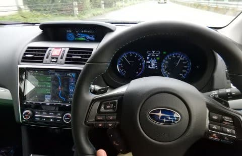
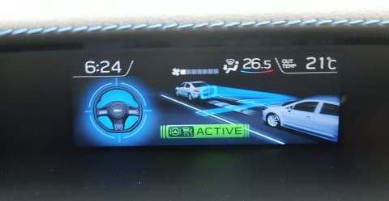
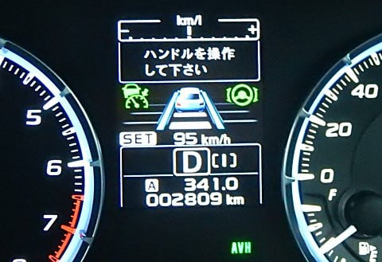

# LEVORG納車から2か月…すでに走行4000km．高速やら山道やら走ったインプレッション

📅 投稿日時: 2018-09-26 04:40:16

ってなわけで．

バタバタした，笑いと涙（？）の

プロジェクトX2の結果．

LEVORG E型の2.0GT-Sが納車されてから，

早くも2か月．

そろそろ，いろんなシチュエーションで

一通り走ったので．

どんな感じかの印象をば書いてみようと思います…

とりあえず，この車．

長距離移動がすごい楽！

高速道路での安定性は文句なし．

100kmの高速走行でも，びしっと安定．

高速道路をかっ飛ばしても，ステアリングに

指一本軽く添えるだけで，安定して

まっすぐ走るよ！

そして，サスも高速になればなるほど

落ち着きが増していくような感じです…

スピードが出れば出るほど，路面の荒れや

うねりなどをすっと収束させる感じで．

高速領域になればなるほど，乗り心地が

良くなっていくように感じる…

で．

車自体も，高速でかなり静か．

ただ，標準で履いているタイヤが悪いのか…

路面状況によってロードノイズが

かなり大きいところがちょいと残念．

滑らかな路面ならかなり静かなんですが，

ざらざらした路面だと，かなりのロードノイズが

響きます…

でも．

高速走行は，アイサイトツーリングアシスト様が

あるので無敵．

渋滞しようが何しようが．

ステアリングもアクセル・ブレーキも

全自動．

ステアリングを全く操作しないと，

「ハンドルを操作してください」と

怒られるけど．

軽く指をかけて，わずかにステアリングが

右か左に切れる方向に重さをかけておけば，

警告が出ることなく，自動でステアリングが

操作されて走っていきます…

そして．

アップダウンが続くワインディングでは…

もう．

無敵．

山道で．

登り坂を恐ろしいほど軽やかに登っていくし．

高速道路の登り坂なんかでも．

BRレガシィ君だと，リニアトロニックのギア比が

変わって，エンジン回転数上がっていくところでも．

エンジン回転数がほとんど上がることなく．

ブーストが上がるだけでグイグイ加速

していくので．

登り坂と気づかないほど…．

上りはマニュアルモード不要．

マニュアルでシフトダウンとかする必要なく，

そのままであっさり登っていきます．

ただ，パドルシフトを積極的に使って

下りのエンブレを使った場合．

エンジン回転が滑らかに上がってしまうので．

エンブレの効きがNAよりちょっと

弱い感じがしますが…

そして．

ワインディングを走ってみると．

フロントのロールがBRレガシィ君より

ずっと少ない！

左右のリズミカルな切り替えで遅れが無く，

左右への切り替えが気持ちいい！

そのせいか，狙ったラインがトレースしやすく．

数mmの精度でフロントタイヤを狙った

ラインに載せられる感じ．

かなりきついコーナーで横Gをかけて行っても．

タイヤグリップが強く，特にフロントはかなり

粘ります．

BRレガシィ君比20％増しでコーナーを

抜けていける感じ…

とりあえず．

ワインディングを走ると．

登り坂のストレスもなく．

車自体も気持ちよく狙ったラインに

乗せていけるので．

山道を走っていても，全然疲れません．

というより，いつまでもワインディングを

走っていたくなる感じ…

ってな感じで．

昨日も6時間ほど走ってましたが．

アイサイトツーリングアシストも

あるため，長時間運転も辛くないです．

遠くへ出かけるのが楽しい車ですね～．

## 💬 コメント一覧

### 💬 コメント by (まいる)
**タイトル**: ツーリングアシスト
**投稿日**: 2018-09-26 21:33:21

こんばんは

ツーリングアシスト便利そうですねー

私の車は、来月下旬に納車です

ビルトインクロスバーが着いてるので冬はありがたいです

あとでレビューしますね

### 💬 コメント by (Skier_S)
**タイトル**: まいるさま
**投稿日**: 2018-09-27 03:18:22

あ，来月下旬まで待たされるんですね…

納車後すぐにシーズンインですね．

スタッドレスも手配しないといけませんね…

またどんなだったか，レビューお願いします～！

