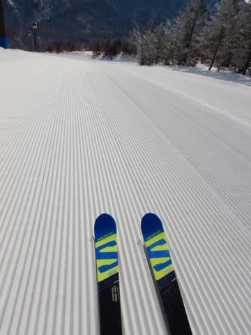

# 2020/3/7(土)の志賀高原スキー場は…終日晴天！朝は冷え冷え最高シマシマっ！！午後は一部緩んだところもあったけど，トップシーズンのいい感じの一日！

📅 投稿日時: 2020-03-08 01:19:05

🏷️ カテゴリ: [2020スキー滑走日記](c282e9230de179e245c7334eabeb0a3b3.md)

ってなわけで．

1時間半睡眠で出発し．

本日も志賀にやってきたわけですが…

今日は，早めに志賀高原に到着したのと．

車の同乗者のリクエストもあり．

いつもの焼額から浮気をして．

朝8時営業開始の，奥志賀でスタート！

ってなことで．

あさイチゴンドラで山頂に上がると…

朝イチは，最高の冷え冷えやわらか雪の

圧雪シマシマっ！！！

…これは．

間違いなく，トップシーズンの最高

冷え冷えベストのシマシマバーン！！

…ちょいと凸凹があり，焼額より圧雪のクオリティーは

落ちますが…

でも．

なかなかないレベルの，最高冷え冷え雪で．

エッジが食い込んでいく，やわらか圧雪の

プレミアムソフトシマシマバーンっ！！

…ってな感じのシマシマバーンを30分ほど堪能したら．

今度は，朝8:30スタートの焼額へ移動！！

そうすれば，2度目のフレッシュシマシマを

楽しめるのだっ！！！

いつもの，焼額営業開始時の山頂の

気温は-5℃と，完全予想通りの気温！

そして，今日2度目のフレッシュシマシマ．

いただきまーーーーす！！

いやーーー．

最高に柔らかい，がっつりエッジが効く

冷え冷えシルキーソフトタッチ雪！！

スピードを乗せるには，もう少し硬い

方がいいけど．

これだけエッジが効くいい雪は

そうそうないよ…！！

と，気持ちいい雪を堪能していたわけですが．

今週は，コロナウイルス対策でゴンドラの

乗車定員が半分に制限されているので…

そのせいで，いつもはまだガラガラの朝9時に．

もう列がつき始めているのですが…（涙）

そして．

朝9時半には…

なんじゃーーーーー！！！

この列はっ！！？？？

決してゲストの数は多くないのに．

ゴンドラの輸送力を半分に落としているので．

乗客が全然捌けず，かなり列が伸びてます…（涙）

公式発表ではゴンドラ待ち最大30分という

ことになってました…（泣）

ただ．

混んでいたのは，輸送力を抑えたゴンドラのみ．

リフトは乗車人数制限をしていないので，

第2高速で最大このくらい．

第3高速はガラガラでした…

が．

やはり，このゴンドラ待ちには耐えられない（涙）

だもんで．

本日も焼額の呪いを解いて．

奥志賀へ脱出！！

奥志賀エキスパートコースは，

北斜面で冷え冷えで．

雪もそんなに荒れておらず…

朝のうちは，人も少な目で荒れておらず，

いい感じ！！！

リフトもほぼ飛び乗りに近いほどガラガラ

だったので．

午前中いっぱい，いい感じで

かっ飛びました…！！

しかし．

奥志賀のこのコースだけでは飽きてくるし．

エキスパートコース，午後にはちょいと荒れて

来たので．

昼頃には，一の瀬へ移動！

一の瀬ファミリー正面バーンも．

多少荒れてはいたものの．

午後まで，意外と冷え気味の雪質で．

ちょいと固めながら，午後3時ごろまで，

それ程ひどく緩むこともなく．

ところどころ，硬めの下地が出てきて

いたものの．いい感じで滑れたかな…！

そして．

夕方ラストはまた焼額に戻ってきましたが…

ちょいと南斜面の焼額，雪が緩み気味

でしたね…（涙）

ただ，南斜面となる唐松，サウスコースでは

ちょいと雪が緩み気味であったものの．

でも．

それ程壊滅的に気温が上がることはなく．

ゲレンデは，ラストまでいい雪をキープ！

…でも．

ゴンドラも，日が傾くラスト近くまで，

輸送力低下の影響で，人が多めでしたが…

とりあえず．

そんな中も．

夕日が沈みかけるラストゴンドラまで，

たっぷり滑ったのでした…

…明日の志賀高原．

朝は最高シマシマです！

そして，終日曇りで．

昼間の気温は上がって，雪はシットリ

しちゃいそうだけど．

液体は降らずに済みそうかな…

ってな感じで．

明日も志賀を滑ってます～！！

## 💬 コメント一覧

### 💬 コメント by (いちと)
**タイトル**: Unknown
**投稿日**: 2020-03-08 06:01:17

頑張って滑って下さい

ブログを見てたら、私も頑張ろうと思い、次の3連休に参戦しようか？と考え始めました　まじめに踊りますので、いい予報を早めにお願いします

### 💬 コメント by (新米パパさん)
**タイトル**: Unknown
**投稿日**: 2020-03-08 07:01:00

奥志賀八時リフトから参戦しました、、、

昨年からS様、ウェア変わりましたか？？

奥志賀はかっ飛びスキーヤーだらけでもはやどなたか判別できず、ご挨拶し損ねすみません。

奥志賀山頂に刺してあった板はシロウ君だったのか！

うちも、焼額第一ゴンの列見て絶望し奥志賀に戻り、午後は一の瀬でのんびり回してました。寺子屋の上はブッシュ出て、カリカリ下地、、、

帰りはギ、トンネル内のキャンピングカー横転後すぐ通過でしたので渋滞ゼロでしたが、アレ、だいぶん渋滞して下山は地獄だったのでは？？

去年も同じとこでハイエース横転してましたが、同じく夕方登りでしたね。

あのトンネル内は、朝でなく夕方が危ないのですか？

志賀高原、怖くなりました。

### 💬 コメント by (なるなる)
**タイトル**: Unknown
**投稿日**: 2020-03-08 11:54:33

昨日、一の瀬のリフトからお見掛けしました。

ちょうど、ヤケビ・奥志賀へ旅に出ようかと思っていたタイミングだったのですが、

何となく、S様が一の瀬を滑ってるってことは、行かない方が幸せなんだろうと感じ…

トンネル事故は、20分少々足止めをくらいましたが、その後は順調に下山出来ました。

トンネル内は道路が白くなくて、飛ばしたり、車間を詰めてくる人が多いですが、

あそここそ、気を付けて走るべきポイントだと思います。

### 💬 コメント by (べー)
**タイトル**: Unknown
**投稿日**: 2020-03-08 15:28:14

毎回昼上がりで帰りますが、今年は暖冬の影響かトンネル前後は路面がシャバシャバでトンネル内はブラックアイスバーンで滑りまくりです（汗

滑ると分かっていてもカウンターあてて通過するのは心臓に良くないです。トンネル内狭いですからね（汗

地元のタクシーも慎重に運転していましたよ。

### 💬 コメント by (新米パパさん)
**タイトル**: Unknown
**投稿日**: 2020-03-09 00:05:41

ベー様、なるなる様、ありがとうございます。

納得です。

昼に雪解け水が小川の様に路面に流れてますものね。

あれが勾配でトンネル内の路面の氷の上に流れ込めばそりゃ、滑りまくるわけですな。

朝の登りは気がはやりついつい早くゲレンデに着きたい一心でトンネル内でも減速が足りないので、より一層気を引き締めて楽しい志賀高原スキーを1日でも長く続けたいと思います。

### 💬 コメント by (Skier_S)
**タイトル**: 今日は結構良かったよ！
**投稿日**: 2020-03-09 01:04:55

＞いちとさま

頑張って滑りました(笑)．

ぜひ3連休にはご参加を…！

＞新米パパさま

去年と同じウェアを着てますよ～！

…でも，奥志賀山頂の四朗君を見てるのですね(笑)．

ちなみに，あのトンネルは，朝や夕方に関わらず．

いつでも結構危ないです…

トンネル内は，気を付けて運転してください．

＞なるなるさま

あら！

来てらしたのですね…

お会いできず残念です．

あの日の焼額は，終日ゴンドラ待ちがあったので

脱出してしまいました．

一の瀬で正解だったかと．

＞べーさま

あのトンネル，途中のカーブがいやらしいですよね…

そして，チェーンで削られた深いわだちで結構ハンドルも

取られるし，注意して運転しないと危ないです…

