# 2025/3/16(日)の志賀高原スキー場，詳細レポート！…終日サンバレーを滑ったけど，午前は混雑＆吹雪，昼は空いてきて日も射す感じに

📅 投稿日時: 2025-03-19 00:47:13

えー．

どうやら暴風大荒れの日曜と違い．

月曜の志賀は新雪が5-10cm積もって

くれたおかげで，今朝…というか，

火曜の朝の記事に書いたように．

特派員によると，晴れて晴天で

朝イチはシマシマで最高の一日

だったみたいです…！！

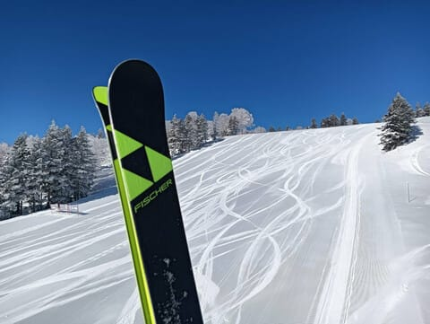

朝イチは完全トップシーズンの

コンディションで，そしてガラガラ…

うらやましすぎる…

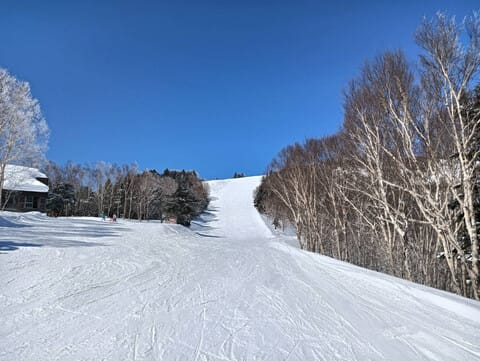

ただ，昼間はちょっと気温が上がったので，

ちょっとだけ雪は緩んだようですが…

それでももう3月中旬ですからね．

これだけのコンディションなら

恵まれてる…！うらやましい…！！

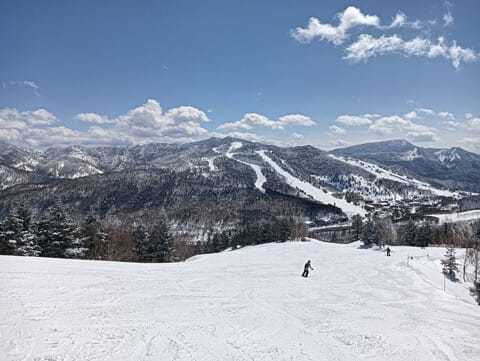

で．志賀高原は，18日の深夜現在，

そこそこの勢いで雪が降っているっぽい

ので…

19日(水)は朝までに10～20cm，

昼間も10cm以上積もりそうな感じ！！

昼間も雪が積もり続けるモフモフデー！

ただ，この日はまた風が強まりそうなので，

ゴンドラ・リフトがちゃんと動くか心配…

で．

19日にいっぱい積もってくれるので．

20日(木・祝)は，朝から冷え冷えの

降りたて雪が圧雪された，トップシーズンの

コンディション！！

この日は朝は雲が残るかもしれないけど，

晴れる上に気温が上がらないので…

トップシーズン並みのコンディションで

滑れるんじゃないかな～！！！！

…雪が柔らかいので，午後はちょっと

バーンが荒れるかもしれないけど…

という感じで．

20日の祭日は，いい雪になりそうです！！

もしかしたら今シーズンラストの，

トップシーズン雪で滑れる日になるかも…！！

ってなことで．

日曜の最悪状態からすでにゲレンデ状況が

回復してしまっている現在．いまさら感が

ありますが…

今日は日曜のサンバレースキー場の

ゲレンデ状況の詳細レポートです！

まず．

宿で朝起きた段階で．

窓から外を見ると，木の枝がゆっさゆっさ

揺れるかなりの風（泣）

この段階で，すでに今日のスキー場の営業が

無理であることを確信するレベル…

案の定，焼額は全山運休，一ノ瀬エリアも

動く気配なしという情報が入り．

同じ宿の人たちがあきらめて帰り始める中，

もう少し待てばリフトが動くかもしれない

ので，とりあえずチェックアウトタイム

ぎりぎりまで宿で様子を見よう…

と，10時ごろまで待ったけど．

動いたのはサンバレーと熊の湯第1のみ（泣）

焼額は全く動く気配がないので，

めっちゃ強風で車があおられる中，

やむなくリフトが動いている

サンバレーへ向かいました…

（私には帰るという選択肢はない）

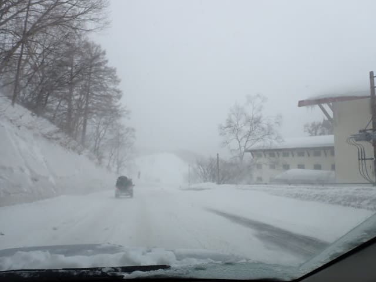

で．

サンバレーに着いたけど…

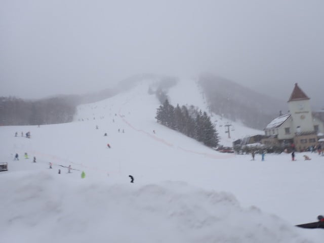

ときおり強い風が吹き付けるし，

雪が吹き付けて視界が悪いし…

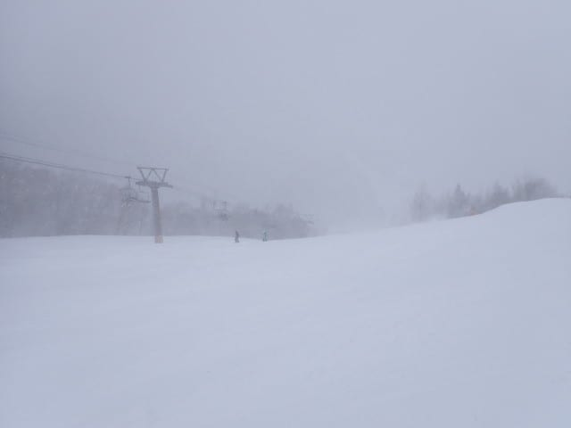

そんな中で，ここと熊の湯しかリフトが

動いてないので，こんな天気でもあきらめず

滑りたいというスキーバカスキー好きが

集中して，かなり混んでるんですが…！？

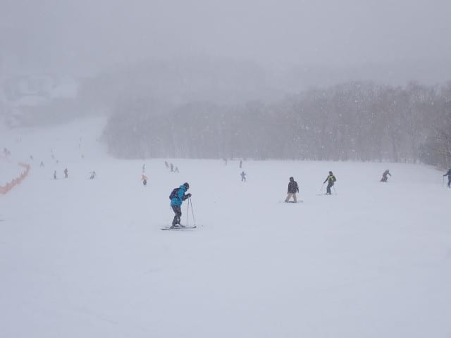

なんだか，サンバレーとしては記録に

残る混雑なんですが…？？？

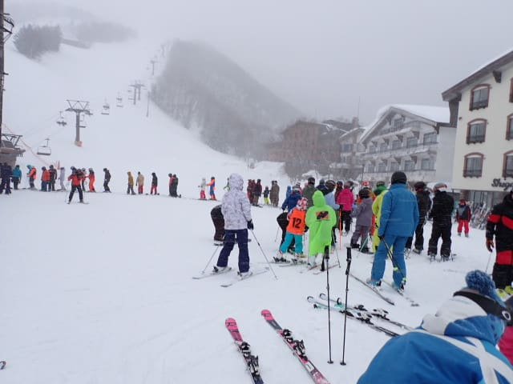

そして．

雪はカリカリの上に，ネットリとした

重い雪が乗っていて，その雪が蹴散らされ

ボコボコになり始めた，かなり楽しくない

コンディションだし…

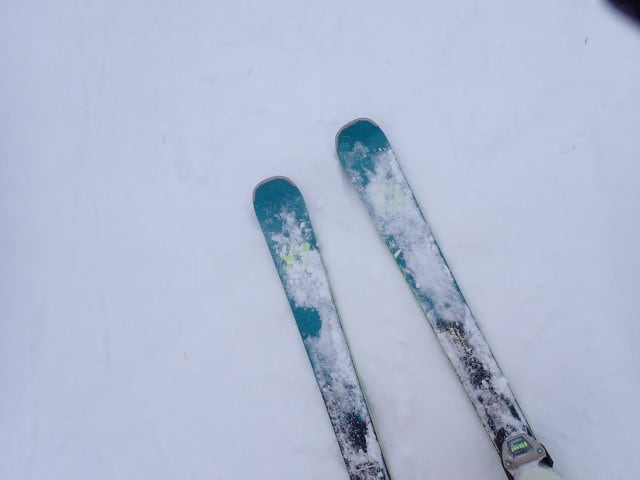

なんでこんな雪が悪くて，

吹雪いて視界が悪い中…

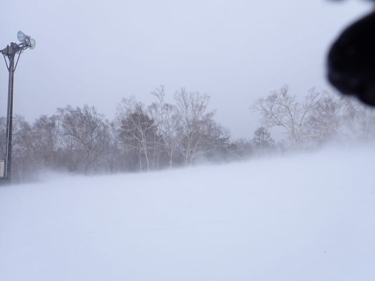

こんなにもゲレンデに人がいるんだ？？

こんなコンディションで滑ろうという

いろいろ終わったスキーバカスキーに情熱を

かける方々がこんなにいるとは…っ！！

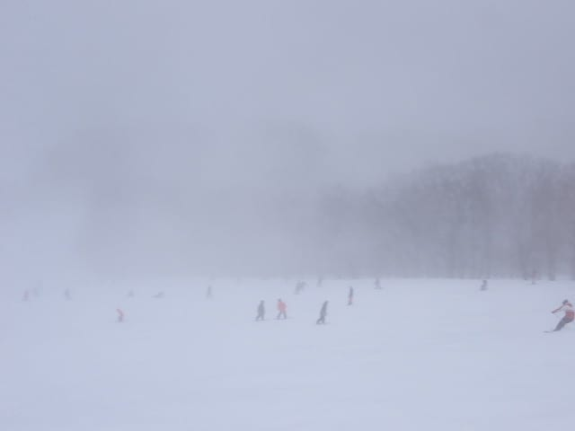

うーん．

混むし天気は悪いし雪は悪いし，

楽しくない（涙）

これは早々に切り上げて，私も早めに

帰ろうかな…と思っていた

ただ，こんなにリフトが並んでいたのは

午前11時過ぎくらいまでで．

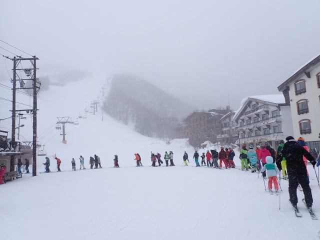

悪天候に耐えられなかったのか，

昼前に帰る人が多かったらしく．

昼頃には，リフトも結構空いてきま

したよ…？

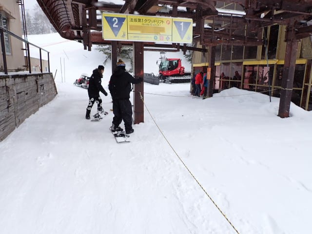

そして，昼頃にはなぜか空も

明るくなり始め…

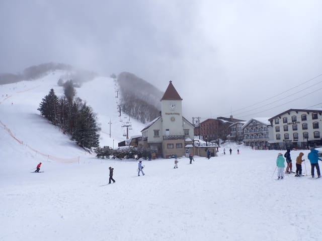

え？

まさか晴れた？？

えええ？？

今日，日が射すとは思わなかったよ！！！

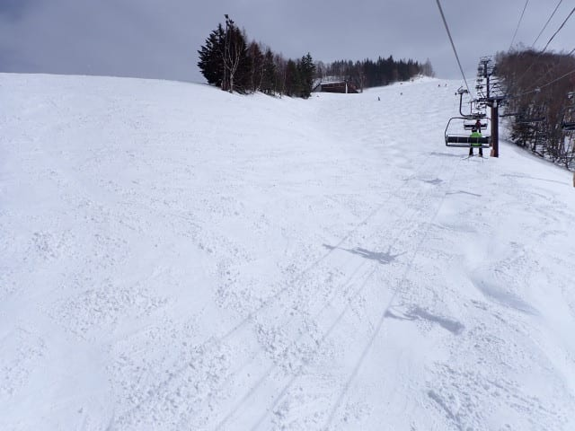

ってな感じで，13時前には風も弱まり，

日も射し始めました！！

まぁ，雪質は湿ったモサモサの雪が…

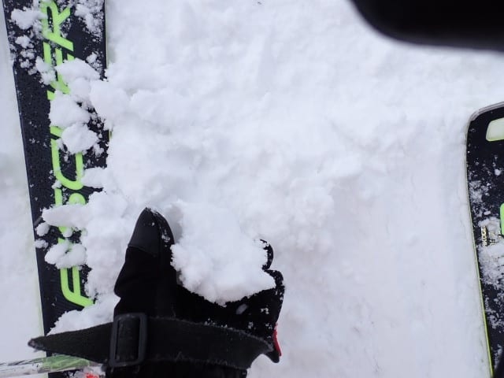

カリカリ＆氷のコロコロの上に乗った，

ちょいと難しめのバーンながらも．

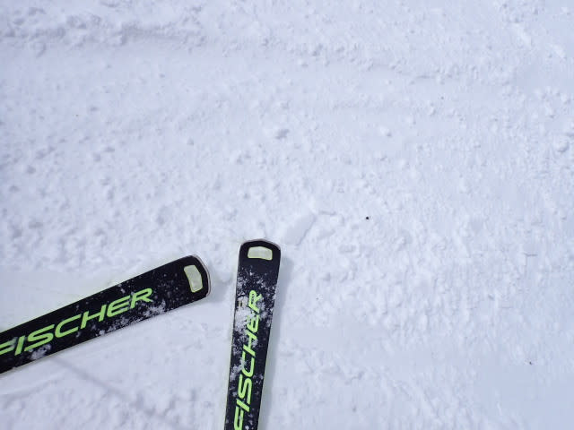

見える！！

バーンが見えるのだ！！！

コンディションが悪かろうが，

バーンが見えればこっちのモノ．

見えればどんなバーンでも

楽しく滑れるのだ…！！！

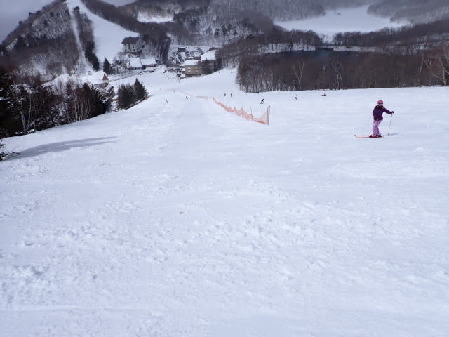

さすがにすっきり晴れとはいかず，

曇ったり時折日が射したりの

天気だったけど．

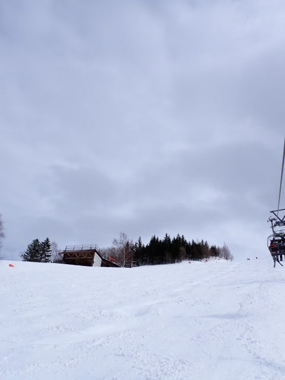

12時半を過ぎたころから，

3時過ぎくらいまではかなり

日が射すことも多く．

午後2時を過ぎると人も減っていき…

意外と楽しいよ！！

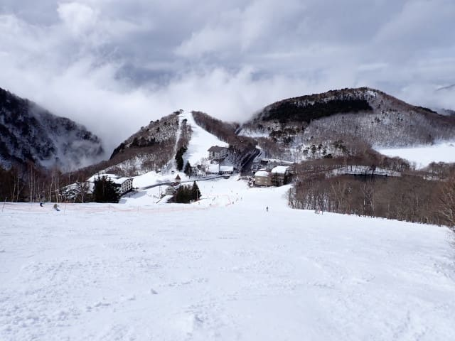

…早く帰るつもりだったのに，

これでは帰れないじゃないか…っ！！

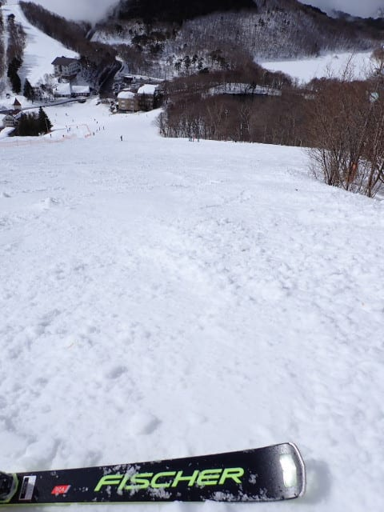

と思っていたら．

午後3時ごろに，怪しげなガスが

ゲレンデに近づき始め…

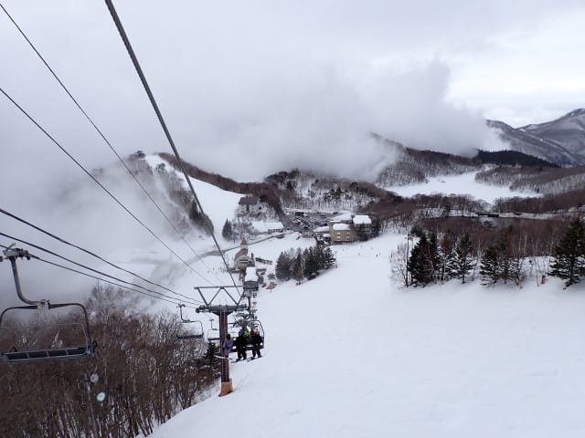

午後3時半ごろには，ついにゲレンデに

ガスが侵入してきました…（泣）

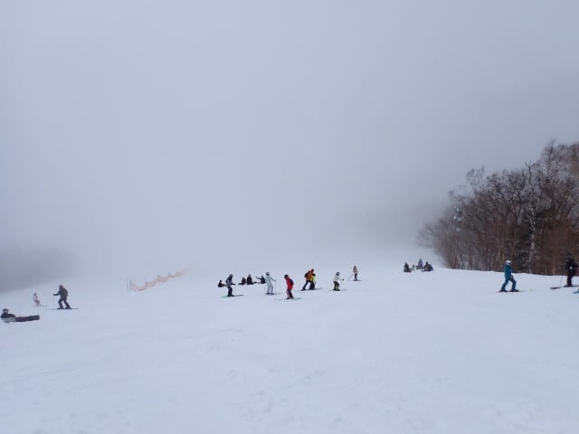

ぐおおお！！

見えない！！

ゲレンデが全く見えない…

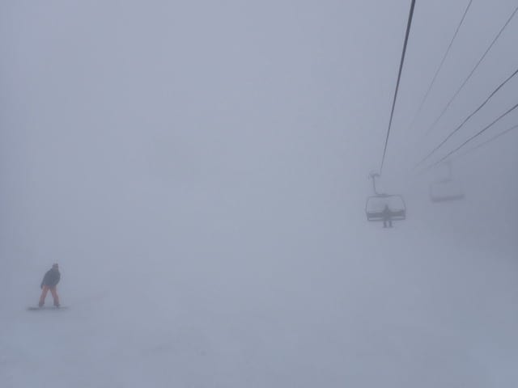

ガスが出てきただけじゃなく，ちょっと

雨か雪か微妙なものも降りだしてきたけど…

ここまで来たら，営業終了まであと30分．

リフトが動いていると帰れない病が

発症し，早く帰るつもりだったのが，

ついつい今日も16:20のリフトストップ

まで滑り続けたのでした…

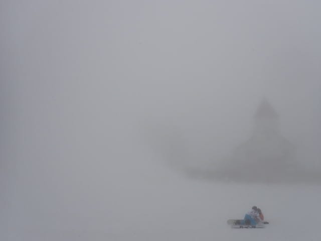

…しかし．

この悪天候の中．

Garminさんのログを見ると…

朝のリフト待ちが長かった時間と，

途中スキー板を取り換えるために

車に戻った以外．

こんなに天気とコンディションが

悪かったにもかかわらず．

ひたすらぐるぐるしていた記録が

残っていて．

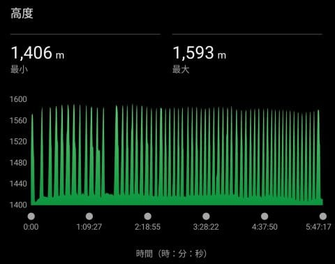

今日は天気も悪いし，休み休み滑って，

早めに帰ろうか

と思っていたのに，これか…

と．

今更ながらに自分が，

「リフトが動いていると休めないし帰れない」

という謎の恐ろしい呪いにかかっていることを

再認識したのでした…

いや．

自分でも，さすがにサンバレーリフトだけを

一日滑ったら飽きるだろう…

早く帰ろうって気分になるだろう…

と思ってたんだけど，まさかこんなに滑る

とは思ってなかった…

PS.確か焼額常連の中に，サンバレーで

20000mチャレンジをしようとして，

このリフトを1日で100回以上乗った

かなりおかしな人何か突き抜けた人が

いた気がする…

## 💬 コメント一覧

### 💬 コメント by (hapi44)
**タイトル**: Unknown
**投稿日**: 2025-03-19 21:22:57

こんばんは！

私には帰るという選択肢はない…

分かります〜🤣

### 💬 コメント by (Skier_S)
**タイトル**: ＞hapi44さま
**投稿日**: 2025-03-20 01:06:00

帰るという選択肢はないし，

リフトが動いていたら滑り続けないといけないし．

天気が良くて雪がよさそうなら，睡眠時間2時間半で日帰り志賀高原に行かなくてはなりません…

もう深夜1時過ぎ．

ホントに明日起きて滑りに行けるのか…？？？

