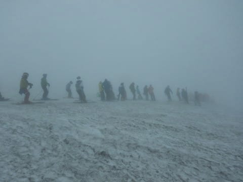

# 2019/6/29(土)の月山スキー場，詳細レポート！…ガス時々雨（涙）．大斜面も終了．ゲレンデが見えない中，混んだTバーを滑るのみ…

📅 投稿日時: 2019-07-01 04:07:32

🏷️ カテゴリ: [2019スキー滑走日記](c3e4496fc0fb7f9c17ff21214a35b1ace.md)

ということで．

本日は，土曜の月山の詳細レポート．

では，行ってみよう！

えー．

まず．

土曜の朝，

朝から雨が降る道路を駐車場まで

上がりましたが…

さすが天気が悪いからか，駐車場の車は

かなり少なかったです．

そして，駐車場からリフト乗り場まで，

とぼとぼ歩くわけですが…

昨日書いたように，途中で一人200円の

協力金を払います．

そこからリフト乗り場に向かって

登っていく道．

全然雪が無くなりましたね（涙）

まぁ，もう7月ですから，こんなもんですか．

リフト乗り場に到着したら，

チケットを買いますが．

すでにリフトを滑って降りることができず．

一日券や半日券は売っていません（泣）

リフト往復券で上に上がって，

上のTバーを滑り．

その後，リフトで降りるしかない状況です（泣）．

雪が多めの年なら，6月最終週でも

リフトが滑れるんですけど…

5月の志賀やかぐらは，雪が多くて

良かったものの．

月山は，ほぼ平均的な時期に終わった

感じでしょうか…

そして，リフトに乗ると．

ニッコウキスゲがかなりいい感じで

咲いていますけど．

…周りはガスってます（涙）

いつもなら，ここからすぐそこに見える

山頂が，全然見えません（泣）．

リフトを降りても…

この目の前にスキーで滑れる斜面があると

思えないんですけど…（激涙）．

そして．

リフトからこんな感じの道を，

かなりの距離歩いて…

やっと雪のある所へやってきました！

…振り返ってみても．

リフト降り場が全然見えませんね…

そして．

周りに何も見えないので．

ここからどっちへ行けばいいか．

月山に来たことが無い人は

絶対分かりません．

遭難可能レベルです（泣）

こんな，何も見えない雪面を，

とぼとぼ登ること5分ほど．

やっと．

ようやっと，Tバー乗り場が見えてきます！

…しかし．

これだけ視界が悪いのに．

こんなに人がいるとは…！！！！

…この時期の月山に来る人は．

やはり，この程度のガスが出ようと，

滑ってしまうような人たちが集まって

いるんだなぁ…（ある意味感動）

ってことで．

Tバーに乗って．

上へ登りますが…

いや．

見えない．

全く見えない（涙）

視界，せいぜい10mちょいってところか…

ようやく，

Tバーのてっぺんに到着！

駐車場からここまで，1時間近く

かかったよ…（涙）

でも，

やっと滑れるよ！！！

…と，コースを見るけど．

…ぜんぜん見えない（泣）．

コースがどんなになっているか，

分からない…（涙）

こんな感じの，わずか先にあるTバー乗り場すら

見えないゲレンデを，滑る！

ひたすら滑る！

…距離が短いので，

あっという間にTバー乗り場に着いちゃいます．

滑走時間，20秒ほど…

でも．

今日滑れるのはこのTバー2本のみ．

このTバーを，ひたすら滑る！

…と，繰り返し滑っていたら．

人が次々と上がってくるので…

午前11時ごろには．

Tバー待ちが10分近くに伸びてきました…（涙）

駐車場から1時間近く歩いてきて．

それでTバーを10分近く待って．

で，霧雨のような雨が時折降る，

こんな感じで視界の悪い中，

滑ろうって人が．

こんなにいっぱいいるんだから…

日本にはまだ，スキーにハマっている

おかしな人素晴らしい人が，まだ

こんなにいるんだなぁ…

と，感動することしきり．

私はそこまで素晴らしい人ではないので．

昼前に退散することにしました…

しかし．

圧雪されてない，荒れた斜面ではありますが．

もう7月になろうという，この時期に，

ちゃんとした雪の上を滑れるとは，

有り難い…

ってな感じで．

Tバーを滑り終わったあと．

視界のないゲレンデを滑り降りていき…

無事，リフト降り場につながる道に

たどり着けました～！

…しかし．

正しくここにたどり着かないと，

どこまでも滑り降りていってしまい．

気づくと目の前が全て藪に塞がれて，

それ以上降りることができない

という，恐怖の体験ができると思います．

月山に行ったことが無い人は，

視界のない日に滑らないことを

おススメしておきます…

ってな感じで．

私はこの日．

無事，今シーズンのすべての

スキーを終えました…

あぁ…スキーシーズンが．

私の2019シーズンが，終わってしまった…

無事，ケガなくスキーシーズンが終えられたことを，

スキーの神様に感謝するという，

スキーシーズン終了儀式（？）を終えて．

リフトで下山です…

ちらっと見える大斜面は．

この写真だと良く分かりませんが．

どうやら，完全に切れてしまっていて．

もう，藪漕ぎで突破できるレベルでは

なさそうでした…

残念ながら，2019シーズンの締めは，

あまり良くない天気となってしまいましたが．

…その代り．

長かったシーズンをねぎらうかのような，

見事な雲海に出迎えられて．

2019シーズンを終えたのでした…

あぁ…

終わった．

終わってしまった…

私の2019シーズンが…

これから次のシーズンまで，

スキー無しで耐えられるのかな…？？

## 💬 コメント一覧

### 💬 コメント by (naoちゃんねる)
**タイトル**: Unknown
**投稿日**: 2019-07-01 07:20:23

シーズン終了お疲れさまでした～

すごく過酷な月山だったのですね…

やはり視界が無いのが一番痛いですね😢

Ｓさんのシーズンが終了すると、ようやく夏がくるのかなと実感します(笑)

しかし、シーズンオフが３ヶ月ちょいって…スゴすぎますよ～

### 💬 コメント by (しんちゃん)
**タイトル**: ご無事で何より
**投稿日**: 2019-07-01 22:45:56

シーズンを無事に終えられ、お疲れ様でした。

今シーズンヤケビのメンバーが怪我に悩まされる中、無事にシーズン終了できて良かったですね。

さあ来シーズンまで、物欲選手権の過酷な戦いが始まりますね(笑)

ＳＸの次期戦闘機は果たして見つかるのか？

スキーパンツの摩耗は著しいのか？

変形したリングのストックはまだまだ使い続けるのか？

どんな物欲選手権になっていくのか期待しています(笑)

### 💬 コメント by (Skier_S)
**タイトル**: まだシーズンが終わった実感がない…
**投稿日**: 2019-07-02 01:23:14

＞naoちゃんねるさま

終わっちゃいました…（涙）

いや，6月中旬以降，リフト乗り場に滑りこめず，

リフトを降りてからゲレンデまで数分歩くように

なる，最終形態の月山はかなりの修行です(笑)．

そして，来週は娘とプールに行く計画をしていたり．シーズンが終わるといきなり夏です！

＞しんちゃんさま

私は無事けがもせず，シーズンを終えることができました…

しかし．

昨シーズン．

ブーツとウェアと板と車と家を買ったので．

今シーズンは物欲は抑えて，おとなしく過ごす予定です…

