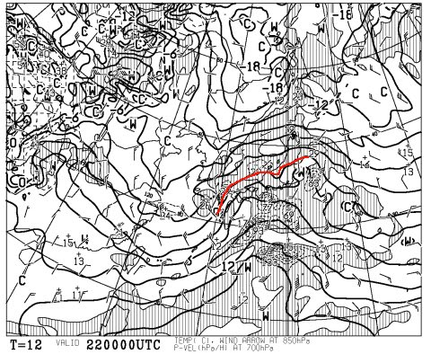

# 今週末の志賀高原は…土曜は雪が残るけど，日曜は晴れだな…

📅 投稿日時: 2015-01-22 01:37:30

🏷️ カテゴリ: [スキー天気予想](c6554f5c3c106093b511a8daae23757e8.md)

あー．

雨を予告している，22日がやってきたわけですが．

…22日朝9時の，850hpa図．

赤線で示した0℃線．

一昨日の予想よりは南に下がってくれて．

きわきわ志賀高原にかかるくらいになってくれてはいるものの…

だけども．

おそらく．

南風が吹き込む午前中は，やっぱり雨でしょう（涙）

山頂付近では，みぞれっぽいかもしれないけど…

せめてもの救いは．

ザーザーぶりにはならなさそう…

ってことくらいでしょうか．

んで．

22日の夕方から，雪に変わります．

そのあと，23日の天気図は，こんな感じで，

なんだかすごい荒れそうな感じなんですが…

んで．

850hpa図を見ると，0℃線はそこそこ南に下がってくれて．

志賀高原にはマイナス6℃くらいの線がかかっているので…

23日は冷えて，吹雪きますな．

そこそこの雪で，22日の雨で凍ったバーンが隠れてくれるか？？

…強風で雪が飛んじゃうとつらいけど…

で．

24日，土曜日は，というと．

地上天気図は，こんな感じで，

高気圧に覆われてるので．

ふーむ．

午前中は雪が残るかもしれないけど．

昼ごろには太陽が射すかな～．

850hpa図の0℃線も，まぁ南に下がっているので．

日が射しても，雪は緩まないくらいの冷えた感じかな～．

それで，だ．

25日の日曜は…

おっと．

完全に高気圧に覆われてますな．

これは，晴れですね～！

850hpaの0℃線は，まだそこそこ南にあるので．

まぁ，1月にしては暖かめだけど，日差しで

雪が溶けてしまうほどではないかな．

…しかし．

土日ともに，そんなに積雪の積み増しは無いので．

日曜あたり，急斜面は22日の雨で凍ったアイスバーンが

顔を出してくるかも…

ってことで．

まとめると．

土曜：朝のうちは雪．午前中に雪は止む．前日の午前中はドサドサ

　　降りそうだけど，夜からの積雪量はそれほどでもないので，

　　朝イチパウダーは望み薄．硬い下地の上に，圧雪が乗った雪質．

　　昼頃から太陽が顔を出し始める．

　　午後は晴れ！

　　気温はそこそこ冷えてて，いい感じ．

　　バーンによっては，下地に硬いところが顔を出す．

日曜：晴れ！朝からすっきり晴れ！

　　朝イチはしっかりした圧雪の，快楽大回りバーンかな！！

　　ただ，上の柔らかい雪が掘れてくると，下地のアイスバーンが

　　でてくるかも…

　　急斜面は柔らかい雪とアイスバーンのまだらになる可能性．

　　気温は高めだけど，日差しで雪が溶けるほどではなさそう．

　　アイスバーンが顔を出すところ以外は，晴れてていい感じの

　　スキー日和になるかな．

…って感じで．

うーむ．

22日，雨になりそうなのが惜しい…っ！！

とりあえず．

まだ，全身全霊で祈り続けているSkier_Sなのだった…

## 💬 コメント一覧

### 💬 コメント by (aqura)
**タイトル**: Unknown
**投稿日**: 2015-01-22 08:09:25

今週末、久しぶりに行けそうです(^^)

雨が降らないように、お祈り、お祈り……q(^-^q)

### 💬 コメント by (Skier_S)
**タイトル**: aquraさま
**投稿日**: 2015-01-23 05:18:53

こちらは，今週末は行けないかも…（泣）．

祈りが通じたのか，志賀高原は雨は小降りだった気配…

でも，気温が上がったのでアイスバーン化しただろうな～（涙）

