# 水中カメラ買い替え計画，予想外の展開っ！

📅 投稿日時: 2015-08-04 01:12:13

そういや．

土曜の海上自衛隊一般公開ですが…

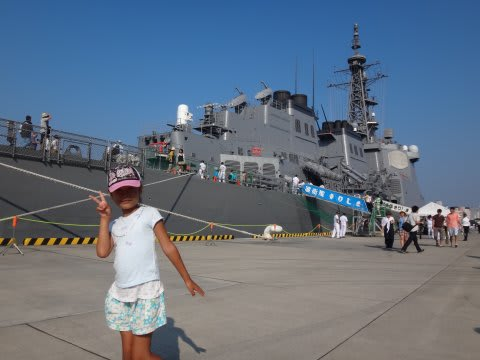

護衛艦の甲板に乗せてもらえたり

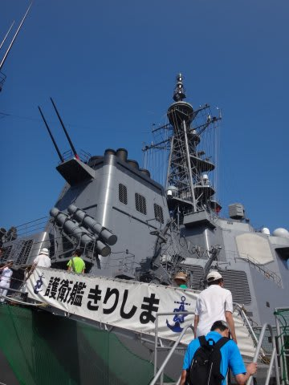

（今となっては前世代型，DDGきりしま）

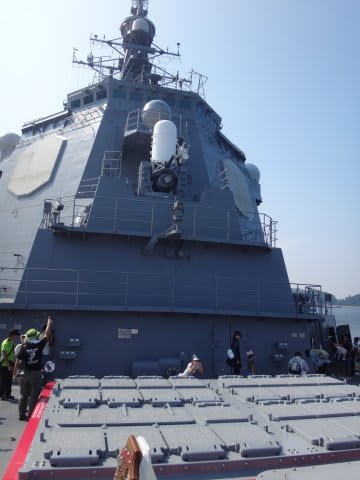

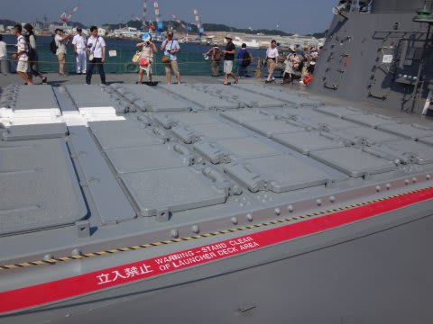

…無造作にここまでVLSやら…

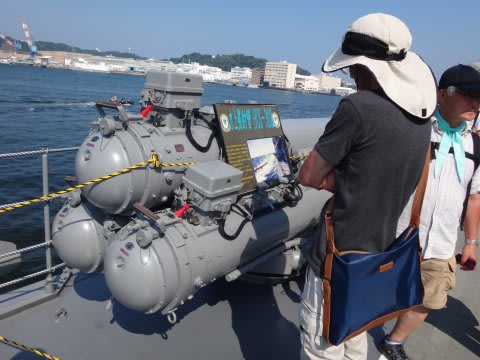

水上発射管やらに近づけます…

潜水艦にも乗せてもらえたり…（甲板だけだけど）

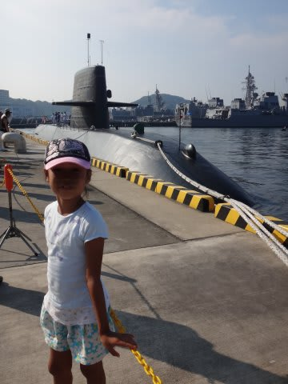

（こちらも今となっては前世代型となった，SSやえしお）

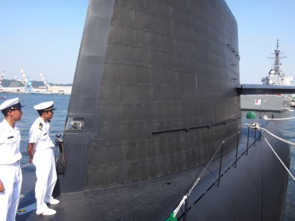

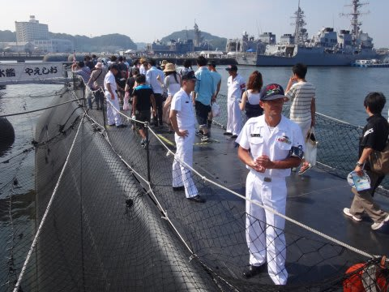

潜水艦のデッキは初めてだったけど…

防音タイルって，こんな材質なのね…

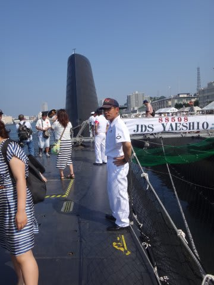

あと．潜水艦のハッチを見れば，最大深度が大体

想像つくってことで，かなり秘密らしいけど．

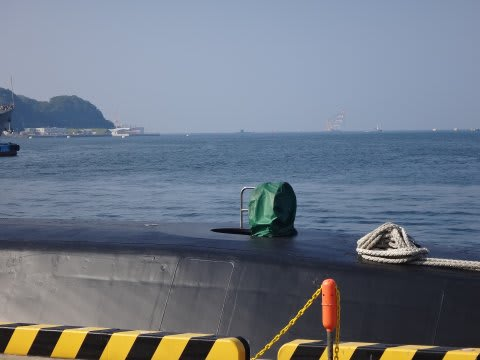

やっぱり，カバーをかけてあるなぁ…

とか，いろいろ感心しつつ，廻った一日．

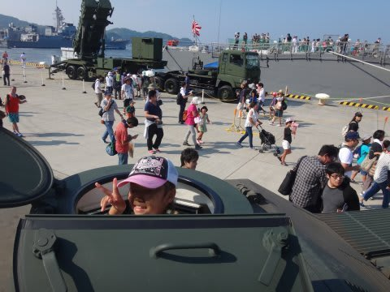

（指揮通信車ハッチから顔を出す娘）

なかなか．

いろいろ，学ぶところの多い一日でした…

というところで．

本題のカメラ買い替え計画，続きへ，Go!

--

前日の記事にあるように．

カメラ買い替え候補の，2機種の最終決戦．

この最終決戦をひっくり返すものを見つけて

しまったわけですが…

それは．

一体なにかというと．

…新宿のとあるカメラ屋にて．

なんと．すでに生産中止になったカメラ．

Canon Powershot S120用の新品ハウジングが，

安値で投げ売りされているじゃないか…っ！！

CanonのS120．

今，私が使っているS90の4世代後の機種で．

もともと，このSシリーズ．

レンズも明るいし，使い勝手もいいしカメラで．

そのSシリーズの最終型，S120用のハウジング．

…まぁ，カメラ本体はもう生産中止になって，

店頭で新品はほとんど入手不可能だから．

ハウジングだけ残っててもこまるだけだし，

ハウジングも投げ売りになるわなぁ…

でも．

この，CanonのS120．

すごく欲しかったんだよな～．

…欲しかったんだよな～．

すごい，欲しかったんだよな～

…だけど，カメラ本体は，すでに製造中止で．

ほとんど新品は残ってないしな～．

…

…

…

…新品が，残ってない…？？

…

ならば．中古を買えばよいのでは？？？

よく考えたら，今，私が使っているS90も．

安く上げるために，中古を買ったんじゃないか！！

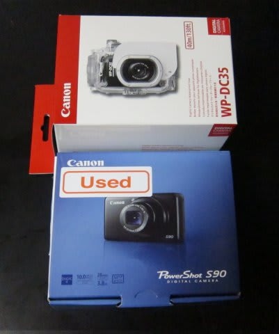

（5年前，中古で買ったS90）

とりあえず，新宿の中古カメラ屋をめぐると…

かなりの人気機種だったS120．

いっぱい売ってるよ…

中古価格は大体2万円前後．

ダイビングでは必須の予備バッテリーが，

S120だとS90のバッテリーと共用できるので．

予備バッテリーも買わずに済むから，

当初のプランC，リッチプランより2万円以上

安く上がるよっ！！！

これだ！

これなら安く上がる！

これで行こう！

（まだ続く）
