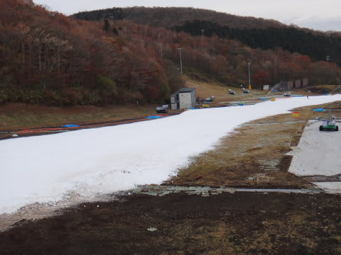

# 11月11日のYetiは…2013シーズンスタートから3週間

📅 投稿日時: 2012-11-12 21:10:30

🏷️ カテゴリ: [2013スキー滑走日記](c91dbe557f9a69230b1600e48622fdd61.md)

えーーー．

昨日，日曜日．

スキー場から帰ってきて，とりあえず動画だけアップしましたが．

今日は詳細レポートをば…

この日は，朝のうちは日も射していたくらいで．

富士山も見えるくらいでしたが…

12時くらいから雨．

1時過ぎから結構強い雨になってしまいました…

雨の天気予報だったからか，ゲレンデは先週よりはすいてましたね～

あー．

あくまでも

先週よりはです．

すいていた（当スキー場従来比）

って感じの表記です．

一般常識から言ったら，かなりの人口密度です．

これが，一番混んでいるとき．

平均的には，この程度かな…

でも，比較的クリアなラップが取れるときもありました．

特に，オープンから1時間，朝9時まではかなりがらがら．

コース幅が先週よりかなり広がったのもあり．

かなーり快適にトップスピードで滑れます．

…って言っても緩斜面なので，限度はありますが．

そういや．

去年，おととしは，結構この時期に壊滅的な土砂降りがあり，

かなり雪が薄くなり，コースも狭くオープン直後より状況が

悪化したこともありましたが．

今年は順調なのか，結構コース幅，広がりましたね～．

オープン時から，大体全体的に倍以上の幅に広がったかな～，

って感じです．

んで．

朝のうちはリフト待ちも無く，ハイペースで滑れましたが．

雪は朝のうちは，ちとやわらかくて潜る雪…

降雪機から出てきたざらざらな雪が，そのまま固められずに

コース上に載っている感じ．

…これが，締まった雪だったら最高だったんだけどなぁ…

そして．

9時半になると人も増えてきて．

クワッドリフトの待ちは最大10分弱かな～．

でも．並行するペアリフトはほぼ待ちなし．待っても最大でこのくらい．1分も待たないかな？

ペアリフトに行けば並ばずにすむので，リフト待ち自体は

気にならないのがいいところ．

でも…

1時過ぎになると．

雨が強くなってきたよ～

…でも，人が少なくなってちょっと快適になってきたかも(笑）．

しかし．

Yetiのこの時期って．

晴れて人が多くて，滑っているっつーより人の合間を縫って

降りていくよりは…

雨の日を狙っていった方が良いんじゃない？

(雨が降ってリフト待ちが2-3分程度に短くなってる）

って思った，雨の日曜日なのであった…

(まだ晴れていた朝のうち）

## 💬 コメント一覧

### 💬 コメント by (千春)
**タイトル**: Unknown
**投稿日**: 2012-11-13 18:38:31

こんにちは、１年前にコメントさせていただいた千春です。

http://blog.goo.ne.jp/tsakamot2001/e/ca170a44ab7dd87d641251a9451bdc0b

2012/11/11、私もイエティ行ってました。

雨が降り出す前の12時ごろ引き上げましたよ。

あのあと、雨が強くなったんですね。

久しぶりにこちらのブログを拝見しに来たら、写真に写ってて笑いましたー。

### 💬 コメント by (Skier_S)
**タイトル**: お久しぶりです～
**投稿日**: 2012-11-14 00:06:02

いらっしゃいませ～

この時期は，Yetiしかあいてないので，

一年前と全く同じような記事です～．

この日は12時から降り出し，1時にはそこそこの雨，

2時にはかなり本格的な雨でした…．

しかし，写真に写ってましたか…

もしかしたら私がどの人物かも気づいていたのでは？

今週末はまだどこに行くか決めてません…

またYetiかも．

