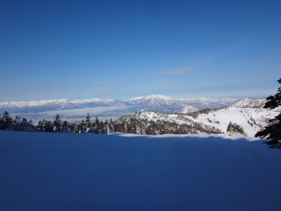
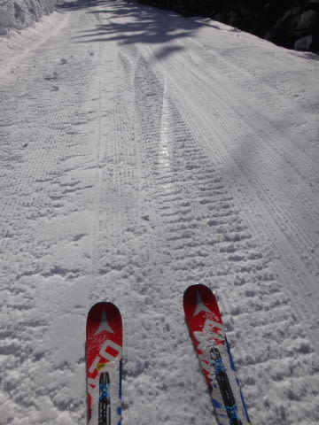
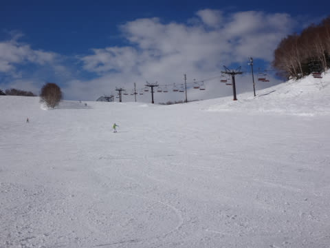
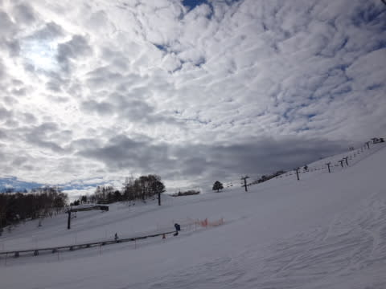
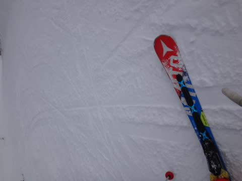
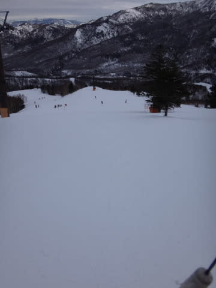

# 1月29日，日曜日の志賀高原速報…快晴，午後曇り．固くパックされた雪質だったよ

📅 投稿日時: 2017-01-30 01:42:24

🏷️ カテゴリ: [2017スキー滑走日記](c7d777cecfc91bdf0fa464ad62c6d49ab.md)

えー．

本日．

激烈に帰宅が遅く．

なぜかもうこんな時間…（涙）

はい．

だもんで．

本日は，日曜定番の速報モードです…

まず．

今日の朝は…

北アルプスがすっきり見渡せる，

超絶快晴で始まりました！

予想通り，放射冷却で朝はしっかり冷えて…

シマシマ圧雪だったものの…

雪質は，かなり固めにパックされたような，

エッジがちょっと引っかかる雪．

午前中はすっきりいい天気が続き…

だのに，ゲレンデはガラガラ！

気持ちよく飛ばせましたよ～！！！

昼過ぎから，ちょっと雲が出てきて．

午後は曇り空になっちゃいましたけど…

でも．

気温は0℃をちょっと超える程度と，

ひどく上がることもなく．

さらに固めにパックされた雪のおかげで．

午後になっても，雪は荒れることなく

フラットなまま！

だもんで…

午後はちょっと曇りでゲレンデが見にくいところも

あったものの．

フラットなガラガラゲレンデを，

夕方まで気持ちよく大回りできましたよ～！

とりあえず…

今日は死ぬほど眠いので．

明日また，詳細レポートやります～．

おやすみなさい…

## 💬 コメント一覧

### 💬 コメント by (michi)
**タイトル**: はじめまして
**投稿日**: 2017-01-30 21:00:44

志賀高原、スキーで検索していたら辿り着きました。ブログ楽しく拝見しています。

毎週、何時間もかけて来るなんて凄いですね。

自分は志賀高原の麓で育ち、今は結婚して長野市に住んでます。

日曜日、息子と焼額山まで行きましたがお会い出来ませんでした。

いつかお会い出来ればと思います。

またコメさせていただきます。

### 💬 コメント by (かず)
**タイトル**: こんばんわ
**投稿日**: 2017-01-30 23:31:17

週末天気で良かったですね　なんとなく金曜休んだほうがよさそうな　笑

### 💬 コメント by (いか)
**タイトル**: Unknown
**投稿日**: 2017-01-31 00:04:01

この週末はよく晴れていいコンディションでしたね！こちら八方も土曜日午前中は曇りでしたが、土曜日午後からは晴れて、圧雪が気持ちいい感じでした（＾＾）

今日降ったと思わしき雨が大変心配ですが、、、

### 💬 コメント by (Skier_S)
**タイトル**: 今朝は，雨（涙）
**投稿日**: 2017-01-31 02:30:46

＞michiさま

始めまして～！

ようこそ，我が駄文置き場へ…

長野市内在住ですか！

いいですね～．近くて…

我が家は土曜はいつも早朝3時～3:30に出発です．

日曜は，レポートしましたが焼額で2本しか

滑らず，ずっと志賀高原をさすらってました…

お会いできなくて残念です．

また，志賀高原にお越しの際はお会いしましょう！

普段はほぼ１００%焼額滑ってますので…

＞かずさま

今週は，明日と２日が新雪な感じですね～．

今週末も，いいコンディションだといいんですが…

少なくとも，パウダーはなさそう．

でも，晴れてくれるかな？？

＞いかさま

この土日は，なかなかGoodでしたね！

今日の雨の影響が確かに心配です…

ちなみに，動画は息子さんですか？

### 💬 コメント by (いか)
**タイトル**: Unknown
**投稿日**: 2017-02-01 01:08:24

Sさま

動画はよく一緒に滑る人のこどもで私のこどもではありません(笑) メキメキ大きくなってきていて、いつ滑りで抜かれるかとひやひやしています(´△｀)

### 💬 コメント by (Skier_S)
**タイトル**: いかさま
**投稿日**: 2017-02-01 03:02:33

あ，知り合いの方のお子さんですか…

子供は上手くなるのが早いので，

しばらくすると「遅い～！」

とか言われるようになりますよ…（笑）

