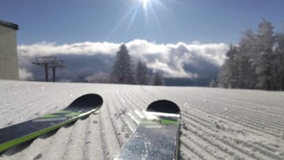
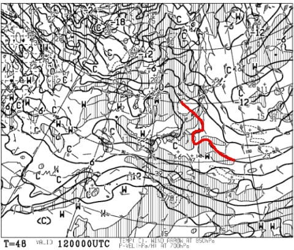
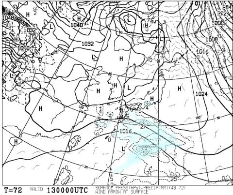
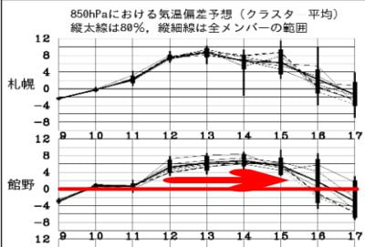
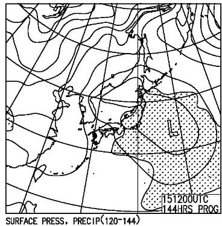

# 2月13，14日の週末の志賀高原スキー場の天気は…土日とも気温は上がるけど液体は降らないよ！そして2月10日の特派員情報

📅 投稿日時: 2021-02-11 00:43:34

🏷️ カテゴリ: [スキー天気予想](c6554f5c3c106093b511a8daae23757e8.md)

ということで．

本日も，まずは志賀高原特派員情報から

行きましょう！

えー．

今日も，朝はすっきり晴天のスタート！

朝の気温は-10℃と，

-8~-9℃の予想，1度ほど外しましたが…

概ね正解の，冷え冷え気温！

冷え冷えの晴天で，おこみんも

嬉しそうですね…！

（今日もおこみん写真が送られてきたことにほっこり♡）

山頂は当然…

シマシマです！

締まり気味冷え冷え雪の，トップシーズンとして

激烈最高級の快楽シマシマバーン

だったようで…

うぎゃーーー！

これは，目の毒だーーーっ！

激烈最高シマシマの，自分が上手くなったと

思いっきり勘違いできる，

完全無欠の勘違いバーン

だったようです…

非圧雪部分は，重めながらも昨日の新雪が

残っていたようで．

うーん．新雪＆シマシマの晴天…

うらやましすぎる…っ！！

午前中，奥志賀ゴンドラも焼額ゴンドラも，

一瞬混んだようですが．混んだのは一瞬だけ．

そして，西舘もいい感じで．

一の瀬正面バーンも，硬めながらも

エッジが食い込むいいバーンで．

ジャイアントもエッジがいい感じで

かかってくれる，楽しいバーンコンディション

だという報告が…

う，うらやましい…

ということで．

今日も晴天ながら昼間はマイナス気温で，

晴天のもと冷え冷え雪質を楽しめる，

シーズンとしてはそうそうない

最高の一日だったようです…！！

まぁ，私が

　結構ねらい目の一日

と書いたので，そうなるのは当たり前なんですが…←だから，あなたが志賀高原の天気決めてるんじゃないんだから…

さて．

明日以降，この週末まで．

いい天気は続くのかな？（期待薄）

と，天気図を見てみるわけですが．

まず，11日（木・祝）の850hpa気温図を見ると．

この日は，水色の-6℃線が志賀にかかる

レベルなので．明日の祭日も冷え冷え！

地上天気図を見ると…

うーむ．

日本海側にうっすら，志賀高原を

見事に巻き込む形で降水域がかかっている

ので，志賀高原は朝のうちは雪が舞ってる

かも…

あ，昼前には止んで，昼過ぎには晴れて

きそうですが．

そして，12日（金）の850hpa図は．

…うーーーーん．

赤い0℃線，志賀高原より北…というか，

東に去っていき．

志賀高原はプラス気温のエリアに入って

ます（涙）

…この日は，春の気温になりそう…（涙）

昼間，+3~4℃くらいまで上がっちゃうかな？

ただ．

地上天気図を見ると，降水域は本州にかかって

ないので，液体の危険は全く無いけど…

逆に，高気圧に覆われて晴れそうなので．

日差しが強いバーンは雪が緩みます（泣）

で．

肝心な13日（土）の850hpa図は．

うううーーむ．

この日も，赤い0℃線は志賀高原より

北にあり，むしろ+3℃線が近づきつつ

あります…（ちょい涙）

これ…降ったらヤバいんですけど！？？

ってなことで．

13日の地上天気図を見ると…

うむ．降水域は志賀高原にかかってない

ようですね．

これなら，降らずにすみます…

というか，朝のうちは晴れてるかも．

で，14日（日）ですが…

ううーむ．この日も850hpaの0℃線は

志賀より北か…（涙）

ただ，地上天気図を見ても．

この日は網掛けの降水域が志賀に

かかってないので．

気温は高いけど，液体が降ることは

なさそうな感じ…！

むしろ曇り空だから，気温が高いこの日は

日差しで雪がゆるまなくてイイかも…

ってなことで．

まとめると．

11日（木）：朝はパラパラ雪．朝までの積雪は5cmほど？

　朝の気温は-8℃程度．

　朝のうちは小雪～曇り，

　圧雪バーンはいい感じの冷え冷え圧雪に，

　ごくわずか薄っすら積雪が乗った，

　快楽バーン！

　昼に向かって天気は回復して行き，

　午後は晴れて，太陽のもといい感じの冷え冷え

　バーンが滑れそう！

　トップシーズンを堪能できる一日．

12日（金）：朝から晴天！

　放射冷却で朝は-5℃くらいまで冷えてくれるかな？

　天気は終日晴れ！

　気温は昼間は+3℃くらいまで上がり，標高が低い

　ところや日当たりのよいバーンはしっとりした

　重い雪になっていく．

　夕方にしっとりした雪が固まるとちょっと

　手ごわいか．

13日（土）：朝は晴れ！

　朝の気温は，-2～-3℃くらいか…

　ファーストトラックの間は放射冷却で

　もう少し冷えてるかな．

　あさイチのバーンは，

　日が当たってないところは締まって

　良さそうだけど，前日に日差しが

　あたったところはカリカリした感じの

　圧雪になり，ところどころコロコロが．

　でも，午前中から気温が上がるので，

　コロコロはすぐ緩む．

　昼間は+3-4℃まで上がりそうで，

　北側-西側の奥志賀・一の瀬方面を

　除くとかなりしっとりした重い雪に

　なっていきそう．

　午後は曇っていくが，昼間に雪が

　緩むので，ちょっと荒れ気味の

　バーンになるかな…

14日（日）：朝から曇り．

　朝の気温は-2℃程度かな？

　あさイチは硬めの圧雪で，昨日緩んだ

　昨日緩まなかったバーンはいい感じの

　締まったバーンだけど，大体のコースは

　すぐにコロコロで覆われたバーンに

　なりそう…

　昼間は土曜と同じくらいの+3-4℃まで

　気温が上がるけど，終日曇りなので，

　土曜ほど雪は緩まない．

　ちょっとしっとりした感じになる程度か…

　むしろ，ちょっと緩むくらいがコロコロが

　無くなっていいかも．

　2月というより，3月ごろのゲレンデ状況．

　まぁ，3月のゲレンデと考えればいい

　コンディションかも

ってな感じでしょうか．

しかし．

11日までの冷え冷え期間が終わったら，

まさかこんな12日から15日まで，

ダメダメ高温期間が続くとは…（涙）

って…え？

15日の月曜まで高温が続くの？

15日は…

あいや？？

うげげげげげげげげ！！！！

…これはちょっと，

15日の月曜は液体が空から落ちてくる危機か…？

と，思いつつも．

FZCX50の降水予想頻度＆スプレッド図を見ると．

水色で塗った，降水予想頻度が50％を超える

水色領域に志賀高原は入っておらず．

降水予想頻度10％の境界を示す点線に

ギリギリかかる程度なので．

志賀高原が雨になる確率は，

今のところ低そう…

15日，液体が降らないよう．

スキーに行く皆さんは祈っていてください←最近いろいろ投げやりになってないか？…あ，槍を降らせたいから投げやりなのね（違う）

## 💬 コメント一覧

### 💬 コメント by (レインボー73)
**タイトル**: Unknown
**投稿日**: 2021-02-11 18:28:19

木曜日の志賀高原情報

朝の湯田中で８cmベタ雪。いっぱい書いたのに消えた。今日は湯田中のよろづや旧館で全焼火事があったので、簡単な報告になりそうです。

ニゴン駐車場で20cm。明け方の圧雪あとに降ったため、シラカバ25cmストップ雪。膝を傷めてリハビリ中の友人は、危険が危ない（？）からリタイア。

三高に行くと、最後に圧雪したのか、数センチの雪で、快適勘違いバーン。これぞ天の助け。日ごろ悪事をはたらかなくてよかった。

イーストとミドルを回して、高天へ。

12時過ぎの、ピザの高天ヶ原ホテルは満員。結局いつもの銀嶺へ。ここも今日だけは繁盛しており、うんうん。

呑みながらなので、消えるのが怖いので、ここで前編しゅう。

### 💬 コメント by (レインボー73)
**タイトル**: Unknown
**投稿日**: 2021-02-11 18:58:08

木曜日の志賀高原情報　後編

かなり呑んでるので、どこまで書いたか？

午後はパウダーしかあたまにない。

高天の非圧雪は、ふかふか快適勘違いバーン。硬ければ老人には無理。夢のようにふわっふわっ！私でもできる。高天が今日の最高雪質。

新潟の上手い友人は『高天のリフト下の雪溜まりが天国だった』とのこと。

タンネでもリフト下をひたすら楽しみ、ダイヤモンドへ。

こんな日は、激戦区のヤケビより、閑散とした場所がたのしい。

ダイヤモンドは私の丸秘パウダーゾーン。いい日は楽しめますよ。内緒だけど。

そんなこんなで、結局レインボー上がり。

でも！ボケ老人。今日も忘れ物をしました。4桁の番号鍵を忘れました。あーあ！

湯田中に帰ると、なんか煙が。

ぎょぎょ！　燃えてる。老舗旅館よろづや全焼。

風がなかったので、類焼を免れました。これで今夜のオカズは一品減りました。

### 💬 コメント by (ほっぽ)
**タイトル**: 大敗です(^^;
**投稿日**: 2021-02-11 21:29:01

Ｓさん

本日、志賀高原に行くように家を出発して10時前にエキップさんに到着。

予約していたので10時から相談＆診断。

結果、naoちゃんねるさんと同じブーツのフレックス違いを購入しました。(^^;

Ｓさんほど難しい足型では無かったので、３時間ほどでフィッティング終了し持ち帰り、今夜は中野の素泊まり宿に泊まり、明日は志賀高原でシェイクダウンです。

シーズン半ばに、今シーズン新品でブーツ買ったのに、また買ってしまいました。(^^;

物欲選手権、大敗です。

でも、技術は道具でカバーする、がコンセプトのレジャースキーヤーですから、これで課題と思っていた左右の動きが改善されれば安いもの。

Ｓさんほど凝ったインプレは出来ませんが、blogにアップしておきました。

次のブーツもエキップさんに頼むと思います。

それと、私くらいの滑走日数だとブーツは使っても２シーズン、本当なら１シーズンで交換とのこと。

冗談抜きで１度に２足買った方が良いかもしれないなと思いました。(^^;

Ｓさんは私よりブーツを酷使していますから、二郎君どころか三郎君くらいまとめ買いした方が良いかもしれませんね、と物欲を煽ってみました。(^^;

### 💬 コメント by (ほっぽ)
**タイトル**: blogのURL
**投稿日**: 2021-02-11 21:30:22

blogのURLを貼り忘れていました。(^^;

http://hoppo.officialblog.jp/

### 💬 コメント by (Skier_S)
**タイトル**: 予想外した
**投稿日**: 2021-02-12 02:58:05

＞レインボー73さま

レポートありがとうございます～！

ストップ雪ながら，高天・ダイヤは楽しめたんですね．

しかし，よろづや旧館，全焼ですか！？？

湯田中では結構な老舗ですよね…

延焼が無かったようで，不幸中の幸いでしょうか…

お疲れ様でした１

＞ほっぽさま

物欲選手権大敗，おめでとうございます．

これで仲間ですね(笑)．

やっぱり，あそこに行くと新しいブーツ買っちゃうんですよね…

