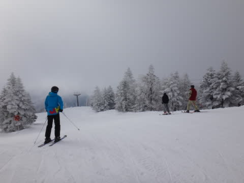
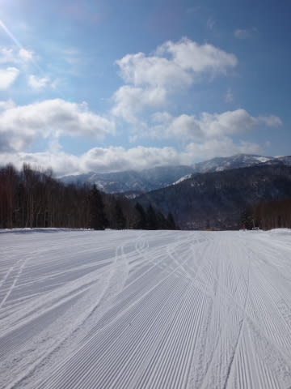
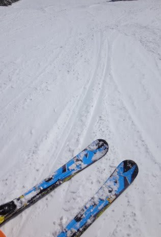
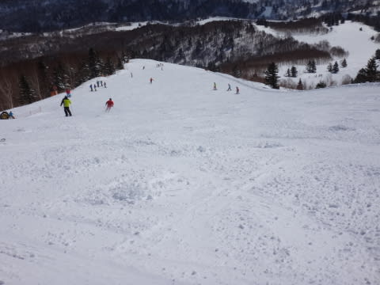
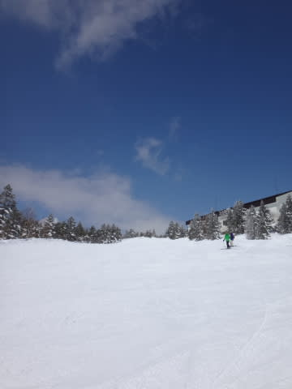
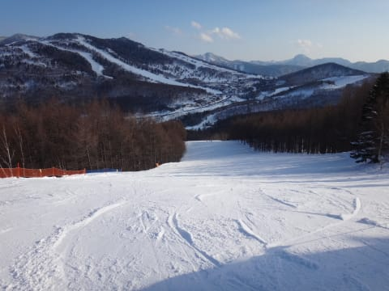
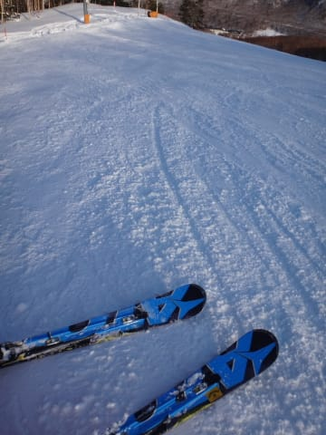

# 3月23日，3連休最終日の志賀高原のゲレンデ状況速報

📅 投稿日時: 2014-03-24 01:50:56

🏷️ カテゴリ: [2014スキー滑走日記](c992167609b6415052179ee69ea1ea7d8.md)

あー．

今日も，リフトストップまで滑って．

いつも通り，帰宅が遅かったので．

…いつも通りの，速報モードってことで．

えー．

本日．

朝イチは，予想になかった雲が，ちょいと残ってましたが…

すぐに太陽が顔をだし．

ぐはははは！！！！！

予想通りの，最高圧雪ピカピカバーンっ！

気温も一日中マイナス気温で．

雪質は3月下旬と思えない，最高！

午前中はちょっと人が多かったものの…

午後になると…．

いつも通り，人がいなくなり…

快適な，ガラガラのバーンを大回り！

人が少ないので，午後まで結構フラット！

うーむ．

3月下旬に，こんな晴天で日差しがあるのに，いい雪質を

終日キープとはっ！！！！！

チョー恵まれた一日で．

ウルトラ幸せなスキーを楽しめた一日だったのでした…

…今シーズン，こんないい雪質で滑れるのは最後かな…

## 💬 コメント一覧

### 💬 コメント by (aqura)
**タイトル**: Unknown
**投稿日**: 2014-03-24 12:46:40

本当に最高の一日でした。3月末にこんなコンディション。まさにウハウハ！   …と言いたいところですが、前日のコブで体力を使い果たして、ヘロヘロ状態で、何度か派手に転んでしまいました。でも、最後に幸せな1日を過ごせました。 残念ながら、私のシーズンは終了です。今後もお、skier_sさんのブログを楽しみにしています。

### 💬 コメント by (Skier_S)
**タイトル**: aquraさま
**投稿日**: 2014-03-25 00:56:20

いやーーーーーー．

3月下旬としては，超恵まれたコンディションでしたね！

でも，もう今シーズン終わりですか…

志賀高原は，まだ1か月半くらい滑れますよ～．

私のスキーシーズンはあと3か月ちょい．

そのあとの夏モードもありますので，

スキーシーズン終了後もご愛読のほど

お願い申し上げます…（願）．

### 💬 コメント by (aqura)
**タイトル**: Unknown
**投稿日**: 2014-03-25 12:49:54

はいはい、大丈夫ですす。一年中愛読していますので………（＾◇＾）

### 💬 コメント by (Skier_S)
**タイトル**: aquraさま
**投稿日**: 2014-03-26 01:49:18

はいはい～

一年中よろしくです～（＾＾

