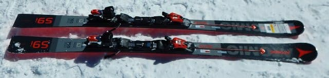
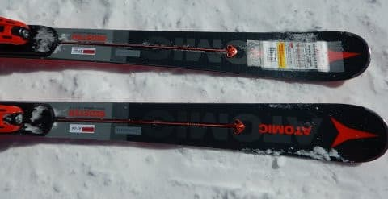
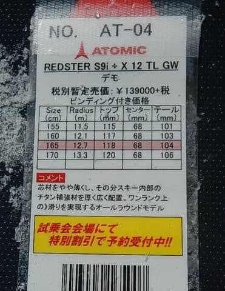
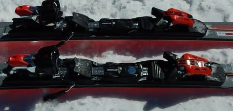
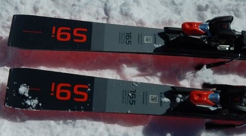
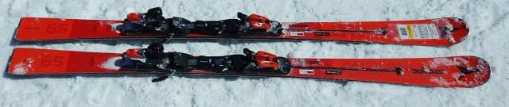
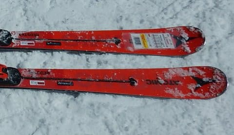
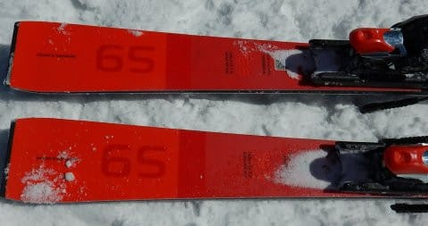
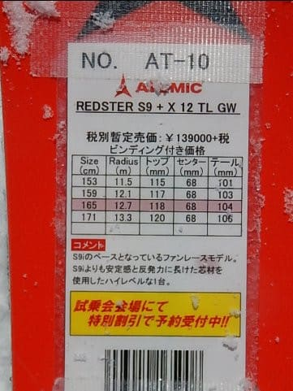

# 2020シーズンモデルのスキー板，試乗レポート…ATOMIC編その1

📅 投稿日時: 2019-04-12 02:16:26

えー．

本日も，個人的に受け取った

志賀高原レポートによると．

朝までに5cmほどの積雪があり，

さらに，朝は-5℃以下の冷え冷え＆

雪降りだったようで…

…今日も，とても4月と思えない

コンディションだったようですね．

明日も例年にない冷えこみで．

さらに晴れるので．

おそらく，明日も最高でしょうね…

なぜ．

先週も今週も，週末を外して冷え冷え

最高になるのか…（涙）

でも．

今週末．

日曜のリフト営業が終わったあと，

夜からは雨になりそうで．

週末滑っている間に雨にならないだけマシ

と，自分に言い聞かせよう…←必死のポジティブ思考

ってなことで．

2020シーズンのスキー板の試乗レポート．

今回は，アトミック編．

私がすごい気になっている

RedsterのS9iとS9です．

試乗コンディションは[こちら](e8b23c39b6c482e1e3a537e4644d9d484.md)を参考に．

では，どうぞ～！

○ATOMIC Redster S9i 165cm

基礎小回り用

基本的に，小回り競技用セカンドモデルのS9の

コアを軽量カルバコアに変更し，軽量化することで

基礎向けにした，小回りモデルのこの板．

この上のモデルとして，来シーズンも

VARビンディングをつけたS9i PROがありますが．

これは，優しいTLビンディングが着いた，

PROと比べると，取り扱いやすいモデルです．

多少デザインが変わって，真っ黒だった

今年モデルから，ちょっとグレーが入った

黒＆グレーツートンに変わりましたね…

構造的には，今シーズンモデルと変わって

ないように見える来シーズンモデルですが．

今シーズンよりもメタルの量を増やして，

強化を図ったとのことで．

ちょっと中身が変わっているようです…

S9iとして3シーズン目のこのモデル，

2シーズン目はサイドウォール強化，

3シーズン目はメタル強化…

と，だんだんフレックスが強くなって

いってますね～．

ってことで．

実際に履いてみると…

をを！？？

明らかに，今シーズンモデルより，

踏み込んだ時のしっかり感が増している！

そして，反発が強くなった感じ…！

今シーズンモデルまでは，谷回りでの

動かしやすさを徹底的に重視していた

感じですが．

この板は，谷回りで割と早くから雪面を

捉えていき，山回りでキュンと回って

いきます．

キュンと回った後も，張りと返りがあり．

それを使って次の谷回りに楽につないで

行ける感じ．

グリップは今シーズンモデルより強く

なった感じはありますが．

履いた時に感じる，驚くべきレベルでの

軽さは今シーズンモデルから継続していて．

もう，山回りだろうが谷回りだろうが，

好き勝手に振り回せる軽快さ．

これだけスイングウェイトが軽ければ．

コブとかでも全く苦労はなさそう…！

でも，軽いけど，

スピードを出しても，安定感は十分．

何にしろ，軽い．

軽いので，硬い斜面をどっしりとした

感じで，ひたすらどこまでも加速して

落ちていく…という，トップスピードを

求める板ではありませんが．

重い板だと手こずる，低速～中速での

動かしやすさはバツグン．

軽くて振り回せるのに，しっかりとした

グリップ感と返りがあるので，

硬い斜面でも荒れた斜面でも，

高速でも低速でも，

どんな斜面でも行けるオールラウンド板として．

結構いいんじゃないでしょうか．

○ATOMIC Redster S9 165cm

SL競技用セカンドモデル

競技用も，S9iと同様，この上に

VARビンディングをつけたS9 FISモデルが

あるので，SL用のセカンドモデルとなる

この板．

S9iとは，コア材が違うだけなのですが．

やはり，軽量カルバコアのS9iと比べると，

ちょいと重めに感じますが…

それでも，私が普段履いているSXよりは

かなり軽く感じます．

そのせいで，軽快さがあり動かしやすくは

あるのですが．

山回りのグリップ力が，SLモデルとして

期待するレベルに達していない感じ…

そこそこ柔らかい雪であれば，

グリップしてくるんと回ってくれますが．

硬めの斜面でスピードレンジを上げて

いったときに，板が耐え切れずに

ちょっと逃げていく感じがあります．

…S9iと構造は基本的に変わらないはずなのに．

なぜか山回りのグリップに不満が残るのは．

S9iは鬼のような軽さ←鬼は決して軽くないよ，と突っ込んでみる

があるので，ある程度の山回りのグリップが

弱くても，それを差し引いても

余りある動かしやすさ，コントローラ

ビリティがありますが．

S9はちょいと重さがあるので（それでも，

普通のSL板に比べると，かなり軽い）

その重さから期待されるグリップ力に

ちょっと届いていない感じ．

グリップ，フレックスともに，

結構優し目に感じます．

いや，でも．

その不満を感じるのは，ガンガンに

硬い斜面をトップスピードで攻めた時

だけなので．

そこまで硬くない雪や，

バリバリのトップスピードで

滑るのでなければ．

軽いので動かしやすく，

そこそこのグリップがあり．

どんな斜面でも滑れそうな，

取り扱いやすい板です…

…今シーズンモデルまでは，

S9とS9iだったら，S9の方が重くて

コアが強い分，安定感があっていいかな…

と思っていたけど．

S9iのフレックス強化が図られた

来シーズンモデルからは，

そこそこのフレックスとグリップ力が

あるのに，驚くべき軽さでどうにでも

振り回せそうなS9iの方がいいかな～…

と，Skier_Sは個人的に思ったのでした←あくまで個人の感想です

## 💬 コメント一覧

### 💬 コメント by (ホンダ)
**タイトル**: Unknown
**投稿日**: 2019-04-12 18:30:45

今日のヤケビは？終了したはずですがガマンできず来てしまいました。朝イチサイコーでした。４月とは思えないバーンでした。オリンピック、gs、唐松、うーん良い。奥志賀良い。天気がイマイチでしたが贅沢言えません。明日の朝は良いと思いますよー。早朝皆さまお待ちしていますよー。

### 💬 コメント by (Skier_S)
**タイトル**: >ホンダさま
**投稿日**: 2019-04-12 23:48:55

レポートありがとうございます～！

復活しちゃいましたか（笑）．

この4月，かなり恵まれてますから，復活して正解です（笑）．

では，また土曜に焼額でお会いしましょう！

### 💬 コメント by (勇気)
**タイトル**: Unknown
**投稿日**: 2020-03-15 18:39:44

下手な私でもとても分かり易かったです。

この板を履くとすごく上手に滑れそう^_^

な感じになりました。

私が読んで、夫婦で楽しく笑って。

きっとスキーがお上手なんでしょうねと。

我が家もスバリストです。

13日の志賀高原の記事からお訪ねしました。

### 💬 コメント by (Skier_S)
**タイトル**: ＞勇気さま
**投稿日**: 2020-03-16 01:32:53

コメントありがとうございます～！

分かりやすかったと言っていただき，ありがたいです…

スキーはそんなにうまくありませんが，スキーの好きさ加減なら

そんじょそこらの人に負けない自信があります(笑)．

ぜひ，志賀高原へお越しください．

おそらく私を発見できるかと…

同じスバリストとして歓迎します！

