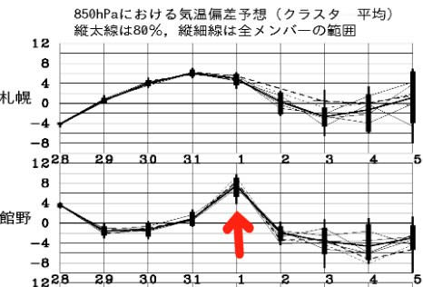

# え？本日の志賀高原スキー場，積雪40cm？？そして一日雪が降り続いたようですね…

📅 投稿日時: 2020-03-30 02:24:17

ということで．

なぜか関東地方に雪が舞い．

我が家の周りでも積雪があった本日．

「関東に降らなくていいから，

　志賀高原に降ってよ…（涙）」

と，全力でツッコミを入れていたら．

…なんと．

志賀高原では，40cmの積雪が…！！

す，素晴らしい！！

（[焼額山Facebook](https://ja-jp.facebook.com/yakebitaiyama/photos/a.533933973368620/2801613693267292/?type=3&theater)より）

ちなみに．

特派員の皆様がレポートしてくださってますが．

どうやら土曜日，予想通り朝の営業開始前い

雨が降り，ゲレンデの雪もちょっと

解けちゃったようですが…

予想通り，営業開始時にはほぼ雨も止んで．

そして，午後は時折晴れ間も射すタイミングも

あり．

予想よりは良かった感じみたいですね…！！

で．

先週の早い段階では．土曜に続いて

日曜も雨になるかも…

と，心配された日曜ですが．

さっきお伝えしたように，

明け方にどっさり雪が積もったようで…

朝は圧雪バーンも，多少重いながらも

新雪が20cmほど積もっていたようです！

重い新雪が乗っていたバーンは，

じきに荒れて凸凹になって滑りにくく

なったみたいですが．

誰か知らないけど，いい加減な人間が

午後に晴れるはず

といった予想は見事に外れたようで．

一日雪降りで，ゲレンデの積雪の結構な

積み増しがあったようです…！

誰だ…？

適当な予想をしたやつは？？？←だから，自分でしょ

とりあえず．

これで今シーズンの雪がもつ期間は，

少し伸びたかな…？？

で．

これから先，4/1は下の図の赤矢印で示したように，

平年比+8℃ほど高くなるほどの高温になり．

液体が降りそうですが（涙）．

それ以降，水色矢印で示した4/2～5日にかけては，

平年より2～4℃低い日が続きそう！！

特に，2日は一日雪が降り続きそうです！！

850hpa図で見ても分かるように，

3，4，5日は赤線は志賀高原より南．

特に4日は太平洋側まで下がり，

この期間，冷え込みそうなことが

分かります…

うむ．

4月1日の高温さえ乗り切れば．

次の週末にかけては，いい感じに

冷え込みそうですね…！！

ってなことで．

5000兆人のこのBlog読者の皆様に

おかれましては．←5000兆人って…？？

GWまでにはコロナウイルス騒ぎが収まり．

かつそれまで冷え込みが続き，

志賀高原に雪が残ることを

全身全霊で祈りましょう…っ！！

## 💬 コメント一覧

### 💬 コメント by (Northfox)
**タイトル**: Unknown
**投稿日**: 2020-03-30 19:49:43

う～む、今週末はいい感じに冷えそうですね。なぜスキーに行けそうにないときに．．．

実は先日、思い切ってブーツのインナーブーツをフォーミングで作ってもらったのです。

物欲スキーヤー聖地の神田にある某ブーツ研究所で。

どんな具合か早く滑って試したいんです。

### 💬 コメント by (地元民)
**タイトル**: Unknown
**投稿日**: 2020-03-30 20:26:52

日曜日は、里でも20～25cm積もりました。ただ志賀の麓の中野市は少なくて10～15cm。里での３月末の20cm越えレベルの積雪は、1993年3月29日以来27年ぶりですね～。

### 💬 コメント by (名無し)
**タイトル**: Unknown
**投稿日**: 2020-03-30 23:06:11

4月1日は私が焼額山へ行く日。雨て．．．

### 💬 コメント by (レインボー)
**タイトル**: Unknown
**投稿日**: 2020-03-31 00:15:39

たくさん書いたのに、うたたねしてすべて消えた。ショック。月曜日の志賀高原情報

朝一、パノラマ、ＧＳ、完璧。奥志賀ダウンヒル、エキスパートも、盛期以上の気持ちよさ。バスでファミリーへ瞬間移動。レジェンドこ○すけさんらと蕎麦屋のあとの寺子屋は、雪はあるけど感動なし。ファミリーはボコボコながら人を引きつける。

ヤケビに戻ると、別世界が！

カラマツの最後で、ぐぐっと足を激しくつかまれ、サウスもさいごで、超激しく！

軟弱な我々はそれでリタイア。でも、この時期としては二重丸の一日でした。

### 💬 コメント by (レインボー)
**タイトル**: Unknown
**投稿日**: 2020-03-31 00:23:41

つづき

レインボー以降最後まで滑った友人情報

オリンピックはボコボコで、回避が正解。

ＳＧＳが最も滑りやすい。

イーストもシマシマが残っていたけど、東館前では凄い妖怪が。

ＧＳ下のゴーゴーウエーブが最難関。妖怪の歓迎にあったもか。

### 💬 コメント by (新米パパさん)
**タイトル**: Unknown
**投稿日**: 2020-03-31 07:23:32

Sさまお疲れ様です。

S様の居住地域は早くコロナ出てましたからホントにお気をつけて下さい。

ブログ更新楽しみにしてます。

志賀高原に行けない日もなぜか、このブログを読むと悔しさ半分、行った気分になれる半分で、毎日チェックしてしまいます。

天気予報も勉強になります。

### 💬 コメント by (かず)
**タイトル**: Unknown
**投稿日**: 2020-03-31 10:03:28

レインボーさん！今後どうなるのか全く分からないので挨拶したかったのですが昨日は1ゴンからチラッとそれらしい方見えただけでした

### 💬 コメント by (レインボー)
**タイトル**: Unknown
**投稿日**: 2020-03-31 10:58:24

火曜日の志賀高原情報(はやっ)

珍しく1ゴンスタート。パノラマ、カラマツを、nao先生とご一緒できました。朝一からすでにゆるゆる。だけど気持ちいい。すぐにＧＳから奥志賀へ。

1ゴン折り場から歩いて渡った隊員は、４高から無人のダウンヒルを滑走して、開口一番[気持ち良かった！]。体力のある人は、このコースがお勧めです。老人はもちろんＧＳ経由ですよ。

山頂気温はすでに６℃。

その後のダウンヒルは、緩すぎるけど許容範囲内。

目的地のエキスパへ行く前に、急用でリタイア。

暖かすぎるので、多分午前中に足つかみ出現かと思います。

### 💬 コメント by (レインボー)
**タイトル**: Unknown
**投稿日**: 2020-03-31 11:05:20

私事でお借りします。

かずさん、今度の土曜まで滑ったら山菜採りに移行します。

滑走101日となる予定です。でも、私より25日も上がおられます。今年はありがとうございました。今週中はレポートしますね。

### 💬 コメント by (レインボー)
**タイトル**: Unknown
**投稿日**: 2020-03-31 13:37:56

志賀高原情報つづき

いつも蛍の光まで滑り続ける友人が、やけびの足つかみが凄く、頼みのＳＧＳにまで現れたため、[やけび全滅だあ]と叫んだかは知りませんが、昼前にリタイアしました。

今日は休養してても悔しくないかと。は

### 💬 コメント by (ほっぽ)
**タイトル**: 試乗会中止
**投稿日**: 2020-04-01 00:04:46

Ｓさん

4/18、19のアルペン試乗会、中止になっちゃいましたね。

この状況では止む無しだと思いますが、アサマで試乗しておいてよかったです。

4/11、12の八方、4/11、12の野沢も中止です。

アサマの試乗日記を上げておきました。

正直、終日ツルツルのアイスバーンだったので、

コメントが的確なのか、本人も怪しいです。(^^;

http://hoppo.officialblog.jp/

### 💬 コメント by (西館)
**タイトル**: 超絶低空飛行ながらも何とか全山最終日まで辿り着きましたね
**投稿日**: 2020-04-01 01:11:07

Ｓさ～ん、何とか生きてますかー？

残念無念で落ち込みすぎて力入らずで、ぐったりしちゃっているのではないでしょーか。

もしくは年度末でちょー多忙でご無体な状況なのでしょうか。

雪は恐らくＧＷまで残りますよ。

祈りすぎて踊りすぎて冷夏になっちゃうんではと心配です。

我が家では、既に９ヶ月後を楽しみにカウントダウンを開始しました。

相棒くんは、3月末に購入したパーク用板を痛板にするべく準備してます。

来シーズンは、シーズン券を購入するのでＧＷまで通うことを誓います！

今シーズンは卒業しますが、6月はタケノコ、7月は蛍、10月は紅葉ときのこのために志賀高原には通いま～す。

>レインボーさま

いつも利用している宿の常連さんにレインボーさん大人気でした。

妖怪足つかみ最高！、上手いこと言うなぁ、表現力凄いね、って。

これからもレポート楽しみにしています♪

### 💬 コメント by (Skier_S)
**タイトル**: 昨晩は死んでました
**投稿日**: 2020-04-01 01:15:18

＞Northfoxさま

フォーミングインナーですか！

それも神田ブーツ研究所だったら，かなりいいお値段だったのかと…

せっかくだから，早く試してみたいですね！

＞地元民さま

あら．中野市で15cmも積もったんですね…

でも，まだ3月．普通ならもっと積雪があっても不思議じゃない時期なので．

もっといっぱい’降ってほしいところ…

＞名無しさま

あら…4月1日は，スキーに行くのは避けた方が良い日です…

＞レインボーさま

いろいろ細かな志賀高原レポートありがとうございます～！！

やっぱり，もう妖怪板つかみが出てくるシーズンになっちゃったのですか…（涙）

そして，今週末で志賀高原を後にされるんですね…

＞新米パパさま

すみません．

スキー場レポートはありませんが，引き続きこのBlogを

読み続けてもらえればありがたいです…

＞かずさま

もうこれでシーズン終わりな感じですか？

### 💬 コメント by (Skier_S)
**タイトル**: コメント続き
**投稿日**: 2020-04-01 01:18:58

＞ほっぽさま

試乗会中止になりましたね…（涙）

残念．

23日休めなかったので行かないでおこうかと思っていた

アサマ2000，22日に行っておいて良かった…

まさか志賀の試乗会が中止になると思わず．

もう少しで試乗レポートができないところでした．

