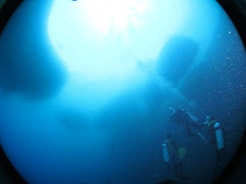
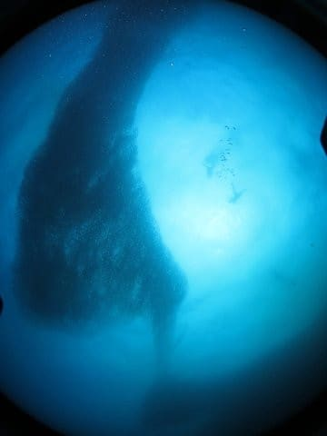

# 2019年8月，4度目のモアルボアル・小6の娘Cカード取得1周年！その20…1本目と2本目の間は，イワシポイントでシュノーケリング！

📅 投稿日時: 2020-08-28 00:27:12

というわけで．

1本目のぺスカドール島のダイビングが

終了して．

ボートの上に上がると．

さすがぺスカドール島，周りは

ダイビングボートがいっぱいいますね…．

そして，海がきれい！

1本目のダイビングを終えたボートは，

ぺスカドール島を後にして，次の

ポイントへ向かうわけですが…

娘はいつもの特等席に座ってます．

…ウェットスーツを着たまま，直射

日光に当たってたら暑いと思うんだけど…

ボートが走っているので，

風が当たって気持ちいいみたいです．

…大人は真っ黒に焼けちゃいそうなので，

絶対直射日光下に長くいたくないけどね…

ってことで．

次のポイントに到着しましたが…

これは，なんだか見慣れた景色ですね…

後の左側に見えるのは，わが家族が

泊まっているホテルから突き出している

テラスでは…？？？

…そうです．

今日の2本目も，ハウスリーフで

イワシの群れ攻略です！

イワシの群れ，飽きるって人もいるみたいですが．

…私にとってはめちゃくちゃ面白いです．

大好きなので，1日1回は潜りたい！！

今日も潜れてラッキー！！

…なんですが．

まだ，ダイビング開始までは時間がありますね．

そして．

ボートの上から見ても，真下にすごい

群れがいるのがみえますね…

（船の下をのぞき込む娘)

娘「すごい！ボートの真下，すごい群れ！」

私「…こ，これ，2本目開始まで，

　シュノーケリングしてていいですか！？」

スタッフ「どうぞ～」

…ってことで．

マスクとフィンをつけて，

ドボン！

…うおおおおお！

いきなり目の前にすごい群れっ！！

（カメラを水に浸けてすぐなので，

　レンズ前に気泡がついてます…）

これは…すごい！

水面に浮いて漂っているだけで，

こんなにすごい群れが見れるとは…っ！

娘もすぐに追いかけて，

水面へドボン！

しかし，娘よ．

まず，いきなり群れへ突っ込もうとするか…？

娘の足下2～3メートルくらいのところに，

川のようなイワシの群れが…！

他のボートからも，シュノーケラーが

群れに突っ込んでますね…

水深わずか2-3ｍなので，

シュノーケリングでも，迫力の群れが

たっぷり堪能できます…

ってなことで．

15分ほど群れと戯れていたら…

スタッフ「そろそろ2本目行きますよ～！」

ということで，ボートに上がり…

そして，ただちに2本目のブリーフィングを

やって…

そのまま，またイワシの海に…

今度はシュノーケリングじゃなく，

ダイビングでエントリー！

今回も我が家3人，深度制限12m組で

1チーム．

ガイドは小見山さん．

当然，エントリー直後から，

頭上は一面のイワシの群れ！！！

さっきはシュノーケリングで，水面から

見たイワシの群れを…

今度は，下から見上げる！

いや…

飽きない．

この群れのダイナミックな動き．

何度見ても飽きない…！！

