# 2022/1/3の志賀高原焼額山スキー場は…朝は雪降り積雪20㎝，午前10時ごろから晴れ！

📅 投稿日時: 2022-01-04 02:33:07

えー．

本日も志賀高原で滑っていたわけですが．

本日はいろいろあって夜遅くなってしまったので，

ちょいと手短に…

昨日の晴天と打って変わって，

雪降りで始まった本日．

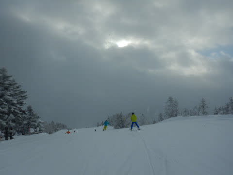

山頂気温は-11℃とそこそこの

冷え込み！

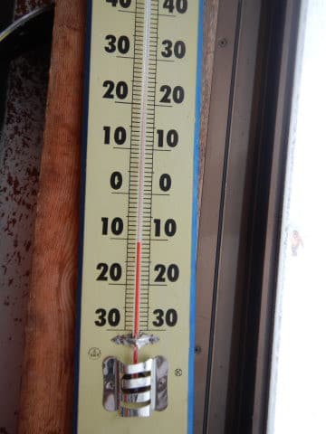

そして，圧雪バーンは圧雪の上に

わずかに積雪がある程度だったけど…

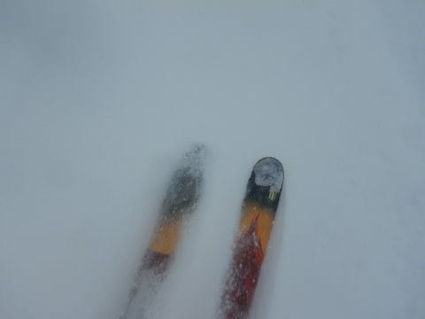

昨晩から20㎝ほど積雪があったので，

新雪を楽しめるオリンピックコースへ向かいます！

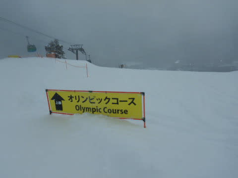

オリンピックコースは…脛パフ！

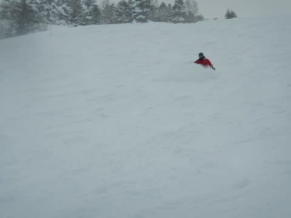

昨日までより軽めの雪で，底付きする

感じの脛パフパウダー！

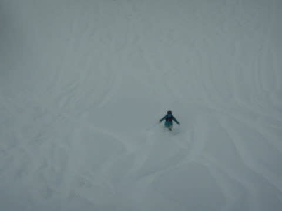

昨日は夕方まで晴天だったので，

今朝，こんなパウダーを楽しめるとは

思わなかったよ！！

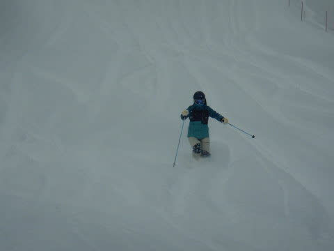

さらに，今日は昨日ほどゲレンデに人が

いなかったので，朝のうちのゴンドラは

ガラガラで…

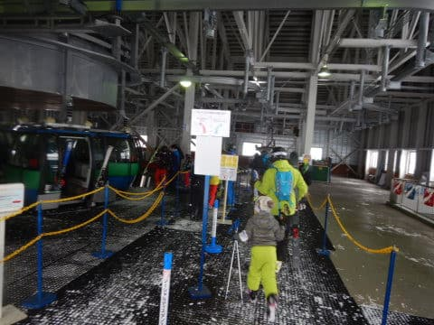

ガラガラゴンドラをグルグルして，

パウダー食べ放題！

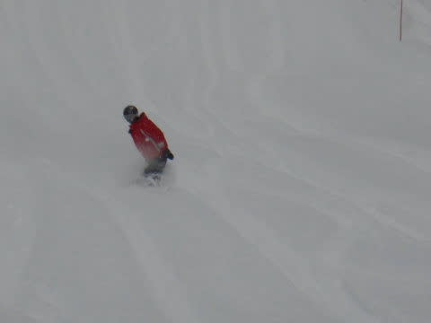

さらには…

朝10時ぐらいになると．

なんと！！

日が射してきました！

シーズンにそうそうない晴天パウダーを，

一昨日に続いて楽しめるとは…！

この正月休み，恵まれてる…

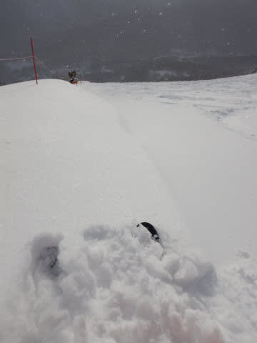

朝の雪降りからうって変わって，

午前10時以降はすっきり晴れた空が

広がっていき…

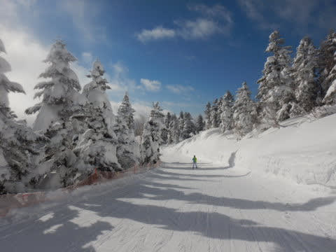

青空の下，今日も冷え冷えトップシーズンの

最高雪が楽しめました！！

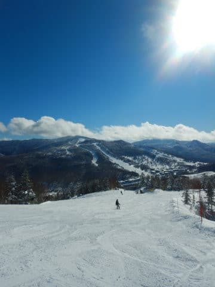

それも，3が日の最終日ということもあり．

今日は帰っちゃった人も多いのか，

第1ゴンドラも最大でゲートの外にでるか

どうかというくらいしか混まず…

(2ゴンは午前中最大10分待ちくらいになったみたいだけど)

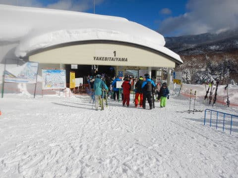

午後のゲレンデは，すっきり晴れているのに

人も少な目で，ゴンドラ待ちもなく，

いい感じ！！

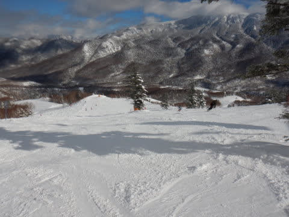

午後になると，ところどころゲレンデは

荒れ気味になった場所もあったものの．

朝はパウダー，

10時以降は晴天圧雪を楽しめた，

一粒で2度おいしい日でした…

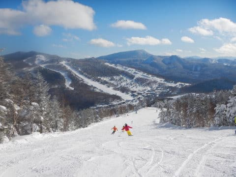

恵まれている…

この正月休みは，スキーヤー的には

恵まれている正月でした～！！

## 💬 コメント一覧

### 💬 コメント by (かず)
**タイトル**: Unknown
**投稿日**: 2022-01-04 20:32:18

今日は視界不良で昼に上がりました 明日でラストどの位積もりそうですかね？

### 💬 コメント by (m&t m)
**タイトル**: Unknown
**投稿日**: 2022-01-04 20:46:48

日頃よりSさんとYASの皆様の人脈というか、人と人を結び付けるチカラみたいなものを感じていましたが、今回、み○しさんと自分のスキーの師匠が同級生である事が判明しました！びっくりです😵

### 💬 コメント by (Skier_S)
**タイトル**: 無事帰宅
**投稿日**: 2022-01-05 02:07:31

＞かずさま

今晩から明日朝までに20cmくらいでしょうか…

ブーツパフくらいの新雪と読んでます．

＞m&t mさま

世の中，意外なところで意外な人とつながるときってありますよね…

しかし，スキーの師匠がいらっしゃるんですね！

### 💬 コメント by (m&t m)
**タイトル**: Unknown
**投稿日**: 2022-01-05 08:52:18

そうなんです

大人になってからスキーを始めた人間には藁にもすがる存在が必要なのです

教えを受けたのは、もう20年程前の事ですが、今でも勝手に師匠だと思っています

### 💬 コメント by (Skier_S)
**タイトル**: ＞m&t mさま
**投稿日**: 2022-01-07 02:23:54

私は子供のころからスキーを履いていた人間なので，

最初の師匠は自分の親なのですが…

しかし，20年前ですか…！

