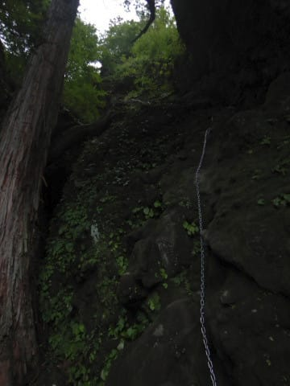

# 上信越道から見える，あの妙義山へ登ってみた，その5

📅 投稿日時: 2020-10-09 02:15:57

えー．

どうやら，昨日の記事に間違いがあったようです．

2019シーズンのシーズン券，72000円じゃなく70000円で，

2018年から値上げ無しでした…

指摘してくれたyumiさん，ありがとうございます～！

…やっぱり，私の記憶力はかなりポンコツのようです…（涙）

ということで．

本日は妙義山登山のレポートの続きです～！

ーーーー

[前回書いたように](eb2304bc4ba43a76460e0ec2fc061e96d.md)，

この矢印の岩に張り付くように回り込んで，

さらにその後，この写真の尾根の先端まで

行かなくてはならないようなのですが…

私の撮った写真ではないですが，

[この写真](https://yamareco.org/modules/yamareco/upimg/165/1656195/d82452765425cb5e504b14eb42c86a01.jpg)とかを見ると，なんとなく

どういう感じで通って行かなくては

ならないか，イメージが湧くかと…

人が写っていると，なんとなく恐ろしさが

増しますね．

ということで．

相変わらず足元が切れ落ちている

横を歩いて…

しばらく行くと．

ようやっとさっき見えてた尾根の

先端までやってきたらしく．

ここから，鎖場の下りです！

こんな狭い岩の割れ目を伝って，

鎖で10mちょいほど下りていくと…

やっと到着しました，見晴らしです！

私と逆ルートで登ってきた人は，

ここで最初に見晴らしが開けるので

感動するんだろうけど…

尾根沿いをずっと来た私には，これまで

尾根沿いでさんざん見てきた景色なので．

今さらここで立ち止まってみなくても

いいかな…という感じ．

…どうでもいいですが，ここも足元は決して

広い平坦な所ではないので，

座ってゆっくりくつろぐような場所では

無いですね…（涙）

でも，ここが尾根沿いの

縦走路のラストポイント．

ここから後は，下るばかりです！

…とはいえ．

この赤で描いたあたりを大の字に向かって

下山しなくてはならないので．

決して緩い下山ルートではないはず…

さて．

ここから先はどうおりるのかな…

と，思ったら．

やっぱり，見晴らしからいきなり

鎖で絶壁を降りていくみたいですね…（涙）

そろそろ，疲れた体には厳しい感じですが．

もうここまで来たら，これを降りるしかない！

と，10mほど岩場を降りると…

まだまだ鎖は続く．

でも．こんな土の上の急斜面なら，

まだ楽勝だな．

あとはこんなところが続くならいいけど…

…と，楽勝鎖場が終わって，しばらく進むと．

世の中そんなに甘くない．

まさか，この先に一番の難関が

待ち構えていようとは…っ！

…え？

なにこれ？？

また鎖？？

…これ，写真だと分かりにくいですが…

下に向かって撮った写真じゃなく，

横に向かって撮ってます．

どうやら，この急斜面を，真ん中に白く写って

いる鎖を伝って，トラバースしなくては

ならないようですね…（ちょい涙）

さらにトラバースした先にも

途切れず下向きに鎖が続き．

片手で鎖に捕まりながら必死に

下を撮ってみましたが．

今度はこのように，真下に落ちていく

長い長い鎖が続きます…！

（この写真，命がけの一枚）

どうやら，これが，大のぞきの前に通った

3段の30mの鎖場と並び難関とされる，

奥の院の鎖場らしく．

毎年ここで何人か滑落事故を起こして

いるようです…（恐怖）

長いうえに，日陰で岩が湿っていて．

足場が滑る！

途中，足場が滑って，腕だけで鎖に

ぶら下がることが一度…

勢いで腕やら脛やらを傷だらけに

してしまいましたが．

なんとか無事に，30mほど降りきって．

一番下までたどり着きました…！！

いや…長い鎖場だった…

横を見るとこんな感じで．

かなりの絶壁感…

いや．

良く降りた．

ここはホントに良く降りた．

鎖場，降りる時は下を見なくてはならないので，

恐怖感倍増．

やっぱり鎖場は，降りるより登る方が楽ですね…

とりあえず．

ひとつアドバイスとして．

雨が降った直後などは，ここは

むちゃくちゃ滑るので注意してください…

死ぬかと思いました．

ということで．

無事に，奥の院まで下りてきました…！！

ここから後は，普通のハイキングコースで

下りられるんだよね…？？？

（[まだ続く](eeb40cfc3ed33eb058078ae37812468de.md)）

## 💬 コメント一覧

### 💬 コメント by (mae)
**タイトル**: Unknown
**投稿日**: 2020-10-09 20:38:43

ハードな山登りだったみたいですね。逆コースの方が楽だったのでは？　

裏妙義にある金洞山の鷹戻しの頭周辺も危険な領域のようですね。

私も鎖場やハシゴは下りより登りの方が楽です。

北アルプスの大キレット、西穂高～奥穂高の稜線、不帰キレット、八峰キレットの方がグレーディングは高いと思いますが、

特に西穂高～奥穂高の間は、他なら鎖やハシゴがあって当然の場所でも、自然のままの状態で浮石もいたるところにあり、鎖も寸足らずの個所が多いようです。

機会があれば、ぜひチャレンジしてみて下さい(^^)

### 💬 コメント by (Skier_S)
**タイトル**: ＞maeさま
**投稿日**: 2020-10-10 00:47:03

標高の割にはハードな山でした…

鷹戻しもすごいみたいですが，何にしろ鎖場は下りより

登りが精神的に楽だと痛感しました．

穂高や鹿島槍は私には無理です（笑）．

日帰りお気楽お散歩登山愛好者なので．．．

