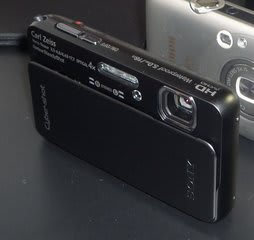

# 新デジカメ購入…スキーヤー御用達カメラはこれだ！

📅 投稿日時: 2011-05-25 00:05:35

昔は，必ずビデオカメラをもってゲレンデに出て，

自分の滑りを撮ってもらったり，人の滑りを撮ったりしていたんですが．

テープ式のビデオカメラが壊れてしまってから．

しばらくビデオなしで滑ってました．

んで．

Xactiかなにか，コンパクトなビデオカメラ欲しいなぁ，

と，長いこと思っていたんですが．

どうも最近，デジカメの動画機能が充実してきたので．

もしかすると，デジカメ1台買い換えれば，ビデオ買わなくて

済むか？？

と思い始め．

（1）防水で

（2）動画がちゃんと撮れる

デジカメがでないかなぁ…

と，待つこと2年．

意外と，条件を満たすカメラが出てきません…

やはり，静止画用デジカメは，動画機能が弱いものが多く．

動画撮影中はズームが効かないとか，

ズームが効いても異常に遅くいとか．

動画撮影中のピントあわせが異常に遅いとか…

さらに，3倍程度のズームしか使えないと，

スキーの場合には，遠くのスキーヤーが小さく

しか写らず，動きがわからない映像になってしまいます．

最低でも動画で光学5倍，

それが無理としても，デジタルズームで10倍近くまで

行ってもらわないとつらいなぁ．

と思ってましたが．

なかなかそういう防水カメラは出てこず．

半分あきらめていたところ．

出ましたね～．

5m防水，

1080Pフルハイビジョン動画＆光学ズーム4倍，デジタルズーム16倍．

動画撮影中のズームも早く．

ビデオとしても十分使えそうなスペックの防水デジカメ．

SONYのTX10です．

先代のTX5は，動画撮影中のズームが遅く，

デジタルズームも無かったので，遠くのスキーヤーは

ゴマ粒でしたが．

今回のTX10は，動画もデジタルズームで16倍まで

行きます．

デジタルズームは画質が落ちるイメージがありますが．

フルHDですので，画質が落ちても，普通のSD画質と同等か

それ以上の画質があります．

フルHDのデジタルズームは，スキーの動きを解析するには

十分ですね～

ということで．

買っちゃいました．TX10.

こいつの使用レポートは，また後日…
