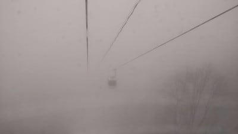
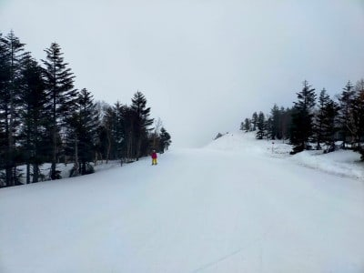
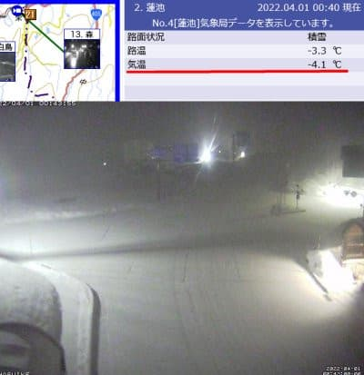
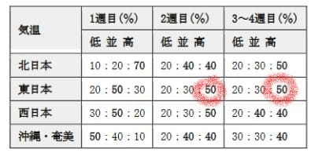
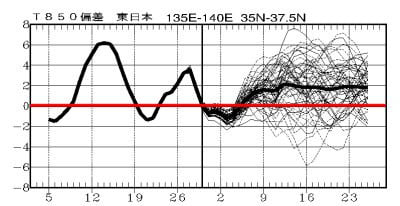

# 4月の1か月予想，気温はやっぱり高めになりそう(涙)…でも今，志賀は雪！今週末は悪くなさそう

📅 投稿日時: 2022-04-01 01:56:22

いつも通り．

本日も志賀高原の特派員から写真が送られて

きたわけですが．

今日は朝から気温がプラスで，

緩めのザラメっぽいシマシマだった

ようで…

そして．

朝は強烈なガスで全然見えなかった

みたいです…

昼ごろになるとガスも消えて，

ちょっと視界が良くなってきたのかな…

でも，ちょっとみぞれっぽい雪が

降ったようですね…

…そして，今日は午後になると，

気温が落ちていったわけですが．

昨日の予想通り，深夜1時現在，志賀高原では

雪が積もってます！！

…そして，今も降ってます！

明日朝までに10cmくらいは積もって

くれるかな？

明日は気温がめちゃくちゃ低いので．

下地はガチガチに固まりますが．

その上に5cmでも雪が積もれば，

コンディションはかなり良くなりそう…！

明日は久しぶりの冷え冷えの良いバーンが

楽しめるかも？？

…ただ，急斜面は積もった雪がすぐに剝げて

ツルツル斜面になっていきそうだけど…

ってなことで．

話題は変わって．

本日は木曜なので，気象庁の1か月予想が

発表される日ですね…

果たしてこの4月は冷えるのか？

（期待薄だけど）予想を眺めてみると…

うーむ．

FCCX92では，

4月第2週目以降，気温が高い確率が

50％となってますね…(泣)

やはり，

この4月，気温が高い日が続きそう…(涙)

FCVX14の気温傾向を見てみると．

4月9日あたりから月末の頃まで，

平年と比べて＋2度くらいの高温傾向が

続きそうですね(泣)

あぁ…ダメか…

この4月は良くないっぽい…

今シーズン．

1，2月は異常に冷えてくれたけど，

3，4月は気温が高くなるという傾向

だったわけですが．

理想はその逆で，

1，2月はそこまで冷えなくても雪質は

悪くないから，

3，4月に冷えて，いいコンディションになって，

雪が融けずにGWまで雪がもってほしい…

4月，気温が高そうだけど，GWまで無事

雪がもってくれるかな？

1，2月の積雪が半端なかったので，

雪がもってくれると信じたいけど…

焼額は，人工雪をしっかりつけた

2ゴン側ではなく，1ゴンが春営業なので．

GWまで，人工雪を付けてないコースが

途切れちゃわないことを祈るばかり…

また，去年のGWのように，

5月に入ってから積雪がある

とかいう奇跡が起こってくれないかな？？

いや．

4月毎週末，冷えて雪が降る

という奇跡が起きてくれてもいいんだけど．

…というか．

5月以降，6月になっても7月になっても，

毎週志賀高原に雪が降ってくれても許す．

というより，降ってほしい…←それはもう氷河期だから．天変地異で大変なことになってるから

## 💬 コメント一覧

### 💬 コメント by (かず)
**タイトル**: Unknown
**投稿日**: 2022-04-01 19:13:20

本日カチカチ確定だったので2回目の野沢に行ってみました  午前中は日がでなかったので つらかった  ほとんど上しかすべれないんですね…

美味しいハンバーガー無くてもやっぱり志賀がいいです笑

### 💬 コメント by (レインボー74)
**タイトル**: Unknown
**投稿日**: 2022-04-01 22:46:45

金曜日は志賀高原情報

朝の車には3cmの積雪。冬が来た！

上林-1℃　蓮池-7℃。

今日は朝圧雪なので、夜の雪にもかかわらず、しましまが残ってる。

気持ちよくヤケビをぐるぐるしたあと奥志賀へ。

気温も下がってカチカチバーンだけど、まあ楽しい。貧乏人には珍しく。グランフェニックスで昼食。

ずっと低温だったため、雪が全く緩むことなく快適を維持。

スキーをやめるという英断を下すのに時間がかかり、またまたレインボーの掟を破ってしまいました。滑りすぎは身体に毒です。

### 💬 コメント by (Skier_S)
**タイトル**: 明日もコンディション良さそう！
**投稿日**: 2022-04-01 23:43:13

＞かずさま

やっぱり志賀がいいですよ！

今日も志賀はコンディション良かったようです…

＞レインボー74さま

今日は一日バーンが緩まなかったようですね…

明日も一日緩まない，冬のコンディションになりますよ！

