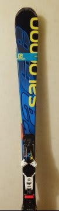

# ってことで．SALOMON X-RACE X12　165cmを買ったわけだが

📅 投稿日時: 2014-12-26 22:18:33

えー．

この週末…

というか，年末．

当然のごとく，明日から志賀高原に行くわけですが．

…今晩から明日にかけて．

降りますね～．

積もりますね～．

朝イチは，30cmほどのパフパフが楽しめるかな？

そして．

昼前には雪も止み．

午後には，日が射してきます！

午後は新雪が蹴散らされた，荒れ荒れバーンで，

ちょっと疲れるかもしれないけど．

太陽のもと，冷え冷えの雪を滑れそう！

で．日曜は晴れなので．

朝から日差しのもと，最高の圧雪を楽しめるよ！

土日の2日間は，絶好のスキー日和のはず！！

…で．

そのあとの，29日．

問題の，29日ですが．

うむ！

なんとかぎりぎり，0度線は志賀高原より南側になる

予想になってきました！

…これなら，なんとか雪になってくれそう．

湿った重い雪が吹き付けますが．

志賀高原では，液体にはならずに済みそうです…

これは．

おそらく．

私が全身全霊で祈ったからだな！！←違うって

ってことで．

明日から，焼額第1ゴンドラをぐるぐるしているわけですが．

おそらく，整地で飛ばせる朝のうちは．

[新たに仲間入りしたアイテム，SALOMON X-RACE](efb7a35a863f49c11192814a01ff64.md)を履いているかと…

いや，この板，165cmの小回り用の板ですが．

むちゃくちゃフレックスが強く，高速安定性も

[そんじょそこらのロング板と比較にならないくらい
強い](d20140313.md)ので．

十分，ロング代わりに使えるな～，と思って．

ロング板を買わずに，この板を選んでしまったんですが．

うむ？

でも．

この板．

いつものお店で買ったのに，いつものシールが貼ってないぞ？？

反対の板を見ても…やっぱり，貼ってない？？

（いつものシール）

と，思ってよく見たら．

うむ…

こんなところに貼ってあったか．

…どうやら，焼額でSkier_Sを発見する目印の

一つになっているらしい，このシール．

今度の板は，わかりにくいところにありますので（笑）．

## 💬 コメント一覧

### 💬 コメント by (Goku)
**タイトル**: いや～速かった！
**投稿日**: 2014-12-26 23:00:28

後ろから見てても安定感抜群でしたよ～♪

しかもしっかり回しているのに速い！

付いていくのに必死でした。

### 💬 コメント by (ゆうこ)
**タイトル**: お久しぶりです。
**投稿日**: 2014-12-27 15:25:26

今日は、志賀高原来てます。今年、初ゲレンデです。

お昼に日が射したときには、天気予報どんぴしゃって思いましたが、雪は降り続きましたね。少しだけですが。

私は今年はスキーはお休みで、暖かい室内で見学のみです。今日はプリンス西館で年賀状書いてました。

来シーズン0歳児を連れてゲレンデデビューする妄想をして、今シーズンは我慢です。

### 💬 コメント by (Skier_S)
**タイトル**: 今日は一日雪…
**投稿日**: 2014-12-27 23:24:05

＞Gokuさま

いやいやいや．

これは，朝イチ焼額用マシンとして，

かなりいいレベルでした．

Volkl Platinum CD178ｃｍより，

スピードが1次元上がりました．

10cm以上長いロングの板より安定度があるとは…

＞ゆうこさま

をを！

来年度は子連れですね！

おめでとうございます．

ただ，今シーズンはちょっと我慢ですね…

我が家も，1歳1ヶ月でゲレンデデビューさせました．

ベビーキャリーで背負って滑ってましたよ～！

そして，今から3年たったら…

板はいて滑ってますよ（笑）

お体大切に！！

