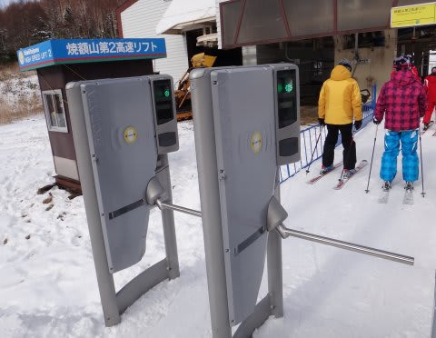
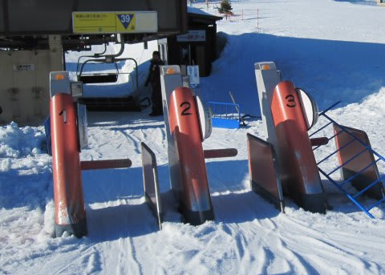

# 志賀高原のゲートシステムを使ってみたよ

📅 投稿日時: 2011-12-15 01:21:53

というわけで．

[志賀高原のリフト券のシステムが全く新しくなった](e881ccf4f96fcc92b78d913329749d937.md)わけですが．

今回の志賀高原で，初めてこの新しいゲートを使ってみました．

いやーーーーー．

反応が良くなりましたね～．

これまで，アンテナにチケットを直接近づけないと

ゲートが開いてくれなかったのに．

新しいゲートシステムだと，胸ポケットにチケットを

入れておいても，ゲートに入るとちゃんとバーが開きます．

無造作にチケットをウェアの内ポケットとかに入れておいても，

ゲートに立てば，勝手にゲートが開いてくれるなんて…

感動～．

んで，昨シーズンまでのゲートでは．

ゲートが開いてから，前に人が詰まっててゲートを通らずにいると，

しばらくしてゲートが閉まってしまい…

そのとき，再び開けようとしても

「このチケットは，まだ利用期限が来ていません」

と，ゲートを開いてくれないという…

こうなると，開かなくなったゲートを目の前に，

後ろの人の冷たい視線を浴びながら，係員が来るのを

待たないといけないという，かなりお寒いシステムでしたが．

今回のゲートはそんなことは無いですね～．

ちゃんと人が通過するまで，ゲートは閉まりません．

ゲートをくぐり損ねた人が詰まっちゃうことも無くて，いい感じです．

とりあえず，アンテナにチケットを近づけなくても，

チケットを身に着けておけば通れる反応のよさは特筆モノ．

…でも，このチケット．

すごいのはこれだけじゃないのだ．

（明日に続く)

## 💬 コメント一覧

### 💬 コメント by (コロネ)
**タイトル**: 突然失礼します。
**投稿日**: 2011-12-15 05:59:34

はじめまして。

いつも天気予報をはじめ、非常に参考になり

役に立つ情報を発信して頂き感謝しております。

志賀高原は年に１～２回泊まりで行く程度なの

でしが、記事に書いてある去年までの問題、

私も何度か経験しました。。。

根がせっかちなもんで。。。（笑）

これは改善されてくれてよかったですー！

あと何が凄いんだろ？？？　楽しみです。

出来ましたら今後ともよろしくお願いします。

### 💬 コメント by (Skier_S)
**タイトル**: はじめまして！
**投稿日**: 2011-12-16 00:03:37

ようこそ，徒然スキーヤー日記へ．

ここの情報がちょっとでも役立っているなら幸いです．

そうですよね～．

あのゲート，混雑してるとよく引っかかるんですよ．

今回のゲートは良くできてますよ．

反応も早いですし！

で，すごい機能ってのは…

次の日記にあるように，滑走標高差・距離の記録機能なんですよ．

私は好きなんですけどね．こういう機能．

こちらこそ，今後ともよろしくお願いします～．

