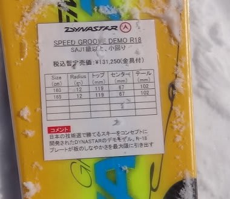

# 2012/2013シーズンモデルのスキー試乗レポート　DYNASTAR編

📅 投稿日時: 2012-04-12 00:37:40

さぁ．

かなり個人的偏見が強い試乗レポートかも知れませんが．

まだまだ続く．

今度はDYNASTAR編ですよ～．

------

○Dynastar

Speed COURSE DEMO R18 182cm

大回り基礎用．

この黄色い板が，来シーズンのDYNASTARのデモ系トップモデルですね…

[以前レポートしたCOURSE TI](eddaf3207460282cfb063d14397faa4c1.md)の上位モデルになるようです．

大回りのCOURSEと小回り用のGROOVEがあって，板のデザインは両者ほとんど

一緒なので見た目で判別は難しい…

で．こっちは大回り用のCOURSEです．

…基礎用なのに，R=25．

トップも105mmと細く，かなり本格的な大回り板ですな．

気合を入れて滑り出してみると．

ト，トップが食いついてこない…

サイドカーブだけでは曲がりません．

トップを押さえて行っても板が回ってきません．まっすぐ行きます．

むしろテール気味に乗って板を押さえ込んでやれば曲がります．

R=25の大回り板としては，フレックスはそれほど強くないです．

かかと気味を押さえて，ヒールピース部分をたわませる意識で行けば

板がたわんで曲がっていく感じ．

でも，自分にはダイヤモンドのリフト3本だけで，このポジションで

この板を使いこなすまでには達せず…

ダイヤモンドの短い，ちょっと荒れ気味のコースでは本領発揮できない

板ですね．

今回は，残念ながら．正当な評価ができませんでした…

とりあえず，受けた感覚としては整地スペシャル．

そこそこスピードを出した領域で使う板でしょう．

もっとスピードが出せる整地，ロングコースで履いて，

もう一度正当に評価してみたいです．

＃まぁ，人が多い荒れたゲレンデで使える板ではない，ということは

＃分かりました．

Speed GROOVE DEMO R18 165cm

小回り基礎板．

見た目COURSEと同じだけど，こっちはGROOVEで小回り用．

これは…結構いい！

エッジがしっかりグリップし，板のたわみで気持ちよく小回りしてくる板です．

トップからテールまできれいにたわんで，トップがインサイドに回って来る感じです．

たわみ量が自由に調整可能で，思った半径で曲がれる操作性があります．

ロッカー要素が強い板のように，どうしようもなく曲がってくる板ではないので，

押さえないでおけばフォールラインに絡めて中回りからロング目のターンも可能．

押さえる量によってたわみ量が調整でき，乗り手が望む回転半径にコントロール

できる感じ．

すっとたわんで，押し込んでいくと粘る感じのフレックス．

ポジションはセンター目で，最近のロッカー板のかかと荷重ではない感じですね．

センター目に乗り続けていればOKで，前後動は不要．

グリップは強めですけど，フレックス自体はしっとりしてますね～．

張りの強さ・返りの強さはそれほどなく，取り扱いやすいです．

しっかりエッジに乗ってキューンと行くのが気持ちいいですが，

ズラシもいけます．

カービング小回りから，ひねりをしっかり使った小回りまで操作できます．

しっかりグリップするのに板なりに曲げられてしまうのではなく，

乗り手の操作範囲が広く，予想以上にいい板でした．
