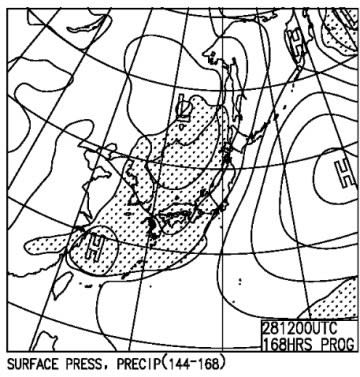
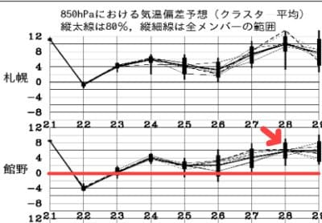
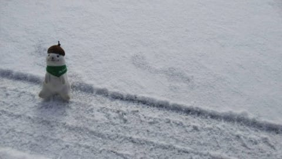
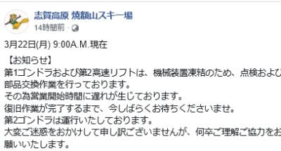
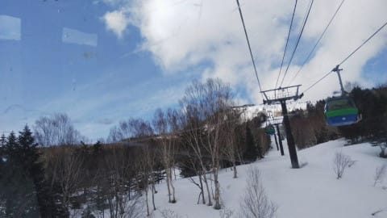
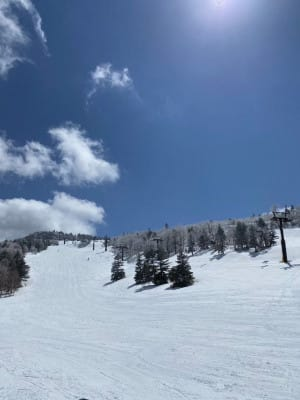
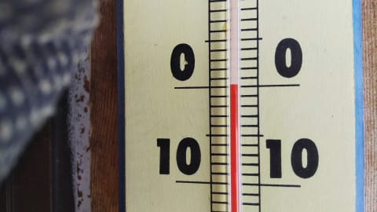
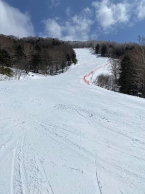
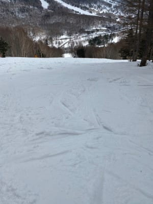

# 2021/3/22(月)の志賀高原スキー場は晴れのち小雪の天気…そして，次の日曜の雨の可能性は減ってきた！

📅 投稿日時: 2021-03-23 00:54:32

えー．

平日睡眠時間3時間が続こうが，

土日にスキー場の駐車場から電話会議に

出ることになろうが，

海外からの飛行機が遅れて

[日曜日の早朝に帰国](ee4856a0ca276e975d3a57034e9443977.md)しようが，

[自宅が引っ越そうが](m201604.md)（このページの一番下の記事あたりから，壮絶？な引っ越し記録が…）

かなりのご無体な状況でも．

というか，普通の人なら絶対あきらめる

状況でも，意地でスキーをしていた

この私からスキーを奪うという，

この緊急事態宣言だったわけですが．

本日，緊急事態宣言が解除されたようなので．

今週末からスキーに行くぞ！！！

…と強く心に誓っている，Skier_Sです．

しかし．

最近の仕事は

いろいろ常識を超えたご無体レベルなので．

とりあえず，今週末は落ち着いて欲しいところ…

…今週末，スキーに行けることを祈ろう…

で．

昨日の記事で，

「日曜は雨になりそう…」

と書きましたが．

最新の天気図を見てみると…

低気圧の位相が昨日より遅れ，

日曜28日，降水域はかかっているものの，

志賀よりギリギリ西側で留まる予想に

変わりました…！！

これなら，日曜のリフト営業中は

降らなさそうですね…！！

…雨になるのは日曜じゃなく

日曜夜~月曜にずれそうな感じかな．

これなら週末は雨にならずに済みそうです！

…でも．

雨にならなさそうなのは

ちょっと嬉しいけど．

この，平年比+6℃の激烈高温，

なんとかならんか…（涙）

雨は降らないものの．

この週末，むちゃくちゃ

気温が上がってザブザブ雪に

なりそうです…（泣）

ってなことで．

本日も志賀高原特派員情報を

お送りしますが．

…本日は，貴重な特派員が，

スマホ不具合により写真が撮れない

という事態のため．

ちょっと写真少なめです…

えー．

まず．

昨晩から期待の積雪ですが．

…一晩でわずか1cm

…これだと，昨日の雨で濡れた雪が

凍ったアイスバーンを隠してくれる

ほどの積雪ではないですね…（涙）

一体，最後に本格的な積雪が

あったのはいつの日だったか…

そして，朝イチの気温は奥志賀山頂で-8℃，

焼額山頂で-6℃とかなり冷え込んだ

ようなので…

当然，昨日の雨で解けた雪は

ガチガチに凍り付いてます．

そのおかげで，ワイヤーの滑車が

凍り付いたらしく．

2ゴンは15分遅れ，2高は10時ごろ，

1ゴンは11時40分ごろにやっと

動き出す状況だったようです…

([焼額山Facebook](https://ja-jp.facebook.com/yakebitaiyama/)より）

天気は朝イチは曇り空だったものの，

すぐに晴れ間が顔を出し，

昼間はいい天気になったようです！

午前中，焼額や奥志賀はガチガチというより，

殺人コロコロバーンで．

寺小屋や一の瀬はかなり硬めの

バーンコンディションだったようですが…

昼は予想より気温が上がり，0℃近くまで

上がったようで．

昼過ぎには，結構バーンも緩みだした

みたいで…

日が当たるバーンは，グサグサ雪に

なっちゃったみたいです…

うーん．今日は硬いバーンを維持すると

思ったんだけどなぁ…

で，午後2時ごろには曇りだし，

パラパラと雪が舞う天気になったようですが…

…昨日のあの天気でも，ラストまで生き残った

人がいたというのに．

本日は，午後2時以降，志賀高原には特派員が

いなくなってしまいました(涙)

という感じで．

期待した今朝の積雪はほぼ0で．

…さらにこれから週末までも，

積雪は期待できない感じです…

というか，ずっと気温が高い日が

続きます(涙）．

うーん．

せっかくのスキー復活の今週末．

あんまりコンディション良くなさそう…（涙）

やはり．

これはそろそろ，例の踊りを踊らねば

ならぬときが来たか！？？

## 💬 コメント一覧

### 💬 コメント by (レインボー73)
**タイトル**: Unknown
**投稿日**: 2021-03-23 08:58:58

火曜日の志賀高原情報

朝の上林ー２℃  蓮池ー４℃。道路は軽快。なのに１号トンネル手前だけが、全面氷。なんで？

昨朝も、軽快だったのにジャイアント分岐の手前だけがツルツル。皆様、油断は禁物ですよね。志賀の道路は常に危険が伴います。だけどその分、極楽が！

朝一のパノラマはといえば、いいぞいいぞ！　でもカラマツは硬すぎてウエーブも。

すぐに１ゴンに逃げます。

ＧＳ、なんて素敵なバーンなの？　ひょっとしてこれが最後になるかもしれない極楽バーン。今日はＧＳ様だ！

### 💬 コメント by (レインボー73)
**タイトル**: Unknown
**投稿日**: 2021-03-23 11:25:47

火曜日の志賀高原情報２

朝の2ゴン上ー７℃  １ゴン上ー８℃。

オリンピックも硬めの勘違いパーン。幸せすぎる。

その幸せも２時間だけ。10時30分を過ぎるとかなり緩んできました。１ゴン上はー４℃でも、日差しが強いので全てゆるゆる。でも、妖怪はまだ目を覚ましません。

ファミリー正面は、ピステンのウインチ故障で、昨日の状態がガチガチに固まって、あのファミリーの主でさえ奥志賀へ移動していきました。

今日のお昼は水芭蕉のカレー。gotoeat対応なので1200→1000円でドリンク飲み放題、しかも美味しい。

### 💬 コメント by (アツシ)
**タイトル**: Unknown
**投稿日**: 2021-03-23 12:43:55

月曜日ですが、奥志賀ダウンヒルやヤケビGS、唐松など日当たりのいい斜面はユルユルになってかなり荒れていました。午後から気温が下がり、荒れたゲレンデがそのまま冷えて固まり、カチカチのボコボコになってしまいました。２時以降ですが、標高の高いところはガスで覆われて視界が悪く、さすがに楽しくなくなってきたので、私も15:55に奥志賀ゴンドラ乗り場に着きましたが、そのまま早上がりしました。

### 💬 コメント by (レインボー73)
**タイトル**: Unknown
**投稿日**: 2021-03-23 15:52:31

水曜日の志賀高原情報３

昼食後のパノラマ、シラカバ、カラマツは、所々深雪ブカブカがあるけど、ほぼ無人なのでまずまずかな。

12時30分１ゴン上はまだー１℃。ＧＳは快適だったけど、奥志賀へのカーブする壁が、削られて危険。

私はレインボーまで１時間も残して早退。根性なんて皆無な男です。

昨日、世にも不幸な男だった人が、今日は意気揚々。『エキスパート良かったで。今日の一番だ。ジャイアントも良かったで』

私は今日はヤケビと心中したのに。他人の良かったという話を、素直に喜べない心の醜い私でした。

明日は暖かいので、もっと早く終わりそうです。

### 💬 コメント by (Skier_S)
**タイトル**: 今週末は雨にならずに済みそう！
**投稿日**: 2021-03-24 03:43:38

＞レインボー73さま

意外と今日はコンディション良かったみたいですね…

明日からはザブザブ雪になりますよ．

しかし，ファミリー正面バーン非圧雪って，想像したくない…

某ファミリーの主も逃げ出しますよね（笑）．

＞アツシさま

月曜も滑ってらしたんですね…

昼間のゆるゆるバーンが固まったガチガチバーンで，

視界が悪かったのに16時近くまで滑ったのですね…

お疲れ様でした！

