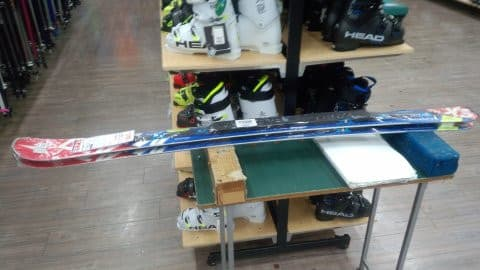

# 物欲選手権番外編2，続編

📅 投稿日時: 2017-12-15 01:24:17

えー．

17日日曜の朝は，日本海側は

パフパフモフモフになりそうだけど，

西風なので，志賀ではそんなに降らないかな～．

と思っていたところ．

最新の天気図を見て，志賀高原でも

15～20cmの積雪になるかも…

そしてこの日は終日雪が降り続け．

かなりの積雪になりそうだなぁ…その代り，ゲレンデの雪は

新雪が蹴散らされた荒れ荒れ凸凹になりそうだけど…

と思い始めた今日この頃．

皆様，いかがお過ごしでしょうか．

…昨日は，忘年会から帰宅して．

ブログ更新中に，意識が徐々に遠のいていき．

次に気がついたら朝6時半だった

という危機的状況にだった，Skier_Sです．

…しかし．

朝6時半に，机に突っ伏して寝ていたのに

気づいた時．

このまま更新をあきらめようか

と思ったのに．

ちゃんとBlog更新をした自分を，誉めて

あげたい…！！←何がそこまでしてまでBlogを書くモチベーションになってるんだろう…？

と，自分を誉めたところで．

今日は，一昨日の「[物欲選手権番外編2](e08f88a704470a5656ebc84fecc72aa08.md)」の続きです！

-----

アナウンサー　「さて．

　第1回 スキーヤーの物欲を刺激するスキー用品屋に来て，

　物欲にまみれたスキーヤーが買い物をせずに

　我慢できるか選手権　

　を開催していますが…

　スキーパンツを探した際に，上下セット9999円の

　ウェアを見つけ，試してみているSkier_S選手．

　果たして，この上下9999円の激安ウェアを

　買ってしまうのでしょうか？？」

解説　「このセットウェア．

　ジャケットとパンツのセットなのに，

　一番安いスキーパンツ単品より安いという

　謎の値段ですから…

　もしこのパンツが使えるようだったら，

　セットのジャケットは使わないで，このパンツだけ

　使うという戦略もとれますからね」

アナウンサー　「Skier_S選手，試着を終えたようですが…

　あー．戻しました．試着したウェアを，ハンガーにかけて

　売り場に戻しました…

　サイズは良かったようですが．

　何か気に入らなかったようですね」

解説　「いや，値段の割に，パンツは意外と悪くなかった

　ようですが…

　しかしこの格安ウェア，あまりにも安すぎて

　さすがにちょっと心配になったようです．

　ポケットも少ないし，機能的にはやはり

　お値段相当のジャケットですから…

　まぁ，年間70日滑る人で，このクラスのウェアを

　買う人は普通はいないと思いますから…」

アナウンサー　「そして，パンツを一通り見て

　あきらめたのか．あるいは気分転換か．

　ウエアのコーナーから離れて．

　板のコーナーにやってきました」

解説　「ここは普通の量販店で，上級者用の板はほとんど

　置いてないのですからね～．

　Skier_S選手の物欲は刺激されないでしょう…」

アナウンサー　「そのようです．板のコーナーをそのまま

　素通りしました…

　…

　と．いきなり立ち止まり，板のコーナーに戻ってきましたよ？？

　なんだか，びっくりしているようですが…

　何があったんでしょうか？？」

解説　「…ああ，上級者用の板がほとんどないこのお店ですが．

　たまたま1台だけ，ATOMICのSXが置いてあったようですね」

アナウンサー　「このお店では，そのクラスの板が置いてることすら

　珍しいのに．たまたまSXがあって驚いたんですね」

解説「まぁ，2週間前にSXを買ったばかりですから…

　それと値段を比較して，安かったら悔しいなぁ，

　って感じでしょうが…

　まぁ，この量販店が神田より安いことは無いでしょうから

　悔しい思いをすることはないでしょう」

アナウンサー　「お値段を見ていますが…

　おっと．ビンディング付きなのに税込み59990円と，

　いつものお店のビンディング無しの値段より，

　数千円安かったようですね」

解説「これは，'16SXで．

　Skier_S選手がいつものお店で買った'17SXより1年

　古いですから，ちょっと安いのは納得いくところですが．

　まぁ，このお値段ならビンディングもTLビンディングで，

　高いVARビンディングじゃないでしょうし」

アナウンサー　「あぁ…Skier_S選手．悔しがっています！

　長さがちょうど買った板と同じ165cmで．

　それもビンディング付きで数1000円安かったことに，

　悔しがっています！！」

解説　「あぁ…よせばいいのに．ビンディングがVARビンディング

　かどうかを店員に確認してますね…

　これで，VARビンディングだったら，さらに悔しさを

　増すだけなのに…」

アナウンサー　「あ，店員が「高いほうのビンディングです」と

　答えましたね…」

解説　「ビンディングの実物も持ってきましたが…

　あ，確かにVARビンディングですね」

アナウンサー　「Skier_S選手，悔しがってます．

　それも，かなり悔しがってますよ！」

解説　「VARビンディング付きがこの価格なら，

　1年古いモデルとはいえ，ビンディング無しで

　これより高く買ったSkier_S選手としては，

　悔しいでしょうねぇ…」

　

アナウンサー　「おっと．さらに店員さんが，ありえない情報を

　Skier_S選手に伝えましたよ！？

　11月中なら，この値段からさらに20%引く，ということの

　ようですが…」

解説　「59990円の20％オフだと，5万円切りますね．

　これだけ安いと，さらにSkier_S選手の悔しさを

　増加させますね」

アナウンサー　「…それだけじゃなく，そのうえでさらに

　10%分の商品券がつくと言ってます！！」

解説　「…それはすごいですね…

　たとえ2年落ちとはいえ，VARビンディング付きのSXが

　4万8000円で買えて，それに4800円分の商品券が

　つくとは…

　VARビンディングだけで3万近くするのに．

　VARビンディング付きSXが実質4万円前半となると，

　さすがにSkier_S選手の悔しさ，察するに

　余りがありますね…」

アナウンサー　「いやー．Skier_S選手．

　ありえないほど悔しがってますよ…！

　ビンディング無し'17SXを，このVAR

　ビンディング付き'16SXより1.5万円近く

　高く買ったことを，かなり悔しがってます…！！」

解説　「1.5万の差額があれば，スキーパンツも十分

　買えますからね．それでさらにビンディングも新品が

　ついてくるとなると，それは悔しい…って，え？？」

アナウンサー　「え？？

　ええええっ！？？

　なんということかっ！

　Skier_S選手．

　悔しさに理性を失ったのか．

　信じられない行動に出ましたっ！！

　なんと．

　買ってます！

　SXを買ってますっ！！！

　なんということか～！！

　2週間前にSXを買い足したばかりというのに．

　さらにSXを1セット買ってしまいました～っ！！！」

解説　「えええええ～！！？？？

　そこは買うところじゃないでしょ！！！！！」

アナウンサー　「なんということだ～っ！！！

　もう，我々の常識では理解できません！

　理解不能です！

　素晴らしい負けっぷりです！

　さすが，さすがはSkier_S選手っ！！」

解説　「すごい…

　すごい．

　1か月以内に板を3セット．

　それも，うち2セットは同じSXを購入という…

　…神です．

　彼は，もう物欲の神としか言いようがありません…」

アナウンサー　「Skier_S選手．新たな歴史を作りました…

　これだけの短期間で物欲に連敗した連敗記録．

　これは，見事な歴史として後世まで

　語り継がれるでしょう！」

解説　「そこ，見事って褒めるところじゃないですから…」

アナウンサー　「この興奮が冷めやらぬところで．

　Skier_S選手．

　受け取った4800円の商品券を利用して．

　9999円のセットのウェアを買いましたね…」

解説　「まさか，これだけの日数を滑るスキーヤーが，

　こんな格安ウェアを買うなんて，普通は考えられませんが…

　とことん『普通』という常識が通用しない選手ですね．

　板はあっさり高いのを買うくせに，こういうところは

　倹約するんですね…」

アナウンサー　「ということで，　

　今回の，

　第1回 スキーヤーの物欲を刺激するスキー用品屋に来て，

　物欲にまみれたスキーヤーが買い物をせずに

　我慢できるか選手権

　ですが．

　誰もが言葉を失う，SXの買い足しと，上下セット9999円の

　激安ウェア購入という，常識をダブルで超越した結果を

　お伝えしたところで，みなさんとお別れです．

　ではまた来シーズンの選手権でお会いしましょう！」

解説　「…なんだか，次の選手権が今シーズン中に開催されても，

　もう驚かないような気がする…」

----

…ってことで．

買っちゃったよ…

衝動とは，恐ろしい…

## 💬 コメント一覧

### 💬 コメント by (komu)
**タイトル**: それは
**投稿日**: 2017-12-15 06:12:43

買わないほうが後悔するでしょ…

しかし、終わってしまった人、認定ですな…

### 💬 コメント by (サトシ父)
**タイトル**: 私もまた負けそうです
**投稿日**: 2017-12-15 06:40:35

ヘルメット検討中です…

明日あたり買っちゃいそうです。

### 💬 コメント by (michi)
**タイトル**: Unknown
**投稿日**: 2017-12-15 08:13:17

Sさま

スキーパンツ買う流れからのぉ〜、また板か⁉︎

いやぁ、もう笑っちゃいました。

家で板の展示会出来そうですね（爆）

### 💬 コメント by (ぴよ＠太田市)
**タイトル**: (^^♪
**投稿日**: 2017-12-15 08:55:51

や～ダメダメでおもろかった(^^)/

ウェアの実践報告をお待ちしていますぅ～

### 💬 コメント by (タカ)
**タイトル**: Unknown
**投稿日**: 2017-12-15 10:51:06

やはり3本目にいきましたね。しかしまたSXですか。自分予想だとXraceと思ってましたが。まああの値段出されたら買うしかないですけど(笑)

### 💬 コメント by (つーちゃん)
**タイトル**: Unknown
**投稿日**: 2017-12-15 13:20:14

下の方まで読んでいくにつれて嫌な予感がしてきましたが

まさか買ってしまうとはっ！思わず笑っちゃいましたー

P.S.

ここのところ頻繁にAmazonの箱が届きます

どうやら右手が知らぬ間に暴走しているようです

### 💬 コメント by (たろ)
**タイトル**: Unknown
**投稿日**: 2017-12-15 13:31:18

Sさん、すごい・・。

ただ、ただ、すごい・・。

絶対に負けてしまう戦いがそこにある・・。

まさに、一人アトミックステーション状態じゃないですか。

レンタル事業が始められそうです。

同じ長さ限定ですが、「かなりヘタレ」「そこそこヘタレ」

「ヘタレ無し」の3パターンから選択可能ですね。

### 💬 コメント by (FCAMEL)
**タイトル**: Unknown
**投稿日**: 2017-12-15 14:39:16

すごい！スキー板の世界にも「ナンピン買い」ってあるんですね！初めて見ました！

### 💬 コメント by (はっち)
**タイトル**: グローブではないんですね
**投稿日**: 2017-12-15 18:41:42

次の選手権は「グローブ」に1万ベリー！ﾄﾞﾝｯ

### 💬 コメント by (しんちゃん)
**タイトル**: 神ってる～!!
**投稿日**: 2017-12-15 20:19:53

この短期間にいた3本購入とは･･･

まさに物欲神。神ってますね（凄）

部屋はまるでサンダーバード。1号2号3号と並んでるんでしょうね。

ちなみに、ジャニーズファンはアルバムＣＤを聞く用・保管用・飾っとく用と同じジャケットを3つぐらい購入する人がいるようです。16SXは何かの思い出の記念に保管用だったりして(笑)

### 💬 コメント by (Goku)
**タイトル**: ハ・ハ・ハ・・・
**投稿日**: 2017-12-15 20:23:02

番外編２と言ってますが、これがまさしく本編でしたね（笑）

しかし、保険で１本分得したとはいえ１ヶ月で３本ですか・・・終わってます（笑）

ではまた明日焼額山でお逢いしましょう。

### 💬 コメント by (Skier_S)
**タイトル**: コメントいっぱいありがとうございます
**投稿日**: 2017-12-16 00:16:10

＞komuさま

いやーー．

ホントに，これは買わないわけに行かない！

と思いましたよ．

あの値段を聞いた時は…

でも．終わってます．はい．否定しません（笑）

＞サトシ父さま

ぜひ，ヘルメット買いましょう！

私だけでなく，一人でも多くの

物欲大敗仲間を巻き込みたい今日この頃です（笑）

＞michiさま

いやーー．

私もあのお店に入った時，まさか板を買うとは

1ミクロンも思ってなかったので…

まさかの流れだったと思います．

一番「まさか」と思ったのは私ですから（笑）

＞ぴよ＠太田市さま

自分でもこんな想定外の大敗をするとは思わず．

自分でも驚きのネタになってます（笑）．

もう，ダメダメです．

物欲に負け続けてます…

＞タカさま

板3本目，ってのをみごと当ててましたね…

自分としては，本人もまさかのオチだったのですが．

我が家はSXがいっぱい並んですごいことになってますよ（笑）

＞つーちゃん

まさか，まさかですよ．

自分でも，まさか買ってしまうとは…

って感じだったので．

もう，物欲って恐ろしいですね…

いまや指一本で買い物できてしまう時代．

お互い，自重しないと…

＞たろさま

「絶対負けてしまう戦い」ですか…

ウケました．ツボりました．

私の物欲選手権は，まさにその通りですね（笑）．

今，我が家に赤青のSXが4セット並んでます．

後日写真載せますが…すごいですよ（笑）

＞FCAMELさま

スキー板のナンピン買いと来ましたか…

確かにそんな感じですね（笑）

もう，志賀へはいらっしゃってるのでしょうか？

また志賀でお会いしましょう～！

＞はっちさま

さすがに私のグローブの惨状を見た人は，

次はグローブと思うかもしれませんね…

でも，まだまだ使います．

パンツも穴が開いても履き続けますから，

グローブもどうせ1年経たずに穴が開くので，

テープで巻いて使い続けます．

…とか言っておきながら，神田に行ったら

知らぬ間にグローブを買ってしまっている

可能性が否定できないですが…

＞しんちゃんさま

2週間で板を3セット買うとは思いませんでした．

いや，本人も予想外でしたから．

1セットも買わないつもりが，気づいたら板が

3セット増えていた…というのは，ある意味ホラーです←違うから

いまは，赤青のSXが1号，2号，3号，4号と4台並んでます．

青のSXも含めると5台あります（笑）

＞Gokuさま

確かに，これが本編だったのかも．

でも，保険金が無ければ買ってなかったと思います…

保険で前の2本の板の代金が実質出たので，

ついつい正常な思考を失ってしまってました…

