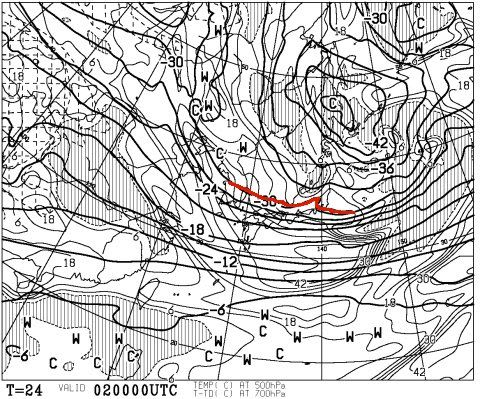
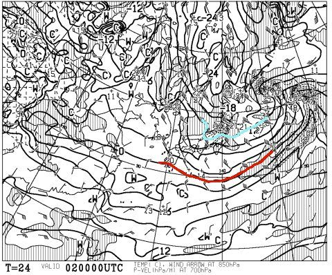
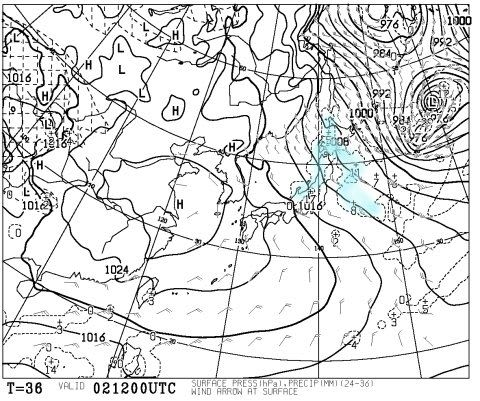
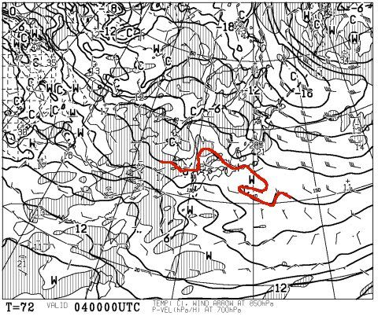
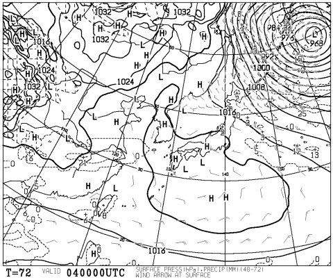
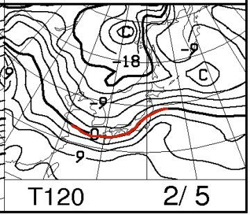
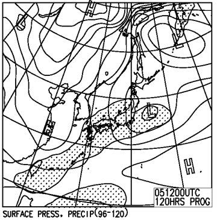

# 今週末，2月4，5日の志賀高原スキー場の天気は…土曜は晴れるけど，日曜は微妙な感じ…

📅 投稿日時: 2017-02-02 00:37:19

えー．

今現在．

スキー場ではかなりの雪が降っているようですね…

昨日の予告の通り．

2日は終日，結構な積雪になりそうな予感…っ！！！

2日朝9時の天気図を見てみると．

やはり昨日の予想と同じく，

500hpa図で-30℃の寒気が志賀高原にやってきてますし…

さらに．

850hpa図では，水色の-12℃線が志賀にいます．

だもんで，2日の朝．-15度クラスの気温でスタートしそう…

そして，2日午後9時の地上天気図も冬型で，水色の降水域が

日本海側を覆ってますよ～！

ってな感じなので．

志賀高原，2日は終日雪が降り続けそう…

ってか，これ，かなりの吹雪では？

とりあえず．

31日の積雪と，2日の積雪で．

30日の雨で固まったゲレンデ．

アイスバーンは完全に隠れてくるかな～．

ってなところで．

次は，肝心な週末の天気を見てみますか…

まずは，土曜，4日の850hpa図．

ふーーむ．

0℃線が，2日に比べるとずっと上まで上がってて．

…志賀高原はせいぜい-3℃線がかかっているレベル．

うーむ．

この日は，昼間の気温は0℃近くまで上がるかな～．

で，地上天気図を見ると…

ふむ．

高気圧に覆われて，晴れそうですね！！

朝のうちは雲が多いかもしれませんが．

土曜はまぁ穏やかな天気になりそう…

そして．日曜．

5日の850hpa図ですが…

志賀はぎりぎり0℃線がかかっているような状況なので．

うーむ．

日曜は，気温が0℃を超えるか？

ってくらいまで上がりそう…

そして，地上天気図を見ると．

降水域を示す網掛けが，志賀高原にもかかってますよ！？？

こ，これは…危険だ…っ！！

ただ，まだ降り始めがいつになるか正確に読めません…

何にしろ，私の嫌いな南岸低気圧です．

降り始めが昼過ぎなのか，夕方なのか…

雪なのか，雨なのか（涙）…

わずかな低気圧の位置のずれで，

大きく天気が変わっちゃいます…（泣）

だもんで．

まだ，日曜の予想精度は低いと思ってください．

とりあえず，まとめると

4日土曜：朝は晴れ！この日は，時々雲が飛んでくるものの．

　基本的に終日いい天気！

　朝イチは，前日まで降った雪が圧雪された，やわらか最高

　圧雪斜面が楽しめるのじゃないかな～．

　2月に入ったので，ちょっとゲレンデの人が増えるかな．

　午前は多少ゴンドラ待ちが出そう．

　午後も天気が続き，気温は高め．朝のうちは　

　冷えていたものが，昼は0℃近くまで上がるけど，

　雪質はそれほどひどくならずにキープしてくれるかな．

　午後に向かってゲレンデは荒れていき，

　夕方は結構凸凹になりそう…

　一部下地のアイスバーンが出てくるところもあるかも？

5日日曜：微妙だけど…朝のうちは晴れてるかも？？

　晴れれば，放射冷却で冷えて最高の締まった

　ハイスピード圧雪バーン！

　その後．だんだん雲が増えていき．

　どこかのタイミングで…降り始めます．

　早ければ昼過ぎくらいだけど．

　今のところ，夕方近くかな～．

　この日も，プラス気温に近いところまで

　気温が上がりそうだけど．

　…運が良ければ，降り始めから雪のはず．

　高気温のおかげで．すっごく運が悪ければ，

　夕方は雨になる可能性も否定できないけど…

　でも．

　祈る．

　私が祈るので，雪になるはず．

って感じで．

日曜の昼ごろから，天気は悪くなっていきそうだけど．

日曜朝まではいいゲレンデコンディションなので．

…おそらく，今週末もまぁまぁの感じかな？

日曜いつごろから天気が崩れるのかの予想は，

また直前に詳細予想やりますので，

お待ちくださいね～！

## 💬 コメント一覧

### 💬 コメント by (Kon Suke)
**タイトル**: 月曜日
**投稿日**: 2017-02-02 10:03:37

Ｓ様

月曜日は朝雨だったので、帰ろうかと思いましたよ。

しかし、雪に変わったので・・・。

一ノ瀬の1本目でお尻が濡れてしまい、泣く泣く焼額1ゴンへ、オリンピックコースなど、濡れた雪がダマになっていたので硬くなったはずです。

午後ファミリーに帰ってきたら、フラットで硬くなっていましたが、この雪で・・・。また柔らかくなりそう。

アイスバーン大好きの私は、雨の翌日が好きなので、今後が楽しみです。

### 💬 コメント by (michi)
**タイトル**: Unknown
**投稿日**: 2017-02-02 12:48:43

先週日曜日ですが第1ゴンドラの駐車場に停めていたのですが、帰り支度をしていたら、ゴンドラ駅舎屋根の雪が一気に落ちてきました。

幸い、息子は車に乗っていたので無事でしたが、私の車の左前が雪に覆われてしまいました。

カラーコーンは潰され、我が車も被害に、、、

焼額の従業員の方が来てくれたので状況を説明してところ、ディーラーで見てもらって下さいとのことで火曜日にディーラーに出しました。

結果、左のフェンダーにズレがあり調整が必要な状況です。とりあえず普段乗りは問題ないそうですが、支払など含め、対応に時間がかかりそうです。

長文失礼しました。

同じ目に遭わないよう、駐車場の位置にはお気を付け下さい。

### 💬 コメント by (michi)
**タイトル**: 訂正
**投稿日**: 2017-02-02 19:03:18

第2ゴンドラの間違えです。

スミマセン。

### 💬 コメント by (Skier_S)
**タイトル**: またまた，どさどさ降っているようで…
**投稿日**: 2017-02-03 01:23:52

＞Kon Sukeさま

やっぱり，月曜の雨は結構降ったのですか…

私は，Kon Sukeさんと違って柔らかい斜面が好きなので（笑），

今回の雪で固いのが隠れてくれた方がうれしいのですが…

でも，一の瀬正面バーンは，この週末も

午後になると雪が削れて，ところどころ

固いのが出てくるかも…

＃その場合，固いのと柔らかいのミックスで滑りにくいかも

＞michiさま

あーーー，びっくりしました！

1ゴン駅舎の屋根から，1ゴン駐車場まで

雪が飛ぶって，どんな落ち方？？？

って，驚きましたが…

やっぱり2ゴンですよね（＾＾；

しかし，いろいろめんどくさいことに

なったようで…

ご愁傷さまです．

私も，2ゴンに車を止める時は，

雪が落ちなさそうなところを

選ぶようにします…

